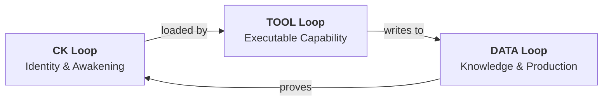
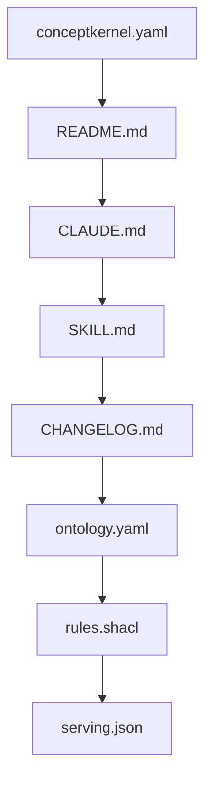
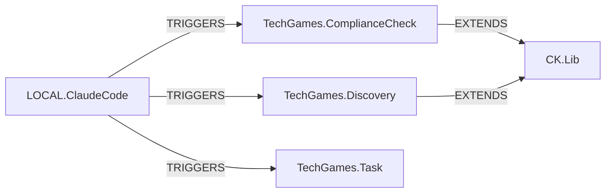

# Architecture

A Concept Kernel is a self-governing entity. It prescribes its own level of ontological enforcement, produces typed output, and generates cryptographic proof that it governed itself correctly. The architecture exists to make this self-governance possible.

Governance requires boundaries. You cannot govern what you cannot isolate. Every kernel therefore maintains three independently versioned repositories — not as an organisational pattern, but as the structural prerequisite for autonomous governance. Identity is separated from capability, capability from knowledge, so that each concern can be governed, versioned, and verified independently.

::: info v3.5 alpha-3
The governance architecture was formalised in CKP v3.5. See the [Three Loops spec](/v3.5-alpha3/spec/three-loops) for the full reference.
:::

## Boundary Isolation — The Three Loops



The CK loop is the kernel's constitution — it declares what the kernel is and what correct output looks like. The TOOL loop is the executive — it acts, but within the constitution's constraints. The DATA loop is the record — immutable evidence that governance was followed. Each loop lives on its own SeaweedFS volume, enabling independent versioning, replication, and access control.

### CK Loop — The Constitution

The CK loop is the genome of the kernel. It declares the kernel's name, version, governance mode, edges, ontology, constraints, and the reading order an agent follows when it wakes up inside a kernel directory. Crucially, it also declares the kernel's type definition — `ontology.yaml` defines what correct output looks like, and `rules.shacl` defines the constraints. These are governance instruments: the kernel is telling the world (and its own tool) what it considers valid.

The awakening sequence defines the order in which an agent reads files to acquire identity:



By the time an agent finishes reading `serving.json`, it knows who it is, what it can do, what constraints apply, and how to serve its actions. No external configuration service is needed. The directory IS the configuration.

### TOOL Loop — The Executive

The TOOL loop contains the processor that turns the CK loop identity into running behaviour. In Python kernels this means a `processor.py` file that imports from `cklib` and registers action handlers with the `@on` decorator.

The TOOL loop reads the CK loop at startup — it operates under the constitution. It never writes to the CK loop. When an action executes, the tool writes its output exclusively to the DATA loop. This one-way dependency is the core governance guarantee: the tool can evolve freely, but its output must always conform to the identity's declared type. If it doesn't, the proof records the failure.

### DATA Loop — The Record

The DATA loop holds everything the kernel has produced: sealed instances, proof records, ledger entries, and indexes. Each action execution materialises as an instance directory under `storage/instances/`, containing a `manifest.json`, a `data.json`, and a `proof.json`.

The DATA loop is governance evidence. Every `proof.json` demonstrates that the kernel governed itself according to its declared rules — data hashes confirm integrity, check results confirm conformance, and the provenance chain traces back to the identity that authorised the action. This circular accountability is what makes a Concept Kernel self-verifying without requiring external oversight.

## Unified Filesystem

All three loops map to a single directory tree on disk. In production each maps to its own SeaweedFS volume, but for local development the layout is flat:

```
{KernelName}/
    conceptkernel.yaml        # CK loop
    README.md                 # CK loop
    CLAUDE.md                 # CK loop
    SKILL.md                  # CK loop
    CHANGELOG.md              # CK loop
    ontology.yaml             # CK loop
    rules.shacl               # CK loop
    serving.json              # CK loop
    tool/
        processor.py          # TOOL loop
    storage/
        instances/            # DATA loop
            i-{slug}-{epoch}/
                manifest.json
                data.json
                proof.json
        ledger/               # DATA loop
            actions-{date}.jsonl
        proof/                # DATA loop
        index/                # DATA loop
```

In SeaweedFS, these become three named volumes per kernel:

| Volume | Mount | Contents |
|--------|-------|----------|
| `ck-{guid}-ck` | root | conceptkernel.yaml, CLAUDE.md, ontology.yaml, etc. |
| `ck-{guid}-tool` | tool/ | processor.py, entrypoints, dependencies |
| `ck-{guid}-storage` | storage/ | instances, ledger, proof, index |

## Edge Graph

Kernels do not communicate through arbitrary channels. All inter-kernel interaction is declared through typed edges in `conceptkernel.yaml`. Edge predicates define the relationship and constrain what operations are permitted.



The edge predicates introduced in v3.5 include EXTENDS (action inheritance), COMPOSES (action delegation), REQUIRES (verification dependency), and TRIGGERS (event notification). The edge graph replaces the message bus configuration of earlier versions -- the graph IS the integration.

## Governance Modes

Every kernel declares one of three governance modes in `conceptkernel.yaml`:

| Mode | Meaning |
|------|---------|
| **STRICT** | All mutations require multi-party consensus before commit |
| **RELAXED** | The kernel owner can commit changes, compliance runs post-hoc |
| **AUTONOMOUS** | The kernel self-governs, with provenance as the audit trail |

The governance mode determines how the DATA loop is sealed. In STRICT mode, sealing requires external compliance verification. In AUTONOMOUS mode, the kernel seals its own instances and the proof record stands as the audit.

---

<div style="text-align: center; padding: 2rem 0;">
  <a href="https://discord.gg/sTbfxV9xyU" style="display: inline-block; padding: 0.6rem 1.5rem; background: #5865F2; color: white; border-radius: 6px; font-weight: 600; text-decoration: none;">Discuss Architecture on Discord</a>
</div>
