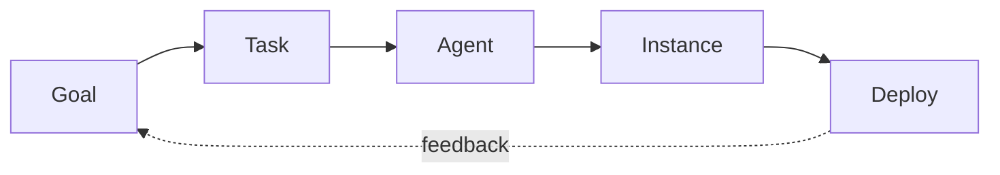

# Consensus

Consensus is the mechanism that prevents unilateral mutations to the kernel graph. When a change could affect other kernels, the protocol requires agreement before it takes effect.

## Governance Modes

Every kernel declares one of three governance modes in its `conceptkernel.yaml`. The mode determines how much autonomy the kernel has over its own mutations.

**STRICT** mode requires multi-party consensus before any mutation is committed. A proposal must be validated against ontology and SHACL constraints, then agreed upon by affected stakeholders. This mode is appropriate for shared infrastructure kernels where semantic drift would be costly.

**RELAXED** mode allows the kernel owner to commit changes directly, with compliance checks running post-hoc. If a compliance check fails, the change is flagged but not rolled back automatically. This suits development-phase kernels where iteration speed matters more than pre-commit verification.

**AUTONOMOUS** mode means the kernel self-governs. It seals its own instances and the provenance chain serves as the audit trail. External compliance can still verify instances after the fact, but the kernel does not wait for approval. Most agent-type and LOCAL.* kernels operate in this mode.

## The Governance Loop

CKP v3.5 formalises the lifecycle from observation to deployment as a governance loop. This loop applies regardless of governance mode — the mode only determines where consensus gates are placed.

A **Goal** identifies something the organism needs. A **Task** breaks the goal into concrete work units. An **Agent** executes a task, producing a sealed **Instance** as proof of execution. The instance is verified and then **Deployed** into the kernel's CK or TOOL loop. Deployment feedback may generate new goals, closing the loop.

In STRICT mode, transitions between stages require consensus. In AUTONOMOUS mode, all transitions are self-authorised with provenance logging.

## Edge Consensus

Edge modifications always require consensus regardless of governance mode. Edges define the communication topology of the organism, and a unilateral edge change could silently grant or revoke access between kernels. This is the one governance constraint that cannot be relaxed.

::: info CSRV.* — Consensus Services
The full consensus voting protocol — vote collection, tallying, quorum rules, deadlock resolution — is being delivered by the **CSRV.\*** kernel family (Consensus Services). The mechanics described here are the governance principles that CSRV.* implements. Details will be documented as those kernels reach production readiness.
:::

---

  <a href="https://discord.gg/sTbfxV9xyU" style="display: inline-block; padding: 0.6rem 1.5rem; background: #5865F2; color: white; border-radius: 6px; font-weight: 600; text-decoration: none;">Discuss Governance on Discord</a>

