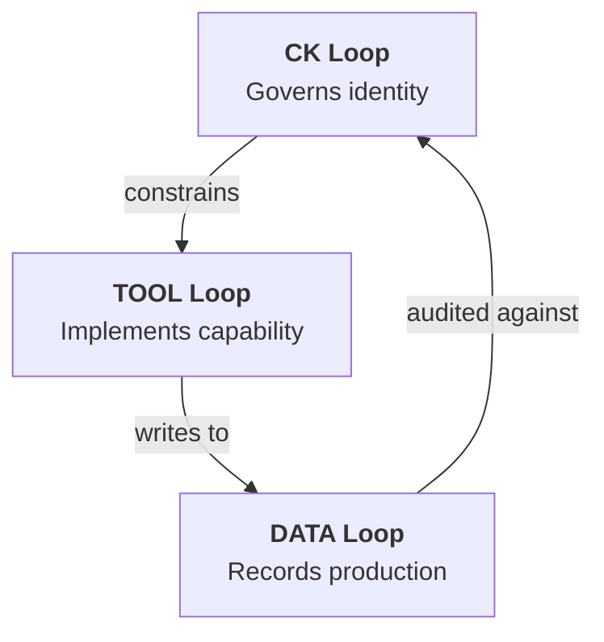
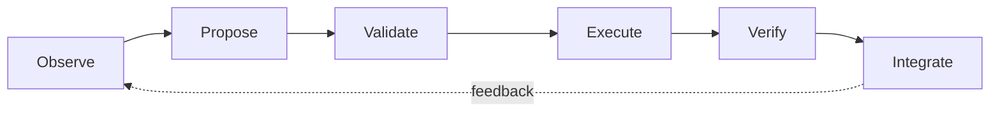

# Governance

CKP governance is built on a structural separation: the CK loop governs the TOOL loop, and the ontology drives the tool rather than the reverse. This separation prevents capability drift, where a tool's implementation gradually diverges from its declared identity. The governance model ensures that what a kernel says it is (CK loop) always matches what it does (TOOL loop) and what it has produced (DATA loop).

## Three-Loop Governance

The three loops have a strict dependency order that doubles as a governance hierarchy.

The CK loop constrains the TOOL loop. A processor can only register actions that are declared in `conceptkernel.yaml`. CK.Lib enforces this at startup -- if `processor.py` defines an `@on("delete")` handler but the genome does not list a `delete` action, the handler is rejected. The ontology similarly constrains what instance shapes the tool can produce.

The TOOL loop writes to the DATA loop. Instances are created and sealed exclusively through CK.Lib's `create_instance()` and `seal_instance()` methods. These methods enforce the schema declared in `ontology.yaml`, so the tool cannot produce an instance that violates its own type definition.

The DATA loop is audited against the CK loop. Compliance checks compare sealed instances against the kernel's declared ontology, SHACL constraints, and provenance requirements. Any mismatch is recorded as a compliance failure in the proof record.

## Ontology-Driven Enforcement

CK.Lib enforces governance at two critical points: action registration and instance sealing.

At action registration, the processor's `@on` handlers are matched against the actions declared in `conceptkernel.yaml`. Undeclared handlers are ignored. This prevents a tool from silently adding capabilities that the kernel's identity does not advertise.

At seal time, the instance's `data.json` is validated against the shapes in `ontology.yaml`. If the data does not conform -- a required field is missing, a value is out of range, a type constraint is violated -- the seal fails and the instance remains in an unsealed, uncommitted state. The ledger records the failure.

This means the ontology is not advisory. It is enforced by the runtime. Changing what a kernel can do requires changing the CK loop first, which is a governed operation subject to the kernel's governance mode.

## The Governance Lifecycle

The full governance lifecycle for evolving a kernel follows a predictable sequence:

**Observe** -- an agent, compliance check, or human identifies a need. A missing action, a schema gap, a failing constraint. This observation is captured as a Goal.

**Propose** -- the goal is decomposed into tasks. Each task targets a specific loop: a CK loop task to update the ontology, a TOOL loop task to implement a new handler, a DATA loop task to backfill instances.

**Validate** -- proposed changes are checked against existing constraints. Ontology changes are validated for BFO alignment. SHACL changes are checked for consistency. Tool changes are tested against the ontology.

**Execute** -- an agent is spawned for each task. The agent reads the kernel's awakening sequence, executes the task, and produces a sealed instance as proof of completion.

**Verify** -- compliance checks run against the sealed instances. The proof model validates hashes, provenance chains, and schema conformance.

**Integrate** -- verified changes are merged into the kernel's loops. CK loop changes update `conceptkernel.yaml` or `ontology.yaml`. TOOL loop changes update `processor.py`. The ledger records the full chain from goal to deployment.

## Constraint Governance

Constraints themselves are governed entities. A SHACL shape in `rules.shacl` can be proposed, voted on, versioned, and audited just like any other kernel artifact. Overriding a constraint requires explicit consensus in STRICT and RELAXED modes, and is not permitted in AUTONOMOUS mode without first updating the rules file through the governance lifecycle.

This prevents the common anti-pattern where validation rules are weakened to accommodate non-conforming data. In CKP, if the data does not fit the shape, the data must change or the shape must go through governance. There is no silent relaxation.

---

  <a href="https://discord.gg/sTbfxV9xyU" style="display: inline-block; padding: 0.6rem 1.5rem; background: #5865F2; color: white; border-radius: 6px; font-weight: 600; text-decoration: none;">Shape Governance on Discord</a>

