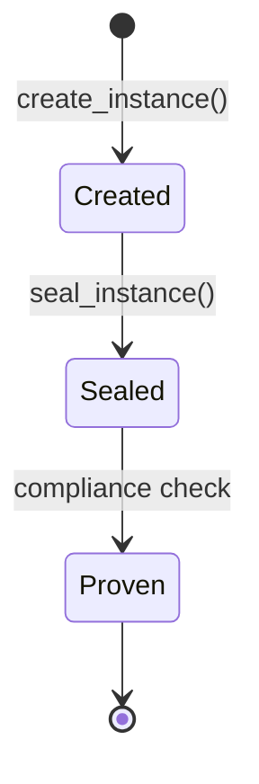

# Concept Kernels

A Concept Kernel is a persistent computational entity that maintains identity, capability, and production history across time. In BFO terms it is a Material Entity (`BFO:0000040`) -- something that exists independently, bears qualities, and participates in processes. Every kernel in the Concept Kernel Protocol is an instance of this class.

## The Kernel-as-Datatype Rule

One of the central insights of CKP v3.5 is that a kernel is self-describing. The kernel does not require an external registry to explain what it is. Instead:

The `ontology.yaml` file IS the type definition. It declares the classes, attributes, and constraints that define what instances the kernel can produce. When another kernel or agent reads the ontology, it knows the kernel's data shape without consulting a central schema registry.

The `storage/instances/` directory holds typed individuals. Each instance in this directory conforms to the shapes declared in the ontology. The instance is not a generic blob -- it is a materialised individual of a declared type.

The `conceptkernel.yaml` file IS the genome. It carries the kernel's name, version, governance mode, edges, and the full awakening sequence. An agent reading this file acquires the kernel's identity. The genome plus the ontology together form a complete, portable, self-contained definition.

## The Genome: conceptkernel.yaml

Every kernel begins with a `conceptkernel.yaml` file. This is the kernel's genome -- the minimum viable declaration of identity. Here is the structure:

```yaml
apiVersion: conceptkernel/v3.5
kind: ConceptKernel

metadata:
  name: LOCAL.ClaudeCode
  version: "1.0"
  guid: "ck-a1b2c3d4-e5f6"
  type: agent
  governance: AUTONOMOUS

spec:
  description: "Agent spawning, context building, fleet awareness"
  urn: "ckp://Kernel#LOCAL.ClaudeCode:v1.0"

edges:
  outbound:
    - target_kernel: TechGames.ComplianceCheck
      predicate: TRIGGERS
    - target_kernel: TechGames.Discovery
      predicate: TRIGGERS

actions:
  unique:
    - name: status
      access: anon
    - name: spawn
      access: auth
    - name: context
      access: anon

qualities:
  max_concurrent_agents: 3
  nats_subject_input: "input.LOCAL.ClaudeCode"
  nats_subject_result: "result.LOCAL.ClaudeCode"
```

The genome declares everything the kernel needs to be identified, located, and interacted with. The `edges` section defines how this kernel relates to others. The `actions` section declares what operations the kernel can perform. The `qualities` section carries operational parameters.

## Kernel Types

Kernels are classified by their runtime behaviour:

| Type | Description |
|------|-------------|
| **hot** | Always-on service kernel, listening on NATS or HTTP |
| **cold** | On-demand kernel, triggered by file-system events or queue messages |
| **agent** | AI agent kernel, spawned for task execution and sealed on completion |

Hot kernels run as persistent processes. Cold kernels activate when work arrives. Agent kernels are ephemeral -- they are spawned, execute a task, seal an instance, and exit. All three types follow the same Three Loops structure and produce the same instance format.

## Kernel Isolation

Kernels are isolated by design. No kernel can directly read or write another kernel's storage. All inter-kernel communication flows through declared edges, mediated by NATS messaging or the `tg.sh` orchestrator. A kernel that attempts to access another kernel's data without a declared edge violates the protocol. SHACL shapes enforce this at the graph level.

This isolation holds even when kernels share a filesystem in development. The boundary is logical, enforced by the protocol, and auditable through the ledger.

## Instance Lifecycle

When a kernel executes an action, it produces an instance. The instance moves through a simple lifecycle:



A created instance is mutable -- the tool is still writing to it. A sealed instance is immutable -- `manifest.json` and `data.json` are finalised, hashes are computed. A proven instance has passed compliance verification and has a `proof.json` attached.

Once sealed, an instance cannot be modified. This append-only property is fundamental to CKP's auditability.

---

<div style="text-align: center; padding: 2rem 0;">
  <a href="https://discord.gg/sTbfxV9xyU" style="display: inline-block; padding: 0.6rem 1.5rem; background: #5865F2; color: white; border-radius: 6px; font-weight: 600; text-decoration: none;">Ask Questions on Discord</a>
</div>
