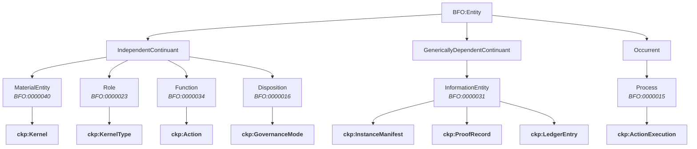

# Ontology

The ontology layer is the formal type system of the Concept Kernel Protocol. Every kernel declares its data shapes through a LinkML schema (`ontology.yaml`) and validates instances against SHACL constraints (`rules.shacl`). These two files, combined with BFO alignment, give CKP a grounded, machine-verifiable semantic foundation.

::: info v3.5 alpha-3
CKP v3.5 introduced base instance shapes (InstanceManifest, SealedInstance, LedgerEntry) and the proof ontology (ProofRecord, ProofCheck). See [Ontology Versions](/v3.5-alpha3/ontology/versions) for the full changelog.
:::

## LinkML Schemas

Every kernel defines its data structure using [LinkML](https://linkml.io/). The schema lives in `ontology.yaml` at the root of the kernel directory. Here is a real example from a kernel that spawns agents:

```yaml
id: https://conceptkernel.org/ontology/v3.5/concepts/LOCAL.ClaudeCode
name: LOCAL.ClaudeCode
description: "Agent spawning, context building, fleet awareness"
prefixes:
  ckp: https://conceptkernel.org/ontology/v3.5/
  bfo: http://purl.obolibrary.org/obo/
  prov: http://www.w3.org/ns/prov#

classes:
  SpawnInstance:
    is_a: ckp:SealedInstance
    description: "Agent spawn record"
    attributes:
      target_kernel:
        range: string
        required: true
      persona:
        range: string
      task_id:
        range: string
      goal_id:
        range: string
      context_payload:
        range: string
        multivalued: true
      prompt:
        range: string

instance_mutability: append_only
```

The key design pattern here is inheritance from CKP base shapes. `SpawnInstance` extends `ckp:SealedInstance`, which itself extends `ckp:InstanceManifest`. The kernel only declares the attributes unique to its domain. The base shapes provide `instance_id`, `kernel_class`, `created_at`, provenance links, and data/tool/ck references for free.

This is the kernel-as-datatype rule in action: the ontology IS the type definition, and every instance produced by this kernel conforms to it.

## SHACL Validation

Beyond schema structure, each kernel enforces SHACL shapes that validate data at runtime. SHACL constraints live in `rules.shacl` and are checked by CK.Lib at seal time. Here is a representative excerpt from the CKP protocol shapes:

```turtle
@prefix sh: <http://www.w3.org/ns/shacl#> .
@prefix ckp: <https://conceptkernel.org/ontology/v3.5/> .

ckp:KernelShape a sh:NodeShape ;
    sh:targetClass ckp:Kernel ;
    sh:property [
        sh:path ckp:kernelName ;
        sh:datatype xsd:string ;
        sh:minCount 1 ;
        sh:maxCount 1 ;
        sh:pattern "^[a-zA-Z][a-zA-Z0-9_-]*$" ;
    ] ;
    sh:property [
        sh:path ckp:hasOntology ;
        sh:nodeKind sh:BlankNodeOrIRI ;
        sh:minCount 1 ;
    ] .

ckp:InstanceShape a sh:NodeShape ;
    sh:targetClass ckp:Instance ;
    sh:property [
        sh:path ckp:instanceId ;
        sh:datatype xsd:string ;
        sh:minCount 1 ;
        sh:maxCount 1 ;
    ] ;
    sh:property [
        sh:path ckp:sourceEdge ;
        sh:class ckp:Edge ;
        sh:minCount 1 ;
    ] .
```

The KernelShape enforces that every kernel has a valid name and at least one ontology definition. The InstanceShape enforces that every instance is traceable to the edge that authorised its creation. SHACL also enforces the communication constraint: kernels can only interact through authorised edges, preventing undeclared dependencies.

## BFO Alignment

CKP aligns its upper ontology with the [Basic Formal Ontology (BFO)](https://basic-formal-ontology.org/). This alignment provides principled categorisation for every entity in the protocol.



The alignment table:

| BFO Class | CKP Class | Meaning |
|-----------|-----------|---------|
| MaterialEntity | Kernel | A persistent computational entity |
| Role | KernelType | Hot, cold, or agent classification |
| Function | Action | What a kernel can do |
| Disposition | GovernanceMode | STRICT, RELAXED, or AUTONOMOUS tendency |
| GenericallyDependentContinuant | InstanceManifest, ProofRecord, LedgerEntry | Information entities produced by kernels |
| Process | ActionExecution | A temporal occurrence of an action |

This alignment ensures interoperability with biomedical ontologies, industrial standards, and any other BFO-aligned system. A CKP kernel can participate in cross-domain reasoning because its categories are grounded in BFO's upper ontology rather than ad-hoc classifications.

## Namespace

All CKP ontology terms live under a versioned namespace:

```
https://conceptkernel.org/ontology/v3.5/
```

Kernel-specific terms extend this with a concept path:

```
https://conceptkernel.org/ontology/v3.5/concepts/LOCAL.ClaudeCode/
```

Static ontology files are published at `/ontology/v3.4/` and `/ontology/v3.5/` on conceptkernel.org. See the [Ontology Versions](/v3.5-alpha3/ontology/versions) page for links to individual `.ttl` files.

---

<div style="text-align: center; padding: 2rem 0;">
  <a href="https://discord.gg/sTbfxV9xyU" style="display: inline-block; padding: 0.6rem 1.5rem; background: #5865F2; color: white; border-radius: 6px; font-weight: 600; text-decoration: none;">Discuss Ontology on Discord</a>
</div>
