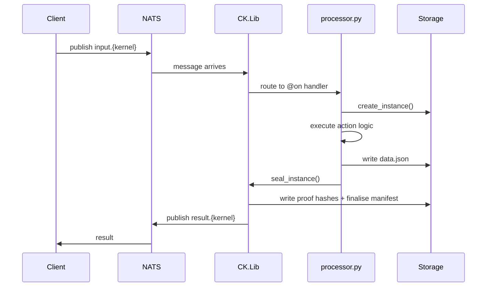

# Protocol

The CKP protocol defines how kernels communicate, how actions are dispatched, and how every interaction produces verifiable output. In CKP v3.5, the runtime implementation is provided by **CK.Lib**, a Python package that any kernel's `processor.py` imports to participate in the protocol.

## CK.Lib Runtime

CK.Lib (`cklib`) is the PyPI package that turns a kernel directory into a running protocol participant. It provides four things: a base class for processors, a decorator for action handlers, instance lifecycle methods, and a NATS message loop.

A minimal processor looks like this:

```python
from cklib import KernelProcessor, on

class MyKernel(KernelProcessor):

    @on("status")
    def handle_status(self, msg):
        return {"status": "ok", "version": self.version}

    @on("process")
    def handle_process(self, msg):
        instance = self.create_instance("process", msg)
        instance["data"]["result"] = do_work(msg["payload"])
        return self.seal_instance(instance)
```

**KernelProcessor** reads `conceptkernel.yaml` at startup, loads the awakening sequence, and registers the kernel's actions. It provides `create_instance()` to begin an instance and `seal_instance()` to finalise it with hashes and provenance.

**@on** is the action decorator. Each decorated method handles one action name. When a message arrives on the kernel's NATS subject, CK.Lib routes it to the matching handler.

**create_instance()** produces a mutable instance directory under `storage/instances/` with a `manifest.json` pre-filled with kernel identity and provenance.

**seal_instance()** freezes the instance. It computes SHA-256 hashes of `data.json` and `manifest.json`, writes the hashes into the manifest, and marks the instance as sealed. After sealing, no field can be changed.

## Message Flow

All inter-kernel communication flows through NATS subjects. Each kernel listens on `input.{kernel_name}` and publishes results to `result.{kernel_name}`. CK.Lib handles the subscription, dispatch, and reply cycle.



The message format is a JSON envelope containing the action name, a payload, and routing metadata. CK.Lib validates the envelope against the kernel's declared actions before dispatching. Unknown actions are rejected with an error response.

## NATS Messaging

CK.Lib includes a `NatsKernelLoop` that manages the connection to NATS, subscribes to the kernel's input subject, and handles reconnection. Starting the loop is a single call:

```python
if __name__ == "__main__":
    kernel = MyKernel()
    kernel.listen()  # blocks, processes messages from NATS
```

For development and testing, the processor can also run in CLI mode without NATS:

```bash
python3 processor.py --status
python3 processor.py --action process --payload '{"input": "data"}'
```

## Authentication

CK.Lib integrates with Keycloak for OIDC-based authentication. Actions marked as `access: auth` in `conceptkernel.yaml` require a valid JWT token in the message envelope. CK.Lib validates the token against the Keycloak realm before dispatching to the handler.

Actions marked as `access: anon` are open and do not require authentication. This split allows kernels to expose public query endpoints (like `status`) alongside protected mutation endpoints (like `spawn`).

## Provenance

Every sealed instance carries a PROV-O provenance chain embedded in its `manifest.json`:

```json
{
  "instance_id": "i-spawn-a1b2c3d4-1774176123",
  "kernel_class": "LOCAL.ClaudeCode",
  "prov:wasGeneratedBy": "ckp://Action#LOCAL.ClaudeCode/spawn-1774176123",
  "prov:wasAttributedTo": "ckp://Kernel#LOCAL.ClaudeCode:v1.0",
  "prov:generatedAtTime": "2026-03-20T10:02:03Z"
}
```

This chain links every instance to the action that created it and the kernel that authorised it. Compliance checks can walk the chain to verify that the instance was produced by a legitimate kernel through a declared action.

---

<div style="text-align: center; padding: 2rem 0;">
  <a href="https://discord.gg/sTbfxV9xyU" style="display: inline-block; padding: 0.6rem 1.5rem; background: #5865F2; color: white; border-radius: 6px; font-weight: 600; text-decoration: none;">Explore the Protocol on Discord</a>
</div>
