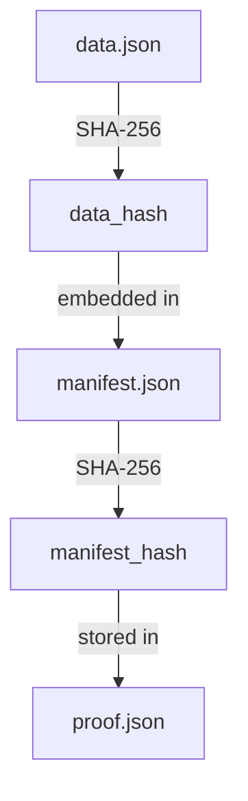
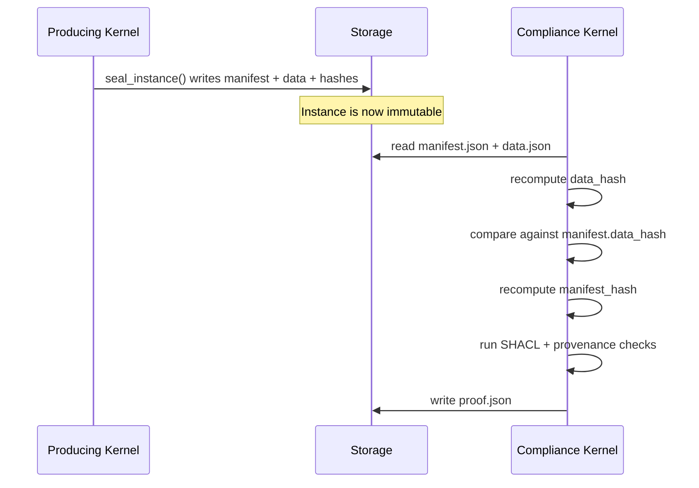

# Proof Model

::: info v3.5 alpha-3
The materialised proof model was introduced in CKP v3.5 alpha-3. The SVID signing component is planned but not yet implemented.
:::

The CKP proof model provides verifiable integrity for every sealed instance. When a kernel seals an instance, CK.Lib computes cryptographic hashes and embeds them in the manifest. When a compliance kernel later verifies the instance, it produces a `proof.json` that records every check performed and its outcome.

## Hash Chain

Every sealed instance carries two SHA-256 hashes computed at seal time:

**data_hash** is the SHA-256 of the `data.json` file contents. This proves that the data has not been modified after sealing.

**manifest_hash** is the SHA-256 of the `manifest.json` file contents (computed after `data_hash` has been written into the manifest). This proves that neither the data nor the metadata have been tampered with.



The chain is intentionally simple. `data_hash` anchors the data. `manifest_hash` anchors everything else -- kernel identity, provenance, timestamps, and the data hash itself. A verifier only needs to recompute these two hashes and compare them against the stored values.

## proof.json Structure

A compliance kernel (such as TechGames.ComplianceCheck) produces a `proof.json` for each verified instance. The proof record contains:

```json
{
  "proof_id": "p-a1b2c3d4-1774176200",
  "instance_id": "i-spawn-a1b2c3d4-1774176123",
  "data_hash": "sha256:e3b0c44298fc1c14...",
  "manifest_hash": "sha256:7d865e959b2466...",
  "outcome": "PASS",
  "checked_by_kernel": "TechGames.ComplianceCheck",
  "checked_by_identity": "ckp://Kernel#TechGames.ComplianceCheck:v1.0",
  "checks": [
    {
      "name": "manifest-schema",
      "type": "SCHEMA",
      "expected": "valid manifest.json",
      "actual": "valid",
      "passed": true
    },
    {
      "name": "data-hash-integrity",
      "type": "INTEGRITY",
      "expected": "sha256:e3b0c44298fc1c14...",
      "actual": "sha256:e3b0c44298fc1c14...",
      "passed": true
    },
    {
      "name": "provenance-chain",
      "type": "PROVENANCE",
      "expected": "wasGeneratedBy, wasAttributedTo present",
      "actual": "both present and valid",
      "passed": true
    },
    {
      "name": "shacl-conformance",
      "type": "SHACL",
      "expected": "conforms to kernel ontology shapes",
      "actual": "conforms",
      "passed": true
    }
  ]
}
```

## Check Types

The proof model defines six categories of verification:

| Check Type | What It Validates |
|------------|-------------------|
| **SCHEMA** | JSON Schema conformance of manifest.json and data.json |
| **SHACL** | SHACL shape conformance against CKP ontology constraints |
| **PROVENANCE** | PROV-O chain integrity (wasGeneratedBy, wasAttributedTo) |
| **STRUCTURE** | File and directory structure (required files exist, naming) |
| **INTEGRITY** | SHA-256 hash verification of data and manifest |
| **OPERATIONAL** | Tool execution correctness (expected output produced) |

A proof outcome is **PASS** if all checks pass, **FAIL** if any critical check fails, and **PARTIAL** if only non-critical checks fail (such as OPERATIONAL checks on optional outputs).

## Verification Flow



The compliance kernel does not need network access to the producing kernel. It only needs access to the sealed instance directory. This means proof verification can happen offline, on a different machine, or at any point in the future as long as the instance files are preserved.

## SVID Signing (Planned)

A future extension will add SPIFFE Verifiable Identity Document (SVID) signing to proof records. When SPIFFE is deployed, the compliance kernel will sign `proof.json` with its SVID, enabling cryptographic verification of both the instance integrity and the identity of the verifier. The `svid` field in the proof record is reserved for this purpose.

Until SVID signing is available, the `checked_by_identity` field and the provenance chain provide the trust anchor. The compliance kernel's own sealed instances serve as proof that it ran the verification.

---

<div style="text-align: center; padding: 2rem 0;">
  <a href="https://discord.gg/sTbfxV9xyU" style="display: inline-block; padding: 0.6rem 1.5rem; background: #5865F2; color: white; border-radius: 6px; font-weight: 600; text-decoration: none;">Discuss Proofs on Discord</a>
</div>
