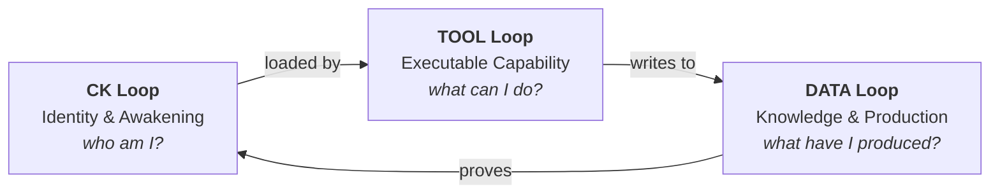

# Three Loops System

::: info v3.5 alpha-3
This spec was introduced in CKP v3.5 alpha-3. It is implemented and validated in production kernels but the specification text is still being refined.
:::

The Three Loops System is the architectural core of CKP v3.5. It replaces the layered architecture of earlier versions (CK_Core, CK_Admission, CK_Ontology, etc.) with a simpler model where every kernel is organised around three independently versioned loops.

## The Model

Each loop has a dedicated storage volume, a clear set of files, and a strict dependency direction. The CK loop is loaded by the TOOL loop but never written to by it. The TOOL loop writes to the DATA loop but never reads production data to modify its own behaviour. The DATA loop proves the CK loop by providing verifiable evidence that the identity was faithfully executed.

## CK Loop

The CK loop contains the kernel's genome: `conceptkernel.yaml`, `README.md`, `CLAUDE.md`, `SKILL.md`, `CHANGELOG.md`, `ontology.yaml`, `rules.shacl`, and `serving.json`. These files are read in a defined order called the awakening sequence. By the time an agent finishes the sequence, it has full knowledge of the kernel's identity, capabilities, constraints, and serving configuration.

The CK loop is the most protected part of the kernel. Changes to the genome are governed by the kernel's declared governance mode and may require consensus. The CK loop is versioned independently -- its version is the kernel's version.

## TOOL Loop

The TOOL loop contains the executable code: `tool/processor.py` and any supporting files. The processor imports `cklib`, reads the CK loop at startup, and registers action handlers. The TOOL loop is where computation happens, but it is constrained by the CK loop's declarations.

The TOOL loop can be updated independently of the CK loop. A bug fix in `processor.py` does not require a genome version bump. However, adding a new action to the processor requires first declaring it in `conceptkernel.yaml` -- the CK loop governs the TOOL loop.

## DATA Loop

The DATA loop is the `storage/` directory: `instances/`, `ledger/`, `proof/`, and `index/`. Every action execution writes here. Instances are append-only -- once sealed, they cannot be modified. The ledger records every event. Proof records verify instance integrity.

The DATA loop grows monotonically. It is the kernel's production history, and it can be independently replicated, backed up, or audited without touching the CK or TOOL loops.

## SeaweedFS Volumes

In production, each loop maps to a dedicated SeaweedFS volume:

| Loop | Volume Name | Purpose |
|------|-------------|---------|
| CK | `ck-{guid}-ck` | Genome files, ontology, constraints |
| TOOL | `ck-{guid}-tool` | Processor, entrypoints, dependencies |
| DATA | `ck-{guid}-storage` | Instances, ledger, proof, indexes |

This separation enables fine-grained access control (the DATA volume can be world-readable while the CK volume is restricted), independent replication policies (DATA grows fast and needs more replicas), and clean backup/restore semantics (restore CK + TOOL to get a fresh kernel, restore DATA to recover history).

## Relationship to Earlier Architecture

The Three Loops System replaces the layered architecture (Layer 0: CK-Core, Layer 1: CK-Ontology, Layer 2: CK-Protocol, Layer 3: User Concepts) and the per-responsibility kernel model (CK_Core, CK_Admission, CK_Proof, CK_Consensus, CK_Constraint, CK_Storage). Those abstractions are now collapsed into the three loops plus CK.Lib as the shared runtime. The edge graph replaces explicit message routing between protocol kernels.

---

  <a href="https://discord.gg/sTbfxV9xyU" style="display: inline-block; padding: 0.6rem 1.5rem; background: #5865F2; color: white; border-radius: 6px; font-weight: 600; text-decoration: none;">Discuss the Spec on Discord</a>

