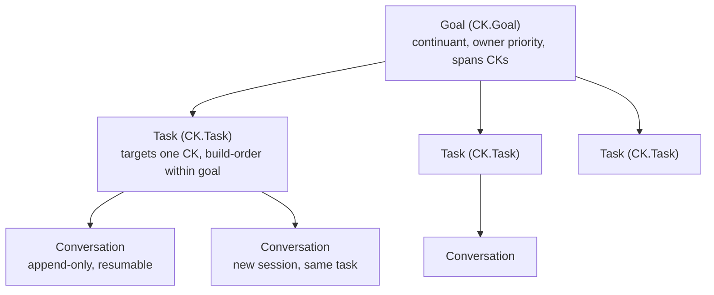

# Autonomous Operations Amendments

CKP v3.4 maps the autonomous operations's three operational loops onto the CK model, turning each kernel into a node in an autonomous business organism. This page collects all autonomous operations amendments in one reference.

## Business Loops

The CK three-loop model is the implementation substrate for the autonomous operations's autonomous business organism. Every autonomous operations operational pattern maps to a specific CKP mechanism. The direction governance model maps directly to CK.Goal -> CK.Task: resource conflicts are detected by CK.ComplianceCheck, consistency violations caught by compliance checks, budget governance enforced by goal priority and task build-dependency sequencing.

| Autonomous Operations Pattern | CKP Implementation | Status |
|-------------------|-------------------|--------|
| Unlimited autonomous directions | CK.Goal instances -- each goal is a direction; tasks distributed across kernels | Implemented |
| Formal task descriptions (machine-executable) | task.yaml in CK.Task storage/ with typed inputs, outputs, quality_criteria, acceptance_conditions | Partial |
| Capability advertisement to registries | spec.actions + capability: block in conceptkernel.yaml; CK.Discovery fleet.catalog | Implemented |
| Audience profile accumulation | `i-audience-{session}/` instances in web-serving kernel storage/ | Future |
| Provenance for all autonomous actions | PROV-O fields in every manifest.json; GPG+OIDC+SVID three-factor audit chain | Partial |
| Deployment as ontological event | `i-deploy-{ts}/` instance with manifests, probe result, operator identity | Implemented |
| SHACL reactive business rules | rules.shacl reactive logic layer; SHACL Advanced Rules for trigger conditions | Future -- stubs only |
| Economic events (ValueFlows/REA) | Sealed instances with vf:EconomicEvent typing; Commitment = amendable instance | Future |

## Formal Tasks

A task instance is not a text description -- it is a typed entity with machine-executable formal properties. The `quality_criteria` and `acceptance_conditions` are what CK.ComplianceCheck validates.

::: warning
A ticket requires human interpretation. A formal task description is directly executable by an autonomous agent. This is the autonomous operations principle.
:::

```yaml
# CK.Task/storage/i-task-{ts}/task.yaml  (v3.4)
type:           ckp:FormalTaskDescription
target_kernel:  ckp://Kernel#Finance.Employee:v1.0
goal:           ckp://Goal#G001:v1.0
order:          1                    # build-dependency sequence within goal

inputs:
  - conceptkernel.yaml               # what to read (CK identity)
  - CLAUDE.md                        # agent instructions
  - SKILL.md                         # available actions

expected_outputs:
  - type: code_change
    target: conceptkernel.yaml

quality_criteria:
  - compliance_check: pass           # CK.ComplianceCheck must pass
  - syntax_valid: true

acceptance_conditions:
  - all_tests_pass: true
  - compliance_all: true             # all checks pass

agent_requirements:
  - capability: code_edit
  - capability: file_read
  - capability: git_commit
```

## Deployment Events

In v3.4, deployment is a formally-typed process. The organism does not run a script -- it instantiates a DeploymentProcess with declared inputs, triggering conditions, post-conditions, and a rollback plan.

```
storage/i-deploy-{ts}/
  manifests/              # input: all platform manifests applied
  probe_result.json       # post-condition: health check outcome
  manifest.json           # PROV-O + BFO provenance
```

```json
{
  "type":                    "ckp:DeploymentProcess",
  "bfo_type":               "BFO:0000015",
  "ckp:input":              "ckp://Kernel#Finance.Employee:v1.0",
  "ckp:triggerCondition":   "all acceptance_conditions pass",
  "ckp:postCondition":      "health probe pass, route rule accepted",
  "ckp:rollbackPlan":       "ckp://Deployment#rollback-Finance.Employee-{ts}",
  "prov:wasAssociatedWith": "ckp://Actor#{operator}",
  "prov:wasAttributedTo":   "ckp://Kernel#CK.Agent:v1.0",
  "prov:generatedAtTime":   "2026-03-14T20:00:02Z"
}
```

::: tip
The instance record is the auditable proof that the deployment occurred. The DeploymentProcess instance links the deployment to its operator, its triggering conditions, and its rollback plan via PROV-O.
:::

## Capability Advertisement

v3.4 adds a `capability:` block to `conceptkernel.yaml` -- the Capability Advertisement that powers the autonomous operations discovery loop. The `spec.actions` block is the machine-readable service description queryable by CK.Discovery and external agents.

```yaml
# conceptkernel.yaml -- v3.4
apiVersion:        conceptkernel/v3
kernel_class:      Finance.Employee
kernel_id:         7f3e-a1b2-c3d4-e5f6
bfo_type:          BFO:0000040
owner:             {operator}
created_at:        2026-03-14T00:00:00Z
ontology_uri:      http://{domain}/ck/finance-employee/v1

namespace_prefix:  TG
domain:            {domain}
project:           ExampleProject

# v3.4 -- capability advertisement (autonomous operations discovery loop)
capability:
  service_type:    "employee data governance"
  pricing_model:   free_tier      # free_tier | per_request | subscription | negotiated
  availability:    deployed       # deployed | staging | local
  sla:             best_effort    # best_effort | 99.9 | 99.99

# v3.4 -- spec.actions (CK.Discovery fleet.catalog serves this)
spec:
  actions:
    common:
      - name: status
        description: Get kernel status and health
        access: anon
      - name: check.identity
        description: Validate kernel against CKP spec
        access: anon
    unique:
      - name: employee.create
        description: Create a new employee concept instance
        access: auth
        params: "name: str, department: str, role: str"
      - name: employee.query
        description: Query employee instances with filters
        access: anon
```

## Audience Profiles

Kernels serving web content write audience interaction events to their DATA loop. Each interaction creates or amends an audience profile instance -- a formal entity tracking topic affinity, engagement depth, and trust trajectory.

::: tip
An audience member is an OWL individual with asserted and inferred properties, not a CRM row. Trust trajectory is implemented as `instance_mutability: amendments_allowed` -- the profile updates with each interaction, each update git-versioned.
:::

```json
{
  "trust_state":          "Explorer",
  "topic_affinity": {
    "cymatics": 0.82,
    "generative_art": 0.65
  },
  "cognitive_style":       "systems-first",
  "depth_preference":      "expert-mode",
  "engagement_count":      14,
  "prov:wasAttributedTo":  "ckp://Kernel#ExampleKernel:v1.0"
}
```

::: details Audience Profile Storage Layout
```
storage/i-audience-{session_id}/
  interaction.json     # what happened: page views, actions, dwell time
  profile.json         # inferred: topic affinity, trust level, cognitive style
  manifest.json        # PROV-O: which kernel wrote this, when, from what input
```
:::

## PROV-O Provenance

Every instance record SHOULD include PROV-O provenance fields linking the instance to the action that created it, the operator who authorised it, and the kernel that produced it. The three-factor audit chain (GPG + OIDC + SVID) from CK.Agent is the full implementation.

```json
{
  "instance_id":              "i-task-1773518402",
  "prov:wasGeneratedBy":      "ckp://Action#CK.Task.task.create-1773518402000",
  "prov:wasAssociatedWith":   "ckp://Actor#{operator}",
  "prov:wasAttributedTo":     "ckp://Kernel#CK.Agent:v1.0",
  "prov:generatedAtTime":     "2026-03-14T20:00:02Z",
  "prov:used": [
    "ckp://Kernel#Finance.Employee:v1.0/conceptkernel.yaml",
    "ckp://Kernel#Finance.Employee:v1.0/CLAUDE.md"
  ]
}
```

::: warning
Every autonomous action must trace to its playbook, its executing agent, and its input data. A kernel that produces instances without provenance fails `check.provenance` in CK.ComplianceCheck.
:::

## Direction Governance

v3.2 adds a three-level work management hierarchy spanning the fleet. v3.4 maps this directly to the autonomous operations's unlimited autonomous directions model: a Goal IS a direction -- a formally-typed autonomous pursuit with a declared goal state, kernel agents assigned to pursue it, resources allocated by priority, and a termination condition that the compliance engine can evaluate.



| Level | Kernel | BFO Type | Storage | Key Properties |
|-------|--------|----------|---------|----------------|
| Goal | CK.Goal | BFO:0000040 (continuant) | CK.Goal/storage/ | Owner-assigned priority; spans multiple CKs; groups tasks |
| Task | CK.Task | BFO:0000040 + lifecycle | `CK.Task/storage/i-task-{conv_guid}/` | Targets one CK; build-order within goal; pending -> in_progress -> completed |
| Conversation | CK.Task | BFO:0000015 (occurrent) | `task/conversation/c-{conv_id}.jsonl` | Append-only; bound to task; resumable -- new file per session |

::: details Task Instance Layout
```
i-task-{conv_guid}/              # folder name = agent conversation GUID
├── manifest.json                # status, target_ck, goal_id, priority, order
├── conversation_ref.json        # { conv_guid, path } -- bidirectional link
├── conversation/                # occurrent records
│   ├── c-{id_1}.jsonl          # first session
│   └── c-{id_2}.jsonl          # resumed session
├── ledger.json                  # state transitions (NATS-driven, append-only)
└── data.json                    # sealed at task.complete (write-once)
```
:::

::: details Task State Machine
```
pending -> NATS: input.CK.Task  { action: task.start, task_id: '...' }
              -> ledger.json appended: { before: pending, after: in_progress }

in_progress -> NATS: input.CK.Task { action: task.update, delta: {...} }
              -> ledger.json appended: { before: {...}, after: {...} }

in_progress -> NATS: input.CK.Task { action: task.complete, output: {...} }
              -> data.json written ONCE (sealed)
              -> ledger.json appended: { before: in_progress, after: completed }
              -> result.CK.Task published
```
:::

## Archetypes

v3.4 maps system kernels to four autonomous operations kernel archetypes. CK.Agent is the universal operator -- it can inhabit any archetype by loading the target kernel's context.

| Autonomous Operations Archetype | CKP Kernels | qualities.type | Autonomous Operations Role |
|---------------------|-------------|----------------|-----------------|
| Executor | CK.Task, CK.Workflow | node:hot | Receives formal task description, executes playbook, writes sealed instance with PROV-O trace |
| Registrar | CK.Discovery, CK.Ontology | service | Publishes fleet capability catalog; answers fleet.catalog queries; maintains semantic registries |
| Monitor | CK.ComplianceCheck, CK.Probe | service | Validates fleet against spec; detects anomalies; executes SHACL reactive rules; health monitoring |
| Personaliser | (domain kernels) | node:cold | Adapts content per audience profile; writes `i-audience-{session}/` instances; serves web/ surface |
| Universal Operator | CK.Agent | agent | Reads any kernel context (identity+skills+memory), executes tasks, manages conversations -- inhabits any archetype |

## ValueFlows and REA

The autonomous operations document identifies ValueFlows (built on REA) as the operational framework for agent-to-agent commerce. v3.4 maps the ValueFlows vocabulary onto the CKP instance model.

::: warning Current Status: Future Work
No CKP kernels currently handle economic transactions. The instance model supports ValueFlows natively -- economic events are sealed instances with appropriate BFO typing. This section defines the mapping so implementation is unambiguous when it begins.
:::

| ValueFlows Entity | CKP Instance Type | instance_mutability | BFO Type |
|-------------------|-------------------|---------------------|----------|
| vf:EconomicEvent | Sealed instance: service delivered, invoice paid, API call consumed | sealed | BFO:0000030 (Object) |
| vf:Commitment | Amendable instance: bilateral obligation -- can be fulfilled or cancelled | amendments_allowed | BFO:0000030 (Object) |
| vf:Agreement | Amendable instance: formal binding of Commitments | amendments_allowed | BFO:0000030 (Object) |
| vf:Process | Workflow execution instance: multi-step production sequence | sealed | BFO:0000015 (Process) |
| vf:Agent | Any CK with qualities.type: agent | -- | BFO:0000040 (Material Entity) |
| vf:EconomicResource | Capability entry in spec.actions + capability: block | -- | BFO:0000030 (Object) |

::: details Economic Event Instance (Target Architecture)
```json
{
  "type":                    "vf:EconomicEvent",
  "bfo_type":               "BFO:0000030",
  "instance_mutability":    "sealed",
  "vf:action":              "vf:deliverService",
  "vf:provider":            "ckp://Kernel#ExampleKernel:v1.0",
  "vf:receiver":            "ckp://Actor#client-acme-corp",
  "vf:resourceInventoriedAs":"ckp://Kernel#ExampleKernel:v1.0/actions/example.render",
  "vf:hasPointInTime":      "2026-03-14T20:00:02Z",
  "prov:wasGeneratedBy":    "ckp://Action#ExampleKernel.example.render-1773518402000",
  "prov:wasAssociatedWith": "ckp://Actor#client-acme-corp"
}
```
:::

## SHACL Rules

SHACL operates at three levels in the CKP: the tool-to-storage contract, the awakening sequence, and the compliance engine.

### Tool-to-Storage Contract

The tool's only obligation toward the DATA loop is to write a conforming instance into `storage/` when it produces an output. The instance must conform to the CK's `rules.shacl` before the write is accepted. Everything else -- proof generation, ledger entry, index update -- is handled by the platform after the tool writes data.json.

```json
{
  "instance_id":   "<short-tx>",
  "kernel_class":  "Finance.Employee",
  "kernel_id":     "7f3e-a1b2-c3d4-e5f6",
  "tool_ref":      "refs/heads/stable",
  "ck_ref":        "refs/heads/stable",
  "created_at":    "2026-03-14T10:00:00Z",
  "data": {}
}
```

### Awakening Sequence

When a CK wakes it reads its identity files in strict order. `rules.shacl` is the 7th file read -- it answers "I am constrained by":

| Order | File | Question Answered |
|-------|------|-------------------|
| 1 | conceptkernel.yaml | I am |
| 2 | README.md | I exist because |
| 3 | CLAUDE.md | I behave like this |
| 4 | SKILL.md | I can do these |
| 5 | CHANGELOG.md | I have become |
| 6 | ontology.yaml | My world is shaped |
| 7 | rules.shacl | I am constrained by |
| 8 | serving.json | Which version am I |

### Compliance Engine

v3.4 extends CK.ComplianceCheck to execute SHACL Advanced Rules as part of governance. When conditions match in the knowledge graph, the compliance engine can materialise new triples and trigger governance actions.

::: tip
Currently `rules.shacl` files are permissive stubs. As kernels mature they accumulate domain-specific reactive rules. The SHACL layer is the bridge between static compliance checking and dynamic governance.
:::
