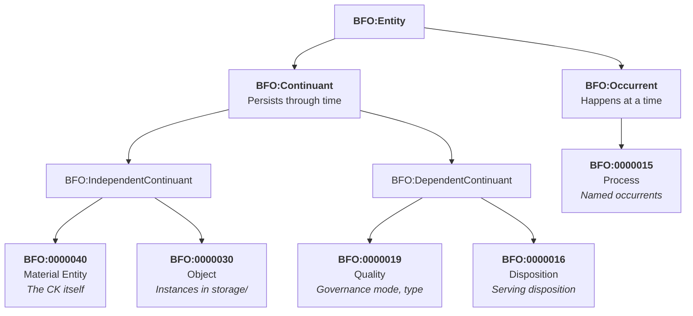

# Ontological Governance: BFO 2020 Typing

Every entity in the CKP is assigned a BFO 2020 type. The SPIFFE URN, CKP URN, and PROV-O chains are three orthogonal identity systems that coexist:

- **SPIFFE** authenticates workloads
- **CKP URNs** address knowledge entities
- **PROV-O** traces causal history

## BFO Class Hierarchy



## Complete Type Mapping

| BFO Type | BFO ID | CKP Entity / Named Occurrent | Loop |
|----------|--------|------------------------------|------|
| Material Entity | BFO:0000040 | The CK itself -- GUID-bound, namespace-prefixed identity | CK loop |
| Occurrent | BFO:0000001 | Commits, tool executions, tool calls (happen at a time) | CK + TOOL loop |
| Object | BFO:0000030 | Instances in storage/, proof files, exported datasets | DATA loop |
| TaskCreation | BFO:0000015 | action `task.create` -> TaskCreation occurrent -> ledger.json | DATA loop (CK.Task) |
| IdentityCheck | BFO:0000015 | action `check.identity` -> IdentityCheck -> proof.json | DATA loop (CK.ComplianceCheck) |
| ConversationSession | BFO:0000015 | action `spawn/chat` -> ConversationSession -> conversation.jsonl | DATA loop (CK.Task) |
| WorkflowExecution | BFO:0000015 | action `workflow.execute` -> WorkflowExecution -> data.json | DATA loop |
| TaskMutation | BFO:0000015 | action `task.update` -> TaskMutation -> ledger.json before/after | DATA loop (CK.Task) |
| InlineDeployment | BFO:0000015 | action `deploy.inline` -> InlineDeployment -> manifests/ | TOOL loop |
| Information Content Entity | BFO:0000030 sub | ontology.yaml, rules.shacl, CK custom resource, CKI | CK + DATA loop |

## CK as Material Entity -- Turtle

```turtle
@prefix ck:   <http://example.org/ck/> .
@prefix bfo:  <http://purl.obolibrary.org/obo/> .
@prefix prov: <http://www.w3.org/ns/prov#> .
@prefix xsd:  <http://www.w3.org/2001/XMLSchema#> .

# The Concept Kernel as Material Entity
# A bounded, independently-existing computational object
ck:Finance.Employee.7f3e  a bfo:BFO_0000040 ;
    rdfs:label         "Finance.Employee instance 7f3e" ;
    rdfs:comment       "A kernel that represents and governs employee concepts." ;
    ck:kernelClass     "Finance.Employee" ;
    ck:guid            "7f3e-a1b2-c3d4-e5f6" ;
    ck:ckRef           "refs/heads/stable" ;
    ck:toolRef         "refs/heads/stable" ;
    ck:ontologyURI     <http://example.org/ck/finance-employee/v1> ;
    prov:wasAttributedTo <mailto:operator@example.org> ;
    ck:created         "2026-03-14T00:00:00Z"^^xsd:dateTime .
```

## Instance as Object -- Turtle

```turtle
# An instance in storage/ is a bfo:Object
# It persists independently of the execution that created it
ck:instance-Finance.Employee.7f3e.abc123  a bfo:BFO_0000030 ;
    rdfs:label          "Finance.Employee instance abc123" ;
    ck:producedBy       ck:execution-7f3e-2026-03-14-001 ;
    prov:wasGeneratedBy ck:execution-7f3e-2026-03-14-001 ;
    ck:storedAt         "storage/instance-abc123/data.json" ;
    ck:ckRef            "refs/heads/stable" ;
    ck:toolRef          "refs/heads/stable" ;
    ck:conformsTo       <http://example.org/ck/finance-employee/v1/output-schema> ;
    ck:createdAt        "2026-03-14T10:00:07Z"^^xsd:dateTime ;
    ck:isAccessibleBy   ck:CK.Query .
```

## SPARQL Query Library

::: info Aspirational -- Filesystem First
These SPARQL queries describe intended semantics. The filesystem IS the occurrent store -- no graph database installation required. Current operations use filesystem scans via the URN resolver. Graph database integration is a future query layer.
:::

### All Material Entities (active kernels)

```sparql
PREFIX bfo: <http://purl.obolibrary.org/obo/>
PREFIX ck:  <http://example.org/ck/>
SELECT ?kernel ?class ?ckRef ?toolRef WHERE {
  ?kernel  a bfo:BFO_0000040 ;
           ck:kernelClass ?class ;
           ck:ckRef       ?ckRef ;
           ck:toolRef     ?toolRef .
}
```

### All instances produced by a CK (last 24h)

```sparql
PREFIX bfo: <http://purl.obolibrary.org/obo/>
PREFIX ck:  <http://example.org/ck/>
PREFIX xsd: <http://www.w3.org/2001/XMLSchema#>
SELECT ?instance ?storedAt ?createdAt WHERE {
  ?instance  a bfo:BFO_0000030 ;
             ck:producedBy  ?exec ;
             ck:storedAt    ?storedAt ;
             ck:createdAt   ?createdAt .
  ?exec ck:executesKernel ck:Finance.Employee.7f3e .
  FILTER(?createdAt >= NOW() - 'PT24H'^^xsd:duration)
}
ORDER BY DESC(?createdAt)
```

### CK loop commits that changed schema

```sparql
PREFIX ck: <http://example.org/ck/>
SELECT ?commit ?message ?timestamp WHERE {
  ?commit  ck:affectsSchema true ;
           ck:message       ?message ;
           ck:timestamp     ?timestamp ;
           ck:modifies      ck:Finance.Employee.7f3e .
}
ORDER BY DESC(?timestamp)
```

### Cross-CK access audit

```sparql
PREFIX ck: <http://example.org/ck/>
SELECT ?accessor ?instance ?accessedAt WHERE {
  ?event  a ck:DataAccessEvent ;
          ck:accessor    ?accessor ;
          ck:onInstance  ?instance ;
          ck:accessedAt  ?accessedAt .
}
ORDER BY DESC(?accessedAt)
```
