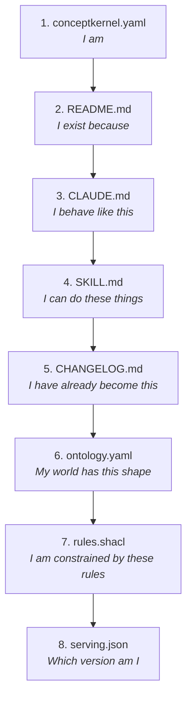

# Introduction

## Executive Summary

The Concept Kernel Protocol (CKP) governs how a Concept Kernel exists, wakes into being, executes its purpose, and accumulates knowledge. A Concept Kernel is a **Material Entity** (`BFO:0000040`): a persistently-identified, spatially-bounded computational object with a single unified filesystem tree and three independently-versioned repositories.

The Three Loops are not separate subsystems. They are three modes of being of the same Material Entity -- each loop a different answer to a different existential question:

| Loop | Existential Question | BFO Basis | Filesystem Volume | Write Authority |
|------|---------------------|-----------|-------------------|-----------------|
| **CK** | Who am I and why am I? | BFO:0000040 | `ck-{guid}-ck` | Operator / CI pipeline |
| **TOOL** | What can I do? | bfo:Occurrent | `ck-{guid}-tool` | Tool developer / CI pipeline |
| **DATA** | What have I produced? | bfo:Object | `ck-{guid}-storage` | Kernel runtime only |

The loops exist in a deliberate dependency order: **DATA is the purpose**; TOOL exists to serve DATA; the CK loop exists to define and sustain both.

::: info Version History
v3.5 integrates the Ontological Enterprise v1.1 white paper, adding formal task descriptions, capability advertisement, audience profiles, PROV-O instance provenance, ODRL-to-grants mapping, four kernel archetypes, direction governance, ValueFlows/REA economic events, and SHACL reactive business logic. v3.4 added mid-level ontology imports (IAO, CCO, PROV-O, ValueFlows) and the Description Logic box mapping. v3.3 added instance versioning, mutation policy, and git-native proof rebuild. v3.2 grounded the protocol in implementation findings from 27 deployed kernels, 312 compliance checks, and 215 actions across a reference fleet.
:::

## The Concept Kernel as Material Entity

A Concept Kernel is typed in BFO 2020 as a **Material Entity** (`BFO:0000040`): an independently-existing, spatially-bounded object. This is not a metaphor. It has architectural consequences at every level of the system.

| Material Entity Property | Architectural Consequence |
|--------------------------|--------------------------|
| **Independently existing** | The CK has a GUID-based identity that persists across version changes, instance executions, and data accumulation. The identity is never derived from any single commit or output. |
| **Spatially bounded** | The CK occupies a definite filesystem root: `{class}/{guid}/`. Everything inside this root belongs to this kernel and no other. |
| **Persists through time** | The CK loop repo (git) records the CK's evolution. New commits change what the CK is capable of without erasing what it was. |
| **Has parts** | The three repos are parts of the Material Entity. The TOOL repo is the capability organ. The storage repo is the memory organ. The CK root repo is the identity organ. |
| **Participates in processes** | When the CK executes, it creates an Occurrent -- a bounded process in time. That process is governed by the TOOL loop. Its output is a new Object in the DATA loop. |
| **Can cooperate with others** | Dependency relationships to other CKs are declared in the CK loop. A CK may read another CK's DATA loop output but may never write to it. Boundaries are sovereign. |

### The Awakening Sequence

When a CK starts -- whether invoked by an operator, a scheduler, or another kernel -- it reads itself into existence in sequence:

Only after this sequence is complete does the CK begin acting. No external configuration service is needed. The directory IS the configuration.
