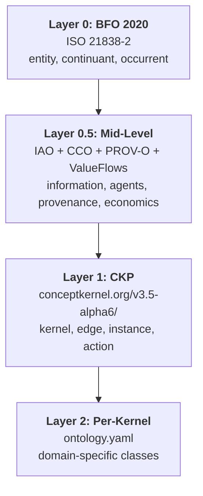

# Ontology Layering Strategy

CKP adopts a four-layer import chain grounded in established ontologies:

## Imported Ontologies (Layer 0.5)

| Ontology | IRI | Scope | Grounds these CKP concepts |
|----------|-----|-------|---------------------------|
| **IAO** | `http://purl.obolibrary.org/obo/iao.owl` | Information entities | KernelOntology -> iao:Document, Instance -> iao:DataItem, Action -> iao:PlanSpecification, Contracts -> iao:DirectiveInformationEntity, ProcessorCode -> iao:Algorithm |
| **CCO Agent** | `cco:AgentOntology` | Agents, roles, organizations | Kernel -> cco:Agent, Project -> cco:Organization, RBAC -> cco:Role |
| **CCO Artifact** | `cco:ArtifactOntology` | Artifacts, specifications | Edge -> cco:Artifact, ServingDisposition -> cco:Specification |
| **CCO Information Entity** | `cco:InformationEntityOntology` | Information, documents | Aligns with IAO for richer information typing |
| **CCO Event** | `cco:EventOntology` | Events, actions | Action subtypes -> cco:Event |
| **PROV-O** | `http://www.w3.org/ns/prov#` | Provenance chains | Instance -> prov:Entity, Action -> prov:Activity, Kernel -> prov:Agent |
| **ValueFlows** | `https://w3id.org/valueflows#` | Economic events (REA) | Payment -> vf:EconomicEvent, Route/Agreement -> vf:Agreement, 402 Response -> vf:Commitment |

## Key Reclassifications from v3.4

The move from BFO-direct typing to mid-level ontology alignment corrects several overloaded type assignments:

| CKP Class | v3.4 (BFO direct) | v3.5 (via mid-level) | Rationale |
|-----------|--------------------|---------------------|-----------|
| `ckp:KernelOntology` | bfo:0000020 (Quality) | iao:0000310 (Document) | An ontology is a document, not a quality of the kernel |
| `ckp:Instance` | bfo:0000031 (GenDepCont) | iao:0000027 (DataItem) | An instance is a truthful data item about something |
| `ckp:Edge` | bfo:0000031 (GenDepCont) | cco:Artifact | An edge is a constructed artifact connecting kernels |
| `ckp:Kernel` | bfo:0000040 (MaterialEntity) | cco:Agent + bfo:0000040 | A kernel is both material entity AND agent -- it acts |
| `ckp:Action` | bfo:0000015 (Process) | iao:0000104 (PlanSpecification) | An action is a plan specification that gets realized as a process |
| `ckp:Project` | (not in v3.4) | cco:Organization | A project organizes kernels into a coherent unit |
| `ckp:QueueContract` | bfo:0000016 (Disposition) | iao:0000017 (DirectiveInfoEntity) | A contract directs how to interact, not just a capability |

## Deliberately Skipped Ontologies

::: details Ontologies deferred for future versions
| Ontology | Reason for deferral | Revisit when |
|----------|-------------------|--------------|
| **CCO Geospatial** | CKP kernels don't have physical location yet | Geo-distributed kernels across data centres; spatial service clustering |
| **CCO Facility** | No physical infrastructure modelling needed | Modelling cluster topology, rack placement, or edge nodes ontologically |
| **CCO Units of Measure** | `xsd:decimal` sufficient for current metrics | Quality-of-service SLAs need formal measurement with uncertainty |
| **CCO Quality** | BFO:0000019 sufficient for kernel qualities | Quality scoring needs richer dimensional analysis |
| **CCO Time** | `xsd:dateTime` sufficient for timestamps | Temporal reasoning (Allen intervals, duration calculus, scheduling) |
| **CCO Currency Unit** | ValueFlows covers economic events | Multi-currency support requiring ISO 4217 modelling |
| **ODRL** | Grants block in conceptkernel.yaml is simpler | Fine-grained policy composition across fleet; machine-readable licensing |
| **Hydra Core** | REST API descriptions handled by OpenAPI | Hypermedia-driven API discovery; self-describing endpoints |
| **SWRL** | SHACL rules sufficient for validation | Complex temporal/conditional business rules; reactive governance |
:::
