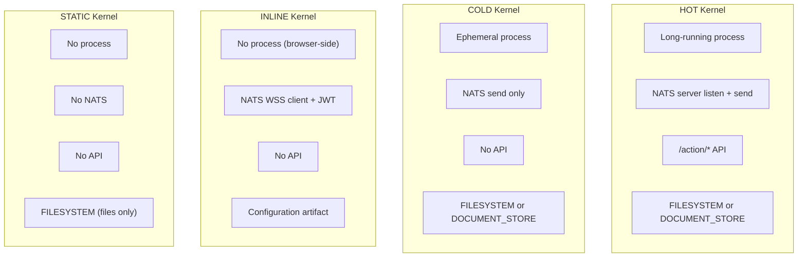

# Implementation Patterns

This page collects the canonical implementation patterns that apply across all CKP kernels.

## Dual-Store Pattern

::: tip Protocol Guidance
When a kernel uses both `ckp:FILESYSTEM` and `ckp:DOCUMENT_STORE` storage media, the `StorageContract` must declare which entities live where. Entities in the document store SHOULD be mirrored as minimal RDF triples in the graph database for cross-entity SPARQL queries. The document store is the authoritative source; the graph is a queryable index.
:::

When a kernel uses both filesystem and document database storage media, entities exist in two worlds. The ontology defines both, but only one is queryable via SPARQL. The dual-store pattern solves this by establishing the document store as authoritative with graph-side indexing.

## Classification Pattern

Classification is a `ckp:Action` (BFO:0000015 Process) that SHOULD be typed as a pipeline stage. The classification method (keyword, LLM, OWL DL reasoning, SHACL) is a property of the action, not a protocol constraint.

::: warning
The result (category assignment) MUST be stored as an RDF triple (`?entity ckp:hasCategory ?category`), regardless of how it was computed.
:::

## Quality Assessment Pattern

Quality assessment is a `sosa:Observation` that produces a quality score (BFO:0000019). The observation method and weights are properties of the assessment action. Scores MAY be pre-computed for performance, but the computation SHOULD be reproducible from the underlying signals via SPARQL or code.

::: tip
The weights themselves are ontological -- they should be declared in the kernel's `ontology.yaml`, not buried in pipeline code.
:::

## Composition Pattern

Composition checking is a `ckp:Action` that validates whether two entities can be chained. The ontology SHOULD declare composition relationships as OWL object properties. Whether inference is done at query time (SPARQL) or materialised in advance (pipeline) is an implementation choice.

::: warning
The relationship MUST exist in the ontology, not only in code.
:::

## Economic Event Pattern

Economic events (payments, revenue splits, commitments) are modeled via ValueFlows:

| Protocol Concept | ValueFlows Class | CKP Instance |
|-----------------|-----------------|--------------|
| Payment Required (402 response) | `vf:Commitment` | ABox instance with amount, network, payTo |
| Payment received | `vf:EconomicEvent` | Linked to workflow via `prov:wasAssociatedWith` |
| Service execution | `vf:EconomicEvent` | One per workflow step, linked to service |
| Revenue split | `vf:EconomicEvent` | Platform fee + creator royalty as separate events |
| Workflow agreement | `vf:Agreement` | The workflow itself -- steps, prices, terms |

::: warning
Every economic event MUST produce a `prov:Activity` instance with a transaction hash (when on-chain) or execution ID (when off-chain).
:::

## Pipeline Stage Pattern

Every kernel with a data pipeline MUST type its stages as subclasses of `ckp:Action` (BFO:0000015) and `prov:Activity`. Input and output artifacts MUST be declared as `prov:Entity` with `prov:used` and `prov:generated` relationships.

::: info
This is the only way to answer "where did this data come from?" across the fleet.
:::

## Provenance Mandate

PROV-O is not optional. Every `ckp:Action` that produces or mutates a `ckp:Instance` MUST record:

```
prov:wasGeneratedBy    -> links Instance to the Action that created it
prov:wasAttributedTo   -> links Instance to the Kernel that produced it
prov:generatedAtTime   -> timestamp
prov:wasAssociatedWith -> links Action to the Kernel
prov:used              -> links Action to its input entities
```

This is enforced by `check.provenance` in CK.ComplianceCheck. A kernel that produces instances without provenance fails compliance.

## Kernel Type Matrix

The kernel type determines the disposition matrix:



| Type | Process | NATS | API | Storage | Web | Deployment |
|------|---------|------|-----|---------|-----|------------|
| **HOT** | long-running | server listen + send | `/action/*` | FILESYSTEM or DOCUMENT_STORE | optional | VOLUME or CONFIGMAP_DEPLOY |
| **COLD** | ephemeral, execute + exit | send only | none | FILESYSTEM or DOCUMENT_STORE | optional | VOLUME or CONFIGMAP_DEPLOY |
| **INLINE** | none (browser-side) | WSS client + JWT | none | configuration artifact | always (IS the web) | INLINE_DEPLOY |
| **STATIC** | none | none | none | FILESYSTEM | always (files only) | FILER or VOLUME |

::: tip
The processor harness (`KernelProcessor` in CK.Lib.Py) reads `qualities.type` from `conceptkernel.yaml` and configures itself accordingly. One codebase, four modes.
:::

### NATS Harness Behaviour Per Type

| Type | NATS Connection | Subscribe | Publish | Auth |
|------|----------------|-----------|---------|------|
| **HOT** | Server-side, persistent | `input.{kernel}` | `result.{kernel}`, `event.{kernel}` | NATS NKey or JWT-SVID |
| **COLD** | Server-side, ephemeral | None (invoked externally) | `result.{kernel}`, `event.{kernel}` | NATS NKey or JWT-SVID |
| **INLINE** | Browser WSS via CK.Lib.Js | `result.{kernel}`, `event.{kernel}` | `input.{kernel}` | Identity provider JWT |
| **STATIC** | None | None | None | None |

## Implementation Roadmap

| Phase | Weeks | Name | Deliverables | Gate |
|-------|-------|------|-------------|------|
| 0 | 1-2 | Infrastructure | Distributed filesystem, NATS JetStream, graph database, identity provider | Health checks green |
| 1 | 3-5 | CK Mint | Platform CLI, 3 git repos, 8 awakening files, apiVersion v3 | CK wakes and reads all files; compliance passes |
| 2 | 6-8 | TOOL Loop | C-P-A triplet, serving.json routing, independent versioning | Wasm tool executes; tool commit != CK commit |
| 3 | 9-11 | DATA Loop + Tasks | CK.Task + CK.Goal deployed; Goal->Task->Conversation hierarchy | 10 tasks complete with sealed data.json |
| 4 | 12-14 | Compliance | CK.ComplianceCheck deployed; 13 check types | All checks pass; 0 warns; 0 fails |
| 5 | 15-17 | Cooperation + SPIFFE | SPIRE deployed; grants block; mTLS; NATS SPIFFE plugin | Cross-CK read verified by SVID |
| 6 | 18-24 | Scale and Operate | Action composition; URN resolver; cost monitoring; canary + rollback | 30-day autonomous operation |
