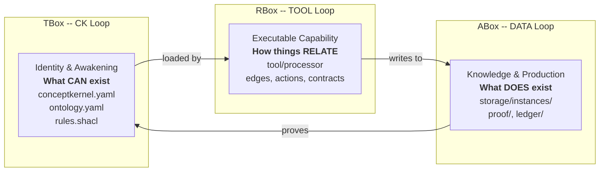
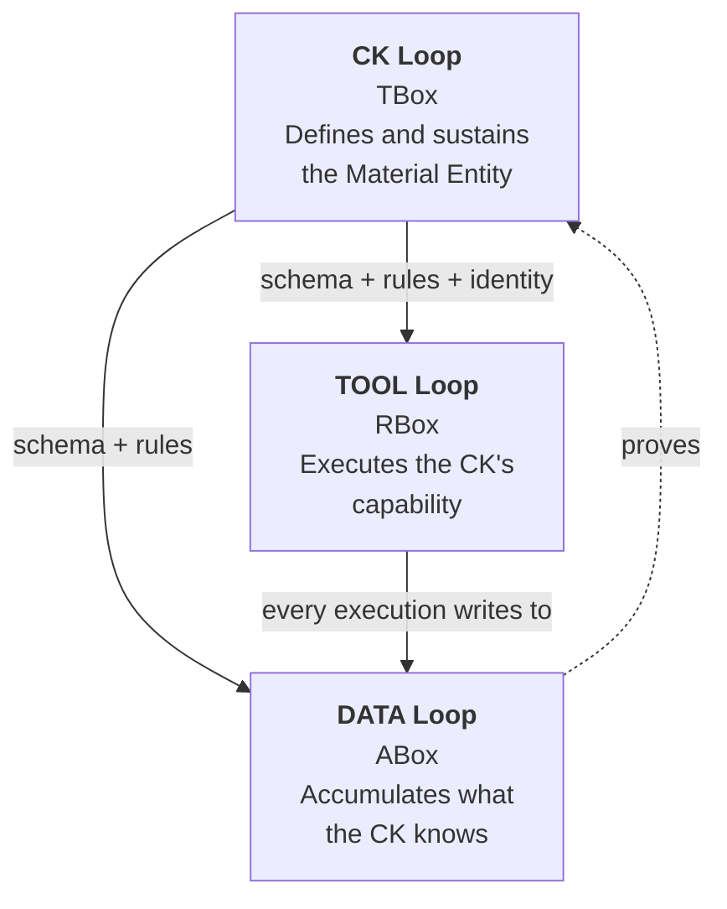

# The Three Loops as Description Logic Boxes

The three CKP loops map directly to the three boxes of OWL 2 Description Logic. This is the foundational architectural insight of the protocol.

::: warning This is the Key Page
The DL box mapping is not a metaphor. Each loop is physically realized as an independently-versioned volume. The separation has consequences for versioning, write authority, security, and migration.
:::

## The Mapping

| DL Box | CKP Loop | Contents | What It Defines |
|--------|----------|----------|-----------------|
| **TBox** (terminological) | CK Loop | `conceptkernel.yaml`, `ontology.yaml`, `rules.shacl` | The kernel's type -- what CAN exist |
| **RBox** (relational) | TOOL Loop | `tool/processor`, edges, actions, contracts | How the kernel relates and operates |
| **ABox** (assertional) | DATA Loop | `storage/instances/`, `proof/`, `ledger/` | What the kernel has produced -- individuals of the TBox type |

## Independence in Practice

Each box is physically realized as an independently-versioned volume. This means:

**TBox changes do not require RBox changes.** Updating the kernel's ontology does not require recompiling the tool. The schema evolves on its own schedule.

**RBox changes do not affect the ABox.** A kernel upgrades its tool from v1 to v2. The RBox (TOOL loop) changes -- new processor, new dependencies. The TBox (CK loop) and ABox (DATA loop) are untouched. Existing instances produced by v1 remain valid. The kernel's identity does not change. Only the relational box -- how it operates -- is versioned forward.

**The ABox proves the TBox.** Every instance in `storage/` is an individual of the type defined in the TBox. The proof records in `proof/` demonstrate conformance. This closes the accountability cycle.

::: tip Future: Database-Backed Boxes
The filesystem is the current physical layer. In future versions, TBox definitions may be served from a graph database (RDF/SPARQL) and ABox instances from a document database. The RBox (tool) remains filesystem -- it is executable code, not query results. The three-loop separation makes this migration transparent: swap the storage layer per loop without affecting the others.
:::

## Dependency Order

The loops are not peers. They exist in a deliberate dependency order that reflects the purpose of the Material Entity:

| Loop | Exists For | Depends On | Serves |
|------|-----------|------------|--------|
| **DATA** | Accumulating what the CK knows and has produced | TOOL (to produce instances), CK (for schema + rules) | Other CKs via grants; the web/ surface; llm/ memory |
| **TOOL** | Executing the CK's capability | CK loop (for ontology, rules, identity) | DATA loop -- every tool execution writes to storage/ |
| **CK** | Defining and sustaining the Material Entity | Nothing -- this is the root | TOOL loop (schema, rules, identity) and DATA loop (schema, rules) |

## The Separation Axiom

::: warning Critical Rule
A storage write (DATA) must **never** cause a CK loop commit. A tool execution (TOOL) must **never** rewrite `ontology.yaml` or `rules.shacl`. A CK loop commit must **never** write directly to `storage/`. These boundaries are enforced by write authority rules on each filesystem volume -- not by convention.
:::

| Boundary | What Is Forbidden | Why |
|----------|-------------------|-----|
| TOOL -> CK loop | Tool execution writing to any file in the CK root volume | CK identity is operator-governed -- runtime cannot alter who the CK is |
| DATA -> CK loop | Storage writes causing commits to conceptkernel.yaml or schema | Identity and schema are design-time artifacts -- not derived from outputs |
| DATA -> TOOL | Instance data retroactively modifying tool source or config | Tools are versioned independently -- instances are their outputs, not inputs to their definition |
| CK -> DATA direct | A CK loop commit writing an instance into storage/ | Instances are produced by tool execution -- they require the full tool-to-storage contract |
| CK B -> CK A writes | Any kernel writing to another kernel's CK or TOOL volume | Volumes are sovereign -- another CK may only read DATA loop outputs via declared access |

## Security Enforcement

The DL box separation is enforced at the infrastructure level through volume driver `readOnly` flags:

| DL Box | Loop | Volume `readOnly` | Consequence |
|--------|------|-------------------|-------------|
| TBox | CK | `true` | Runtime process cannot modify identity or ontology |
| RBox | TOOL | `true` | Runtime process cannot modify its own code |
| ABox | DATA | `false` | Runtime process writes instances, proofs, ledger |

This makes the Separation Axiom physically impossible to violate, not merely a convention.
