# Ontological Governance: BFO 2020 Typing

Every entity in the CKP is assigned a BFO 2020 type. The SPIFFE URN, CKP URN, and PROV-O chains are three orthogonal identity systems that coexist: SPIFFE authenticates workloads, CKP URNs address knowledge entities, PROV-O traces causal history.

## BFO Type Hierarchy

```mermaid
classDiagram
    class BFO_Entity["BFO:Entity"]
    class Continuant["BFO:Continuant"]
    class Occurrent["BFO:Occurrent"]
    class IndependentContinuant["BFO:IndependentContinuant"]
    class MaterialEntity["BFO:0000040\nMaterialEntity"]
    class Quality["BFO:0000019\nQuality"]
    class Disposition["BFO:0000016\nDisposition"]
    class Role["BFO:0000023\nRole"]
    class Realizable["BFO:RealizableEntity"]
    class Process["BFO:0000015\nProcess"]
    class Object["BFO:0000030\nObject"]
    class ICE["BFO:0000030 sub\nInformationContentEntity"]
    class TemporalRegion["BFO:0000008\nTemporalRegion"]
    class SpatialRegion["BFO:0000006\nSpatialRegion"]

    class CKP_Kernel["ckp:Kernel\n(CK itself)"]
    class CKP_Instance["ckp:Instance\n(storage/ objects)"]
    class CKP_KernelType["ckp:KernelType\n(HOT/COLD/INLINE/STATIC)"]
    class CKP_GovernanceMode["ckp:GovernanceMode\n(STRICT/RELAXED/AUTONOMOUS)"]
    class CKP_ServingDisposition["ckp:ServingDisposition\n(API/Web/NATS)"]
    class CKP_Grant["ckp:Grant"]
    class CKP_TaskCreation["ckp:TaskCreation"]
    class CKP_IdentityCheck["ckp:IdentityCheck"]
    class CKP_ConversationSession["ckp:ConversationSession"]
    class CKP_WorkflowExecution["ckp:WorkflowExecution"]
    class CKP_TaskMutation["ckp:TaskMutation"]
    class CKP_InlineDeployment["ckp:InlineDeployment"]
    class CKP_ICE["ckp:KernelOntology\n(ontology.yaml, rules.shacl)"]

    BFO_Entity --> Continuant
    BFO_Entity --> Occurrent
    Continuant --> IndependentContinuant
    Continuant --> Realizable
    IndependentContinuant --> MaterialEntity
    IndependentContinuant --> Object
    Object --> ICE
    Realizable --> Quality
    Realizable --> Disposition
    Realizable --> Role
    Occurrent --> Process
    Occurrent --> TemporalRegion
    Continuant --> SpatialRegion

    MaterialEntity --> CKP_Kernel
    Object --> CKP_Instance
    Quality --> CKP_KernelType
    Quality --> CKP_GovernanceMode
    Disposition --> CKP_ServingDisposition
    Role --> CKP_Grant
    Process --> CKP_TaskCreation
    Process --> CKP_IdentityCheck
    Process --> CKP_ConversationSession
    Process --> CKP_WorkflowExecution
    Process --> CKP_TaskMutation
    Process --> CKP_InlineDeployment
    ICE --> CKP_ICE
```



## Complete Type Mapping

| BFO Type | BFO ID | CKP Entity / Named Occurrent | Loop |
|----------|--------|------------------------------|------|
| Material Entity | BFO:0000040 | The CK itself -- GUID-bound, namespace-prefixed identity | CK loop |
| Occurrent | BFO:0000001 | Commits, tool executions, tool calls (happen at a time) | CK + TOOL loop |
| Object | BFO:0000030 | Instances in storage/, proof files, exported datasets | DATA loop |
| TaskCreation | BFO:0000015 | Named: action `task.create` -> TaskCreation occurrent -> ledger.json | DATA loop (CK.Task) |
| IdentityCheck | BFO:0000015 | Named: action `check.identity` -> IdentityCheck -> proof.json | DATA loop (CK.ComplianceCheck) |
| ConversationSession | BFO:0000015 | Named: action `spawn/chat` -> ConversationSession -> conversation.jsonl | DATA loop (CK.Task) |
| WorkflowExecution | BFO:0000015 | Named: action `workflow.execute` -> WorkflowExecution -> data.json | DATA loop |
| TaskMutation | BFO:0000015 | Named: action `task.update` -> TaskMutation -> ledger.json before/after | DATA loop (CK.Task) |
| InlineDeployment | BFO:0000015 | Named: action `deploy.inline` -> InlineDeployment -> manifests/ | TOOL loop |
| Information Content Entity | BFO:0000030 sub | ontology.yaml, rules.shacl, CK custom resource, CKI | CK + DATA loop |

## CK as Material Entity -- Turtle

```turtle
@prefix ck:   <http://{domain}/ck/> .
@prefix bfo:  <http://purl.obolibrary.org/obo/> .
@prefix prov: <http://www.w3.org/ns/prov#> .
@prefix xsd:  <http://www.w3.org/2001/XMLSchema#> .

# The Concept Kernel as Material Entity
# A bounded, independently-existing computational object
ck:Finance.Employee.7f3e  a bfo:BFO_0000040 ;
    rdfs:label         "Finance.Employee instance 7f3e" ;
    rdfs:comment       "A kernel that represents and governs employee concepts." ;
    ck:kernelClass     "Finance.Employee" ;
    ck:guid            "7f3e-a1b2-c3d4-e5f6" ;
    ck:ckRef           "refs/heads/stable" ;
    ck:toolRef         "refs/heads/stable" ;
    ck:ontologyURI     <http://{domain}/ck/finance-employee/v1> ;
    prov:wasAttributedTo <mailto:{operator}> ;
    ck:created         "2026-03-14T00:00:00Z"^^xsd:dateTime .
```

## Instance as Object -- Turtle

```turtle
# An instance in storage/ is a bfo:Object
# It persists independently of the execution that created it
ck:instance-Finance.Employee.7f3e.abc123  a bfo:BFO_0000030 ;
    rdfs:label          "Finance.Employee instance abc123" ;
    ck:producedBy       ck:execution-7f3e-2026-03-14-001 ;
    prov:wasGeneratedBy ck:execution-7f3e-2026-03-14-001 ;
    ck:storedAt         "storage/instance-abc123/data.json" ;
    ck:ckRef            "refs/heads/stable" ;
    ck:toolRef          "refs/heads/stable" ;
    ck:conformsTo       <http://{domain}/ck/finance-employee/v1/output-schema> ;
    ck:createdAt        "2026-03-14T10:00:07Z"^^xsd:dateTime ;
    ck:isAccessibleBy   ck:CK.Query .
```

::: tip
Every named occurrent (TaskCreation, IdentityCheck, etc.) is a subclass of BFO:0000015 (Process). The naming convention makes the BFO grounding explicit in every instance record.
:::
