# CK Loop: Identity and Awakening

> **CK Loop -- Who am I and why am I?**

The CK loop is the identity organ of the Material Entity. It holds everything the CK needs to read itself into existence. It is versioned by the developer -- the human or CI process that governs the CK's evolution. It is the slowest-changing of the three loops and the only one that defines what the CK fundamentally is.

## Awakening Sequence

When a CK wakes it reads its identity files in strict order. Each file answers a progressively more specific question.

| Order | File | Question Answered | Notes |
|-------|------|-------------------|-------|
| 1 | `conceptkernel.yaml` | I am | GUID, class, BFO:0000040, owner, namespace_prefix, domain, project |
| 2 | `README.md` | I exist because | Purpose, goals, what problem this CK solves, who it serves |
| 3 | `CLAUDE.md` | I behave like this | At OPS root -- agent reads here automatically. Folder map, rules, agreements, inter-kernel protocols |
| 4 | `SKILL.md` | I can do these | Action catalog -- reusable capabilities, invocable by self or cooperating CKs |
| 5 | `CHANGELOG.md` | I have become | Completed evolution -- items moved here when done, never deleted |
| 6 | `ontology.yaml` | My world is shaped | LinkML TBox schema -- defines the data shape this CK produces and consumes |
| 7 | `rules.shacl` | I am constrained by | SHACL validation rules -- what instances must conform to before storage writes |
| 8 | `serving.json` | Which version am I | Active version routing -- stable/canary/develop refs for CK and TOOL loops |
| 8a | `.ck-guid` | My SPID is | Canonical UUID source for SPID; separate from kernel_id in YAML for filesystem-level identity tools |
| 9 | SPIRE agent (SPIFFE) | I am cryptographically who I claim | SVID obtained and verified; grants block loaded into access proxy. Skip if `LOCAL.*` prefix (no SPIFFE required) |

```mermaid
graph LR
    A["conceptkernel.yaml<br/><i>I am</i>"] --> B["README.md<br/><i>I exist because</i>"]
    B --> C["CLAUDE.md<br/><i>I behave like this</i>"]
    C --> D["SKILL.md<br/><i>I can do these</i>"]
    D --> E["CHANGELOG.md<br/><i>I have become</i>"]
    E --> F["ontology.yaml<br/><i>My world is shaped</i>"]
    F --> G["rules.shacl<br/><i>I am constrained by</i>"]
    G --> H["serving.json<br/><i>Which version am I</i>"]
    H --> I["SPIRE agent<br/><i>I am who I claim</i>"]

    style A fill:#4a6fa5,color:#fff
    style I fill:#6a8e4e,color:#fff
```



## conceptkernel.yaml -- Identity Document

This is the CK's birth certificate. It carries identity only -- no mounts, no runtime config, no tool references. Those are platform concerns.

v3.4 adds a `capability:` block -- the Capability Advertisement that powers the autonomous operations discovery loop. The `spec.actions` block is the machine-readable service description queryable by discovery kernels and external agents.

```yaml
# conceptkernel.yaml -- v3.4
apiVersion:        conceptkernel/v3   # v2 deprecated; validators warn on v2, reject unknown
kernel_class:      Finance.Employee
kernel_id:         7f3e-a1b2-c3d4-e5f6
bfo_type:          BFO:0000040
owner:             operator@example.org
created_at:        2026-03-14T00:00:00Z
ontology_uri:      http://example.org/ck/finance-employee/v1

# v3.2 -- namespace + domain fields
namespace_prefix:  ACME
domain:            example.org
project:           Acme.Analytics

# v3.4 -- capability advertisement (autonomous operations discovery loop)
capability:
  service_type:    "employee data governance"
  pricing_model:   free_tier      # free_tier | per_request | subscription | negotiated
  availability:    deployed       # deployed | staging | local
  sla:             best_effort    # best_effort | 99.9 | 99.99

# v3.4 -- spec.actions (discovery kernel fleet.catalog serves this)
spec:
  actions:
    common:
      - name: status
        description: Get kernel status and health
        access: anon
      - name: check.identity
        description: Validate kernel against CKP spec
        access: anon
    unique:
      - name: employee.create
        description: Create a new employee concept instance
        access: auth
        params: "name: str, department: str, role: str"
      - name: employee.query
        description: Query employee instances with filters
        access: anon

# URN: ckp://Kernel#ACME.Finance.Employee:v1.0
```

## serving.json -- Active Version Routing

`serving.json` declares which version of the CK loop (and by extension which `tool/` commit) is currently active. It is the only file in the CK loop that is mutated at runtime by the platform -- all other CK loop files are written by the developer.

```json
{
  "kernel_class": "Finance.Employee",
  "versions": [
    { "name": "stable",  "ck_ref": "refs/heads/stable",
                          "tool_ref": "refs/heads/stable",  "weight": 95 },
    { "name": "canary",  "ck_ref": "refs/heads/canary",
                          "tool_ref": "refs/heads/canary",  "weight":  5 },
    { "name": "develop", "ck_ref": "refs/heads/develop",
                          "tool_ref": "refs/heads/develop",  "weight":  0 }
  ],
  "routing": {
    "default": "stable",
    "by_header_X-Kernel-Version": { "canary": "canary", "dev": "develop" }
  }
}
```

## CK Loop NATS Topics

```
ck.{guid}.ck.commit           # CK loop repo -- new commit
ck.{guid}.ck.ref-update       # Branch pointer moved
ck.{guid}.ck.promote          # Version promoted to stable
ck.{guid}.ck.rollback         # Version rolled back
ck.{guid}.ck.canary           # Canary weight updated
ck.{guid}.ck.schema-change    # ontology.yaml or rules.shacl changed
ck.{guid}.ck.depends-on       # Dependency on another CK declared or updated
```

::: tip Version Routing
The `serving.json` weight-based routing enables canary deployments at the kernel level. Traffic splits between stable (95%) and canary (5%) are platform-managed. The `develop` version (weight 0) is only accessible via explicit header routing.
:::
