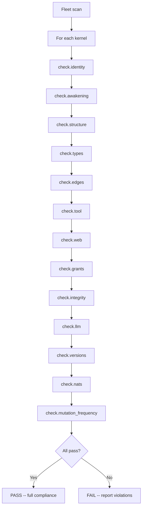

# CK.ComplianceCheck -- Fleet Validator

CK.ComplianceCheck is the platform kernel that validates the entire fleet against the CKP specification. It runs 13 check types as BFO-typed IdentityCheck occurrents.

v3.3 adds `check.mutation_frequency`. v3.4 extends the compliance engine to execute SHACL Advanced Rules as part of governance: when conditions match in the knowledge graph, the compliance engine can materialise new triples and trigger governance actions (e.g., escalate overdue tasks, promote trust trajectories). Currently `rules.shacl` files are permissive stubs -- as kernels mature they accumulate domain-specific reactive rules.

## Check Types

| Check Type | BFO Basis | What It Validates |
|------------|-----------|-------------------|
| `identity` | BFO:0000040 | apiVersion: conceptkernel/v3, is_a, kind, metadata, namespace_prefix, domain, project fields |
| `awakening` | CKP | All 8 awakening files present: yaml, README.md, CLAUDE.md, SKILL.md, CHANGELOG.md, ontology.yaml, rules.shacl, serving.json |
| `structure` | BFO:0000040 | Directory layout -- llm/, tool/, web/, storage/ present |
| `types` | BFO:0000019 | qualities.type, governance_mode, deployment_state declared |
| `edges` | BFO:0000015 | Target exists, predicate valid (COMPOSES/EXTENDS/TRIGGERS/LOOPS_WITH/PRODUCES), no duplicates |
| `tool` | BFO:0000015 | processor.py exists, valid syntax, entrypoint declared |
| `web` | BFO:0000040 | index.html present if serve=true, no broken refs |
| `grants` | BFO:0000023 | grants block present with identity + actions declared |
| `integrity` | BFO:0000144 | Files non-empty, YAML parses, no stale/deprecated fields |
| `llm` | BFO:0000017 | CLAUDE.md at OPS root (not in llm/), SKILL.md sections valid, kernel name refs correct |
| `versions` | BFO:0000008 | metadata.version is valid semver, serving.json present and parses |
| `nats` | BFO:0000015 | spec.nats with input/result/event topics declared |
| `mutation_frequency` | BFO:0000144 | Git commit count per file matches expected band for its type (v3.3) |

::: warning Mutation Frequency Rules
`conceptkernel.yaml` + `ontology.yaml`: flag if >20 commits. Sealed `data.json`: flag if >3. Cross-references against `instance_mutability` in ontology.yaml.
:::

## Running Compliance

```bash
$ ckp compliance
  Running CK.ComplianceCheck against fleet...
  check.identity            N/N  PASS
  check.awakening           N/N  PASS  (8 required files)
  check.structure           N/N  PASS
  check.types               N/N  PASS
  check.edges               N/N  PASS
  check.tool                N/N  PASS
  check.web                 N/N  PASS
  check.grants              N/N  PASS
  check.integrity           N/N  PASS
  check.llm                 N/N  PASS  (CLAUDE.md at root, not llm/)
  check.versions            N/N  PASS
  check.nats                N/N  PASS
  check.mutation_frequency  N/N  PASS  (v3.3 -- commit bands match policy)
  ---------------------------------------------------------------
  ALL PASS  |  0 warns  |  0 fails  |  full v3.3 compliance
```

## Compliance Flow



::: tip
Each check type is a BFO-typed IdentityCheck occurrent. The compliance engine produces `proof.json` per check and a combined `check.report` instance in `storage/`.
:::
