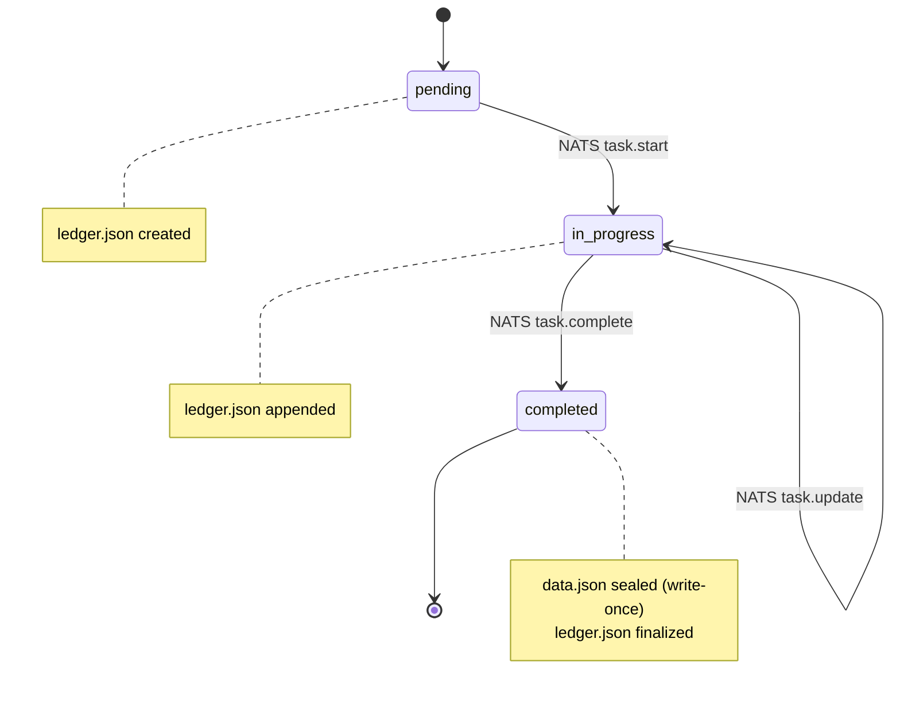

# DATA Loop: Knowledge and Production

> **DATA Loop -- What have I produced?**

The DATA loop is the memory organ of the Material Entity. It is the accumulation of everything the CK has created, verified, and come to know. Instances live here. Proofs live here. The audit ledger lives here. LLM context lives here. The web surface lives here. Nothing is ever rewritten. The storage volume grows over time and is the CK's most valuable asset.

## storage/ -- The Instance Tree

Every tool execution that produces an output creates one instance folder. v3.2 distinguishes two instance kinds:

- **Sealed instances** -- write-once from first write
- **Task instances** -- `data.json` still sealed at completion, lifecycle state tracked in `ledger.json` via NATS

::: warning Write-Once Rule
`data.json` is NEVER modified after first write. This applies to both sealed instances and task instances. For task instances, lifecycle mutations (`pending` -> `in_progress` -> `completed`) are invoked via NATS and recorded append-only in `ledger.json`. `data.json` is written exactly once at the `task.complete` NATS event.
:::

::: details Full storage/ Tree Structure
```
storage/

# -- SEALED INSTANCE (all non-task CKs) --
|- instance-<short-tx>/
|   |- manifest.json              # who, what, when, bindings
|   |- data.json                  # write-once output sealed on first write
|   |- proof.json                 # validation result (check-type actions)
|   +- ledger.json                # before/after for mutate-type actions

# -- TASK INSTANCE (task kernel) --
|- i-task-{conv_guid}/             # folder name = agent conversation GUID
|   |- manifest.json              # status, target_ck, goal_id, priority, order
|   |- conversation_ref.json      # { conv_guid, path } pointer to agent session
|   |- data.json                  # write-once -- sealed at task.complete NATS event ONLY
|   |- ledger.json                # append-only state log -- all mutations via NATS
|   +- conversation/              # operate-type: append-only session records
|       |- c-{conv_id_1}.jsonl    #   first session
|       +- c-{conv_id_2}.jsonl    #   resumed session

# -- SHARED STORAGE --
|- proof/
|- ledger/
|   +- audit.jsonl
|- index/
|   |- by_timestamp.json
|   |- by_task_id.json
|   +- by_confidence.json
|- llm/
|   |- context.jsonl
|   |- memory.json
|   +- embeddings/
+- web/
```
:::

## Formal Task Description (v3.4)

A task instance is not a text description -- it is a typed entity with machine-executable formal properties. The `quality_criteria` and `acceptance_conditions` are what the compliance check kernel validates.

::: tip Autonomous Operations Principle
A ticket requires human interpretation; a formal task description is directly executable by an autonomous agent.
:::

```yaml
# {task-kernel}/storage/i-task-{ts}/task.yaml  (v3.4)
type:           ckp:FormalTaskDescription
target_kernel:  ckp://Kernel#ACME.Cymatics:v1.0
goal:           ckp://Goal#G001:v1.0
order:          1                    # build-dependency sequence within goal

inputs:
  - conceptkernel.yaml               # what to read (CK identity)
  - CLAUDE.md                        # agent instructions
  - SKILL.md                         # available actions

expected_outputs:
  - type: code_change
    target: conceptkernel.yaml

quality_criteria:
  - compliance_check: pass           # compliance check must pass
  - syntax_valid: true

acceptance_conditions:
  - all_tests_pass: true
  - compliance_351: true             # 351/351 checks (v3.3)

agent_requirements:
  - capability: code_edit
  - capability: file_read
  - capability: git_commit
```

## PROV-O Provenance in Instance Records (v3.4)

Every instance record SHOULD include PROV-O provenance fields linking the instance to the action that created it, the operator who authorised it, and the kernel that produced it.

::: warning Provenance Mandate
Every autonomous action must trace to its playbook, its executing agent, and its input data. The three-factor audit chain (GPG + OIDC + SVID) is the full implementation.
:::

```json
{
  "instance_id":              "i-task-1773518402",
  "prov:wasGeneratedBy":      "ckp://Action#Task.task.create-1773518402000",
  "prov:wasAssociatedWith":   "ckp://Actor#operator",
  "prov:wasAttributedTo":     "ckp://Kernel#AgentKernel:v1.0",
  "prov:generatedAtTime":     "2026-03-14T20:00:02Z",
  "prov:used": [
    "ckp://Kernel#ACME.Cymatics:v1.0/conceptkernel.yaml",
    "ckp://Kernel#ACME.Cymatics:v1.0/CLAUDE.md"
  ]
}
```

## Audience Profiles as DATA Loop Entities (v3.4)

Kernels serving web content write audience interaction events to their DATA loop. Each interaction creates or amends an audience profile instance -- a formal entity tracking topic affinity, engagement depth, and trust trajectory.

::: tip
An audience member is an OWL individual with asserted and inferred properties, not a CRM row. Trust trajectory is implemented as `instance_mutability: amendments_allowed` -- the profile updates with each interaction, each update git-versioned.
:::

::: details Audience Profile Structure
```
storage/i-audience-{session_id}/
  interaction.json     # what happened: page views, actions, dwell time
  profile.json         # inferred: topic affinity, trust level, cognitive style
  manifest.json        # PROV-O: which kernel wrote this, when, from what input
```

```json
// profile.json -- maps to autonomous operations AudienceMember OWL individual
{
  "trust_state":          "Explorer",
  "topic_affinity": {
    "cymatics": 0.82,
    "generative_art": 0.65
  },
  "cognitive_style":       "systems-first",
  "depth_preference":      "expert-mode",
  "engagement_count":      14,
  "prov:wasAttributedTo":  "ckp://Kernel#ACME.Cymatics:v1.0"
}
```
:::

## Task Lifecycle via NATS

Task lifecycle is driven entirely through NATS -- no direct file mutation from tooling.



## Instance Versioning and Mutation Policy (v3.3)

Git on the `storage/` volume makes instances natively versioned. The URI of an instance never changes -- the path is stable forever. What it resolves to depends on whether the consumer points to HEAD (always-latest) or pins a commit hash (frozen input).

::: tip SQL vs Git Instance Model
SQL UPDATE destroys prior state unless you build a separate audit table. Git on `storage/` gives you the inverse for free: every state is preserved at its commit hash, the URI is stable, HEAD always resolves to latest, and a pinned hash is forever reproducible. Downstream kernels choose their own resolution strategy -- no coordination required.
:::

### instance_mutability -- Ontology-Level Declaration

The kernel's `ontology.yaml` declares the mutability policy for all instances it produces. This is enforced by the platform -- mutation requests that violate the policy are rejected at the NATS gate before any file is written.

```yaml
instance_mutability: sealed               # default -- data.json never changes
instance_mutability: amendments_allowed   # additions permitted, proof rebuilt
instance_mutability: full_versioning      # data.json replaceable, full history kept
```

### Consumer Resolution Strategies

```
# Pattern A: always-latest (resolves to HEAD)
depends_on: ckp://Instance#i-task-{conv_guid}
# Gets amendments automatically. Good for living documents.

# Pattern B: frozen input (pinned to commit hash)
depends_on: ckp://Instance#i-task-{conv_guid}@b2c1f4
# Never changes. Good for reproducible pipelines, audit snapshots.

# Pattern C: canary promotion on instance
storage/i-task-{conv_guid}/
  refs/
    stable -> commit b2c1   # original (95% consumers)
    canary -> commit f3a9   # amended (5% consumers)
```

## DATA Loop NATS Topics

```
ck.{guid}.data.written         # New instance written to storage/
ck.{guid}.data.indexed         # Index files updated
ck.{guid}.data.proof-generated # proof/ entry created
ck.{guid}.data.ledger-entry    # audit.jsonl appended
ck.{guid}.data.accessed        # storage/ read by another kernel (audit)
ck.{guid}.data.exported        # Dataset derived from storage/ for consumers
ck.{guid}.data.amended         # Instance amendment committed + proof rebuilt (v3.3)
```

## Git Commit Frequency as Governance Signal (v3.3)

Commit frequency per file is a first-class observable. A file accumulating commits at the wrong rate is a governance anomaly that the compliance check kernel can detect.

| Frequency Band | Files | Loop | If Violated |
|---------------|-------|------|-------------|
| **High** -- runtime accumulation | `storage/ledger.json`, `storage/llm/context.jsonl`, `storage/index/*` | DATA | Expected -- these are append-only logs |
| **Medium** -- developer-paced | `CLAUDE.md`, `SKILL.md`, `CHANGELOG.md` | CK | Expected -- identity evolves gradually |
| **Low** -- stable foundation | `conceptkernel.yaml`, `ontology.yaml`, `rules.shacl`, `README.md` | CK | Flag if >20 commits -- schema churn is a smell |
| **Variable** -- tool development | `tool/*` -- all tool source files | TOOL | Expected during active dev; low in production |
| **Near-zero** -- sealed outputs | `storage/i-*/data.json` (sealed instances) | DATA | Flag if >1-3 commits -- mutation policy may be violated |
| **One** -- sealed on completion | `storage/i-task-*/data.json` (task instances) | DATA | Flag if 0 (never completed) or >3 (over-amended) |
