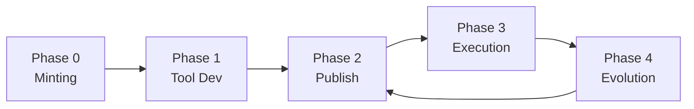

# Full Lifecycle: From Mint to Knowledge Accumulation

A Concept Kernel moves through five phases -- minting, tool development, publishing, execution, and evolution. Each phase operates on a specific loop and produces auditable artifacts.



## Phase 0: Minting (Local)

The platform CLI mints a new CK by scaffolding the three volumes in the distributed filesystem and initialising three git repos. The CK wakes for the first time with empty `storage/` and a minimal identity set.

```bash
$ ckp concept create Finance.Employee
  Orchestrator: Invoking tool for [CK.Create]...
  Provisioning distributed filesystem volumes:
    ck-{guid}-ck       ->  filer:/concepts/Finance.Employee/{guid}/
    ck-{guid}-tool     ->  filer:/concepts/Finance.Employee/{guid}/tool/
    ck-{guid}-storage  ->  filer:/concepts/Finance.Employee/{guid}/storage/
  Initialising git repos in each volume...
  Writing conceptkernel.yaml, README.md, CLAUDE.md, SKILL.md,
         CHANGELOG.md, ontology.yaml, rules.shacl, serving.json...
  Registering SPIFFE identity with SPIRE:
    SPIFFE ID: spiffe://{domain}/ck/Finance.Employee/{guid}
    Selector:  workload:sa:ck-finance-employee-{guid}
    TTL:       3600s (auto-rotated)
  Created: concepts/Finance.Employee/{guid}/
```

## Phase 1: Tool Development

The developer works inside `tool/` -- an independent git repo. They can choose any form for the tool. They commit and push independently of the CK identity files. The CK loop and TOOL loop have no shared commit history.

```bash
# Developer writes the tool in any form:
cd concepts/Finance.Employee/{guid}/tool/
vim app.py              # API service
# or: vim run.sh        # bash script
# or: vim main.rs       # Wasm source

git add . && git commit -S -m 'Initial tool implementation'
# This commit goes to ck-{guid}-tool volume history
# It does NOT affect ck-{guid}-ck history
```

## Phase 2: Publishing (C-P-A Triplet)

Publishing translates the local tool into a cloud-executable artifact and registers the CK on the cluster as a custom resource.

```bash
$ ckp kernel publish concepts/Finance.Employee/{guid}/
  (C) Compile:  tool/main.rs -> tool.wasm
  (P) Push:     tool.wasm -> registry.{domain}/kernels/finance-employee@sha256:abc123
  (A) Apply:    CK custom resource -> cluster
                annotations:
                  ckp.conceptkernel.org/ck-commit:   {ck-loop-git-hash}
                  ckp.conceptkernel.org/tool-commit: {tool-loop-git-hash}
                  ckp.conceptkernel.org/tool-digest: sha256:abc123
  SUCCESS: Finance.Employee is now Available
```

### Deployment as Ontological Process

In v3.4, publishing and deployment are each formally-typed processes: the organism does not run a script -- it instantiates a DeploymentProcess with declared inputs, triggering conditions, post-conditions, and a rollback plan.

```
storage/i-deploy-{ts}/
  manifests/              # input: all platform manifests applied
  probe_result.json       # post-condition: health check outcome
  manifest.json           # PROV-O + BFO provenance
```

The deployment manifest is typed as both a BFO Process and a PROV-O Activity:

```json
{
  "type":                    "ckp:DeploymentProcess",
  "bfo_type":               "BFO:0000015",
  "ckp:input":              "ckp://Kernel#Finance.Employee:v1.0",
  "ckp:triggerCondition":   "all acceptance_conditions pass",
  "ckp:postCondition":      "health probe pass, route rule accepted",
  "ckp:rollbackPlan":       "ckp://Deployment#rollback-Finance.Employee-{ts}",
  "prov:wasAssociatedWith": "ckp://Actor#{operator}",
  "prov:wasAttributedTo":   "ckp://Kernel#CK.Agent:v1.0",
  "prov:generatedAtTime":   "2026-03-14T20:00:02Z"
}
```

::: tip
The instance record is the auditable proof that the deployment occurred. The organism does not run a script -- it instantiates a DeploymentProcess.
:::

## Phase 3: Execution and Storage Write

When a ConceptKernelInstance (CKI) is created, the CKI-Spawner reads the CK custom resource, selects the correct runtime via the Polyglot Execution Matrix, and runs the tool. The tool writes to `storage/`.

| Step | Actor | Action | Result |
|------|-------|--------|--------|
| 1 | User (via platform CLI) | Creates ConceptKernelInstance resource | Platform stamps OIDC identity on CKI |
| 2 | CKI-Spawner | Reads CK resource, selects runtimeClassName | Job created with volume mount |
| 3 | wasmedge / bash / node | Executes `tool/` artifact | Tool runs in milliseconds |
| 4 | Tool | Writes `storage/instance-<short-tx>/data.json` | Platform validates against rules.shacl |
| 5 | Platform | Generates proof/, appends ledger/, updates index/ | Instance sealed -- write-once |
| 6 | Platform | Publishes `ck.{guid}.data.written` to NATS | Cooperating CKs notified |
| 7 | Platform | Scrapes result -> CKI.status.outputs = Succeeded | CKI is now a prov:Entity |

## Phase 4: Awakening After Evolution

When the developer promotes a new version to stable -- in either the CK loop or the TOOL loop -- the next CK wake reads the updated files and resumes with the new identity. `CHANGELOG.md` records what changed. The CK's prior instances in `storage/` are unaffected.

```bash
# Promoting a new CK loop version:
ckp ck promote --kernel Finance.Employee --ref refs/heads/develop
  # Updates serving.json: stable -> new ck-loop commit
  # Publishes: ck.{guid}.ck.promote
  # Next wake reads: new ontology.yaml, new CLAUDE.md, new SKILL.md

# Promoting a new TOOL version (independent):
ckp tool promote --kernel Finance.Employee --ref refs/heads/develop
  # Updates serving.json: stable tool_ref -> new tool commit
  # Publishes: ck.{guid}.tool.promote
  # Next execution uses: new tool/ artifact
  # CK identity files: UNCHANGED
```

::: warning
CK loop and TOOL loop promotions are independent. Promoting a new tool version does not change the kernel's identity files.
:::
