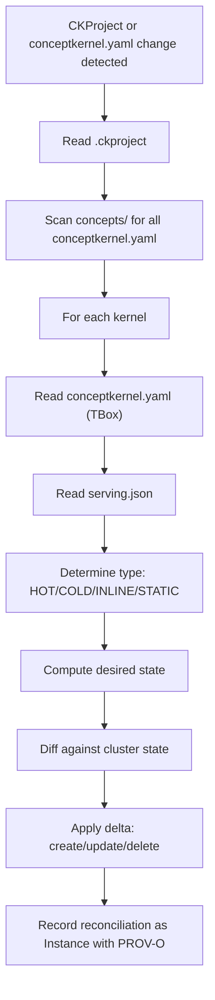

# CK.Operator -- CKP Cluster Operator

CK.Operator reconciles `.ckproject` and `conceptkernel.yaml` files into cluster gateway resources. It reads the declared state (TBox) and makes the cluster match.

::: warning Single Rule
If it is not in the ontology, it does not exist in the cluster.
:::

## Lineage

CKOP v2.0 defined the three orthogonal loops with independent versioning, NATS topics per loop, and BFO typing. CKP v3.0-v3.4 corrected its structural errors and renamed OPS to CK. CK.Operator v3.5.1 is the physical realization -- a cluster operator that makes the three-loop topology real in a managed environment.

| CKOP v2.0 | CKP v3.4 | CK.Operator v3.5.1 |
|-----------|----------|---------------------|
| Three orthogonal loops | Three independently-versioned volumes | Three persistent volumes per kernel |
| OPS/TOOL/DATA | CK/TOOL/DATA | TBox/RBox/ABox |
| Custom objects/refs/commits | Native git per volume | Git on volume-mounted filesystem |
| serving.json with canary weights | serving.json with ck_ref + tool_ref | Explicit version directories + route rule |
| NATS topics per loop | Name-based NATS (primary) + GUID-based (extended) | Operator watches resources, not NATS |
| Manual apply | Inline YAML via platform tooling | Operator reconciles from conceptkernel.yaml |
| Rollback via ref pointer | Rollback via git branch | Rollback via git + route rule update |
| BFO Continuant/Occurrent | BFO 2020 full hierarchy | BFO + IAO + CCO + PROV-O + ValueFlows |

## Ontological Grounding

CK.Operator is itself a `ckp:HotKernel` (BFO:0000040 + cco:Agent). Its actions are `ckp:Reconciliation` (iao:PlanSpecification + cco:Event). Its outputs are `ckp:Instance` (iao:DataItem) with PROV-O provenance.

### What the Operator Maps

| CKP Class (Layer 1) | Mid-Level (Layer 0.5) | Cluster Resource | Relationship |
|---------------------|----------------------|------------------|--------------|
| `ckp:Kernel` | cco:Agent + BFO:0000040 | Workload, Service | One kernel -> one workload |
| `ckp:Action` | iao:PlanSpecification | Route rule `/action/*` | Actions exposed as API endpoints |
| `ckp:Instance` | iao:DataItem | Persistent volume (DATA loop) | Instances written to storage volume |
| `ckp:Edge` | cco:Artifact | Route subpath, volume mount | Edge dependencies as shared volumes |
| `ckp:GovernanceMode` | BFO:0000019 | Security policy | STRICT/RELAXED/AUTONOMOUS -> CORS/auth |
| `ckp:KernelType` | BFO:0000019 | Workload strategy | HOT -> process; INLINE -> config artifact; STATIC -> filer only |
| `ckp:StorageMedium` | BFO:0000019 | Persistent volume or config artifact | FILESYSTEM -> volume; CONFIGMAP -> config artifact |
| `ckp:DeploymentMethod` | BFO:0000019 | Volume mount type | VOLUME -> volume driver; FILER -> HTTP passthrough |
| `ckp:ServingDisposition` | BFO:0000016 | Route rules | APIServing -> /action/; WebServing -> filer; NATSListening -> no gateway resource |
| `ckp:Project` | cco:Organization | CKProject custom resource | One project -> one namespace scope |
| `ckp:KernelOntology` | iao:Document | (not a cluster resource -- read by operator) | ontology.yaml drives type validation |

### What the Operator Does NOT Map

Resources without ontological basis are not created:

- No init containers (unauthorized foreign images)
- No sidecars (unless declared as edge kernel with COMPOSES predicate)
- No cluster-scoped resources (operator stays in namespace)
- No DNS records (external-dns handles that from route rule annotations)
- No secrets (identity provider operator handles identity secrets)
- No gateway resource (gateway-system boundary -- operator only creates route rules referencing the existing gateway)

## Input: What the Operator Watches

### CKProject Custom Resource

```yaml
apiVersion: conceptkernel.org/v1
kind: CKProject
metadata:
  name: example-project
spec:
  domain: example.org
  storage: volume       # configmap | filer | volume
  gateway:
    parentRef:
      name: multi-domain-gateway
      namespace: gateway-system
```

### conceptkernel.yaml Fields

The operator reads from TBox only -- it never reads TOOL or DATA loop files:

| Field | DL Box | Drives |
|-------|--------|--------|
| `metadata.name` | TBox | Cluster resource naming |
| `kernel_class` | TBox | Filer path, volume naming |
| `qualities.type` | TBox | HOT/COLD/INLINE/STATIC -> workload strategy |
| `qualities.governance_mode` | TBox | Security policy generation |
| `spec.web.subdomain` | TBox | Route rule hostname |
| `spec.web.serve` | TBox | Whether to create web-serving route rules |
| `spec.tool.runtime` | TBox | Whether to create workload |
| `spec.actions.unique` | TBox | Route rules for `/action/*` |
| `spec.edges.outbound` | TBox | Shared volume mounts, subpath routes |

### serving.json (Version Routing)

```json
{
  "versions": [
    { "name": "v1", "active": true },
    { "name": "v2", "active": true, "current": true },
    { "name": "v3", "active": false, "deprecated_at": "2026-04-01" }
  ]
}
```

Each active version produces an explicit route rule path prefix. `current` also serves at `/`. Deprecated versions are announced; removed when `active: false`.

## Output: What the Operator Creates

### Per-Kernel: Three Persistent Volumes

When `spec.storage: volume`:

| DL Box | Volume Name | Filer Path | Access |
|--------|-------------|------------|--------|
| TBox | `ck-{conceptkernel}-ck` | `/ck/{project}/concepts/{conceptkernel}/` | ReadOnlyMany |
| RBox | `ck-{conceptkernel}-tool` | `/ck/{project}/concepts/{conceptkernel}/tool/` | ReadOnlyMany |
| ABox | `ck-{conceptkernel}-storage` | `/ck/{project}/concepts/{conceptkernel}/storage/` | ReadWriteMany |

### Per-Kernel: Route Rules

```
Gateway split routing:

/action/*   -> process (TOOL loop)
/cklib/*    -> filer (CK.Lib edge storage/web/)
/v{N}/*     -> filer (versioned DATA loop storage/web/v{N}/)
/*          -> filer (current DATA loop storage/web/)
```

For **HOT/COLD** kernels with `spec.tool.runtime`: process handles `/action/*`, filer handles everything else. No FUSE overhead for web serving.

For **INLINE** kernels: no process. Gateway serves configuration artifact or filer directly. CK.Lib.Js handles NATS WSS in the browser.

For **STATIC** kernels: no process, no NATS. Gateway serves filer only.

### Per-Kernel: Security Policy

| GovernanceMode | CORS | Auth | Inter-Kernel |
|----------------|------|------|--------------|
| RELAXED | Allow `*.{domain}` | None (anon) | Open |
| STRICT | Specific origins only | JWT (identity provider) | JWT required |
| AUTONOMOUS | No CORS | mTLS (SPIFFE) | SVID required |

### Per-Kernel: Workload + Service (HOT/COLD only)

Process filesystem follows the CKP canonical tree:

```
/app/concepts/{conceptkernel}/
├── conceptkernel.yaml              <- CK loop volume (ReadOnly)
├── tool/                           <- TOOL loop volume (ReadOnly)
│   ├── processor.py
│   └── cklib/                      <- Edge volume: CK.Lib (ReadOnly)
└── storage/                        <- DATA loop volume (ReadWrite)
    ├── web/
    ├── instances/
    ├── proof/
    ├── ledger/
    ├── index/
    └── llm/
```

### Edge Dependencies

Each edge declared in `spec.edges.outbound` produces:

| Edge Predicate | Cluster Resource | Mount |
|---------------|------------------|-------|
| EXTENDS | Volume mount (TOOL loop of target) | `tool/cklib/` or target tool path |
| COMPOSES | Route subpath to target's web | `/cklib/`, `/{edge-name}/` |
| TRIGGERS | (no cluster resource -- NATS-level) | -- |

## Reconciliation Loop



::: details Full Reconciliation Pseudocode
```
On CKProject or conceptkernel.yaml change:
|
+-- Read .ckproject -> domain, storage type, gateway parentRef
+-- Scan concepts/ -> list all conceptkernel.yaml
|
+-- For each kernel:
|   +-- Read conceptkernel.yaml (TBox only)
|   +-- Read serving.json (version routing)
|   +-- Determine kernel type (HOT/COLD/INLINE/STATIC)
|   +-- Compute desired state:
|   |   +-- Persistent volumes  (if storage: volume)
|   |   +-- Workload + Service  (if HOT or COLD)
|   |   +-- Startup config      (if HOT or COLD)
|   |   +-- Route rules         (actions + versions + edges + web)
|   |   +-- Security policy     (from governance_mode)
|   |   +-- Edge volumes/routes (from edges.outbound)
|   |
|   +-- Diff against current cluster state
|   +-- Apply delta (create / update / delete)
|
+-- Record reconciliation as Instance:
|   storage/instances/i-reconcile-{ts}/
|   +-- manifest.json
|   |   prov:wasGeneratedBy: ckp://Action#CK.Operator/reconcile-{ts}
|   |   prov:wasAttributedTo: ckp://Kernel#CK.Operator:v3.5.1
|   |   prov:generatedAtTime: {ISO}
|   +-- data.json (sealed: what was applied)
|   +-- proof.json (SHA-256 of applied resources)
|
+-- On kernel deleted:
    +-- Delete route rules, security policy
    +-- Delete workload, service, startup config
    +-- RETAIN persistent volumes (data preservation)
    +-- Record deletion instance with PROV-O
```
:::

::: tip Data Preservation
When a kernel is deleted, the ABox (DATA loop) persistent volume is NEVER destroyed by the operator. Data is preserved.
:::

## CK.Operator as a Concept Kernel

CK.Operator follows CKP v3.5. It is self-hosting -- it can reconcile itself.

### Identity (CK Loop / TBox)

```yaml
kernel_class: CK.Operator
bfo_type: BFO:0000040
qualities:
  type: node:hot
  governance_mode: AUTONOMOUS
```

### Tool (TOOL Loop / RBox)

`tool/operator.py` (or `tool/src/main.rs`) -- cluster operator watching CKProject custom resource and conceptkernel.yaml. Two candidate frameworks:

| Framework | Language | Pros | Cons |
|-----------|----------|------|------|
| **kopf** | Python | Same language as CK.Lib.Py, rapid prototyping | GIL, memory footprint |
| **kube-rs** | Rust | Performance, type safety, small binary | Slower iteration, separate toolchain |

::: tip
The spec is framework-agnostic -- the reconciliation loop and ontological grounding are the same regardless of implementation language.
:::

### NATS Harness

CK.Operator is a HotKernel -- it runs the standard NATS harness alongside the operator loop:

| NATS Topic | Direction | Payload |
|-----------|-----------|---------|
| `input.CK.Operator` | Subscribe | `{ action: "reconcile" }`, `{ action: "status" }`, `{ action: "rollback", kernel: "..." }` |
| `event.CK.Operator` | Publish | `{ event: "reconciled", project: "...", kernels: N, created: N, updated: N, deleted: N }` |
| `event.CK.Operator` | Publish | `{ event: "kernel.deployed", kernel: "...", type: "HOT", version: "v2" }` |
| `event.CK.Operator` | Publish | `{ event: "kernel.deleted", kernel: "..." }` |
| `event.CK.Operator` | Publish | `{ event: "error", kernel: "...", reason: "..." }` |

Other kernels can subscribe to `event.CK.Operator` to react to infrastructure changes -- e.g., CK.ComplianceCheck runs on `kernel.deployed`, CK.Discovery refreshes its catalog on `reconciled`.

### Data (DATA Loop / ABox)

- `storage/instances/` -- reconciliation records with PROV-O provenance
- `storage/proof/` -- SHA-256 hashes of applied cluster resources
- `storage/ledger/` -- append-only log of all reconciliation events

### Ontology (ontology.yaml)

```yaml
classes:
  ReconciliationEvent:
    is_a: ckp:SealedInstance
    attributes:
      project: { range: string, required: true }
      kernels_reconciled: { range: integer, required: true }
      resources_created: { range: integer }
      resources_updated: { range: integer }
      resources_deleted: { range: integer }

  CKProjectDeclaration:
    is_a: ckp:KernelOntology
    attributes:
      domain: { range: string, required: true }
      storage: { range: StorageMediumEnum, required: true }
      kernel_count: { range: integer }
```

## Relationship to Platform Tooling

**Platform tooling manages content. CK.Operator manages infrastructure.**

| Concern | Platform Tooling | CK.Operator |
|---------|-----------------|-------------|
| Scaffold new kernel | `ckp new` | -- |
| Sync files to filer | `ckp apply --sync` | -- |
| Run compliance | compliance check | -- |
| Create route rule | -- | Reconciles from conceptkernel.yaml |
| Create security policy | -- | Reconciles from governance_mode |
| Create persistent volume | -- | Reconciles from .ckproject storage type |
| Create workload | -- | Reconciles from qualities.type + runtime |
| Version routing | -- | Reconciles from serving.json |
| Rollback | -- | Updates route rule + workload from serving.json |

## Versioning Roadmap

| Version | Scope |
|---------|-------|
| v3.5.1 | Persistent volume creation, route rules, security policy, workload for `storage: volume` projects |
| v3.5.2 | serving.json version routing, explicit `/v1/`, `/v2/` paths, deprecation announcements |
| v3.5.3 | Edge dependency volume management, inter-kernel security policy, COMPOSES/EXTENDS resolution |
| v3.5.4 | Compliance gate -- refuse to reconcile kernels that fail `check.ontology` |
| v3.6.0 | SPIFFE integration -- mTLS policies derived from grants block |

## Testing and Compliance

CK.Operator validates itself against CKP v3.5:

| Check | What It Validates |
|-------|-------------------|
| `check.structure` | CKP v3.5 compliant directory (storage/web/ not root web/) |
| `check.ontology` | ontology.yaml defines ReconciliationEvent and CKProjectDeclaration |
| `check.provenance` | Every reconciliation produces manifest.json with PROV-O |
| `check.proof` | Every reconciliation produces proof.json with SHA-256 |
| Integration tests | Test cluster with sample CKProject + 3 kernel types |
| Production target | First real deployment |

## CRD Definition

::: details CKProject CustomResourceDefinition
```yaml
apiVersion: apiextensions.k8s.io/v1
kind: CustomResourceDefinition
metadata:
  name: ckprojects.conceptkernel.org
spec:
  group: conceptkernel.org
  versions:
    - name: v1
      served: true
      storage: true
      schema:
        openAPIV3Schema:
          type: object
          properties:
            spec:
              type: object
              required: [domain, storage]
              properties:
                domain:
                  type: string
                storage:
                  type: string
                  enum: [configmap, filer, volume]
                gateway:
                  type: object
                  properties:
                    parentRef:
                      type: object
                      properties:
                        name: { type: string }
                        namespace: { type: string }
  scope: Namespaced
  names:
    plural: ckprojects
    singular: ckproject
    kind: CKProject
    shortNames: [ckp]
```
:::
