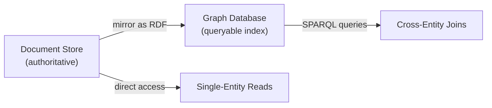
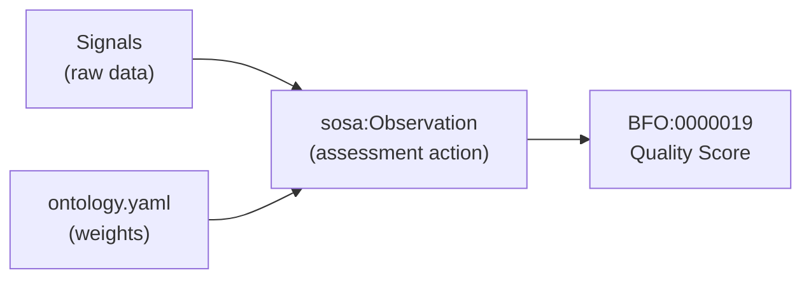
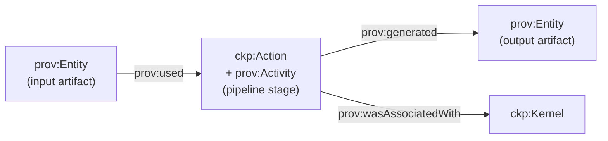

# Implementation Patterns

These eight patterns define how CKP kernels implement common concerns. Each pattern is grounded in BFO and PROV-O -- the ontology is not optional.

## Dual-Store Pattern

When a kernel uses both filesystem and document database storage media, entities exist in two worlds. The ontology defines both, but only one is queryable via SPARQL.

::: tip Protocol Guidance
When a kernel uses both `ckp:FILESYSTEM` and `ckp:DOCUMENT_STORE` storage media, the `StorageContract` must declare which entities live where. Entities in the document store SHOULD be mirrored as minimal RDF triples in the graph database for cross-entity SPARQL queries. The document store is the authoritative source; the graph is a queryable index.
:::



## Classification Pattern

Classification is a `ckp:Action` (BFO:0000015 Process) that SHOULD be typed as a pipeline stage. The classification method (keyword, LLM, OWL DL reasoning, SHACL) is a property of the action, not a protocol constraint.

::: warning
The result (category assignment) MUST be stored as an RDF triple (`?entity ckp:hasCategory ?category`), regardless of how it was computed.
:::

```sparql
# Querying classification results
SELECT ?entity ?category WHERE {
  ?entity ckp:hasCategory ?category .
}
```

## Quality Assessment Pattern

Quality assessment is a `sosa:Observation` that produces a quality score (BFO:0000019). The observation method and weights are properties of the assessment action.

::: tip
Scores MAY be pre-computed for performance, but the computation SHOULD be reproducible from the underlying signals via SPARQL or code. The weights themselves are ontological -- they should be declared in the kernel's `ontology.yaml`, not buried in pipeline code.
:::



## Composition Pattern

Composition checking is a `ckp:Action` that validates whether two entities can be chained. The ontology SHOULD declare composition relationships as OWL object properties.

::: tip
Whether inference is done at query time (SPARQL) or materialised in advance (pipeline) is an implementation choice -- but the relationship MUST exist in the ontology, not only in code.
:::

```sparql
# Check if two services can be composed
ASK WHERE {
  ?serviceA ckp:canComposeTo ?serviceB .
}
```

## Economic Event Pattern

Economic events (payments, revenue splits, commitments) are modeled via ValueFlows:

| Protocol Concept | ValueFlows Class | CKP Instance |
|-----------------|-----------------|--------------|
| Payment Required (402 response) | `vf:Commitment` | ABox instance with amount, network, payTo |
| Payment received | `vf:EconomicEvent` | Linked to workflow via `prov:wasAssociatedWith` |
| Service execution | `vf:EconomicEvent` | One per workflow step, linked to service |
| Revenue split | `vf:EconomicEvent` | Platform fee + creator royalty as separate events |
| Workflow agreement | `vf:Agreement` | The workflow itself -- steps, prices, terms |

::: warning
Every economic event MUST produce a `prov:Activity` instance with a transaction hash (when on-chain) or execution ID (when off-chain).
:::

## Pipeline Stage Pattern

Every kernel with a data pipeline MUST type its stages as subclasses of `ckp:Action` (BFO:0000015) and `prov:Activity`. Input and output artifacts MUST be declared as `prov:Entity` with `prov:used` and `prov:generated` relationships.

::: tip
This is the only way to answer "where did this data come from?" across the fleet.
:::



## Provenance Mandate

PROV-O is not optional. Every `ckp:Action` that produces or mutates a `ckp:Instance` MUST record:

```turtle
prov:wasGeneratedBy    # links Instance to the Action that created it
prov:wasAttributedTo   # links Instance to the Kernel that produced it
prov:generatedAtTime   # timestamp
prov:wasAssociatedWith # links Action to the Kernel
prov:used              # links Action to its input entities
```

::: warning
This is enforced by `check.provenance` in CK.ComplianceCheck. A kernel that produces instances without provenance fails compliance.
:::

## Kernel Type Matrix

The kernel type determines the disposition matrix -- one codebase, four modes:

| Type | Process | NATS | API | Storage | Web | Deployment |
|------|---------|------|-----|---------|-----|------------|
| **HOT** | long-running process | server listen + send | `/action/*` | FILESYSTEM or DOCUMENT_STORE | optional | VOLUME or CONFIGMAP_DEPLOY |
| **COLD** | ephemeral, execute + exit | send only | none | FILESYSTEM or DOCUMENT_STORE | optional | VOLUME or CONFIGMAP_DEPLOY |
| **INLINE** | none (browser-side) | WSS client + JWT | none | configuration artifact | always (IS the web) | INLINE_DEPLOY |
| **STATIC** | none | none | none | FILESYSTEM | always (files only) | FILER or VOLUME |

::: tip
The processor harness (`KernelProcessor` in CK.Lib.Py) reads `qualities.type` from `conceptkernel.yaml` and configures itself accordingly.
:::

### NATS Harness Behaviour Per Type

| Type | NATS Connection | Subscribe | Publish | Auth |
|------|----------------|-----------|---------|------|
| HOT | Server-side, persistent | `input.{kernel}` | `result.{kernel}`, `event.{kernel}` | NATS NKey or JWT-SVID |
| COLD | Server-side, ephemeral | None (invoked externally) | `result.{kernel}`, `event.{kernel}` | NATS NKey or JWT-SVID |
| INLINE | Browser WSS via CK.Lib.Js | `result.{kernel}`, `event.{kernel}` | `input.{kernel}` | Identity provider JWT |
| STATIC | None | None | None | None |
