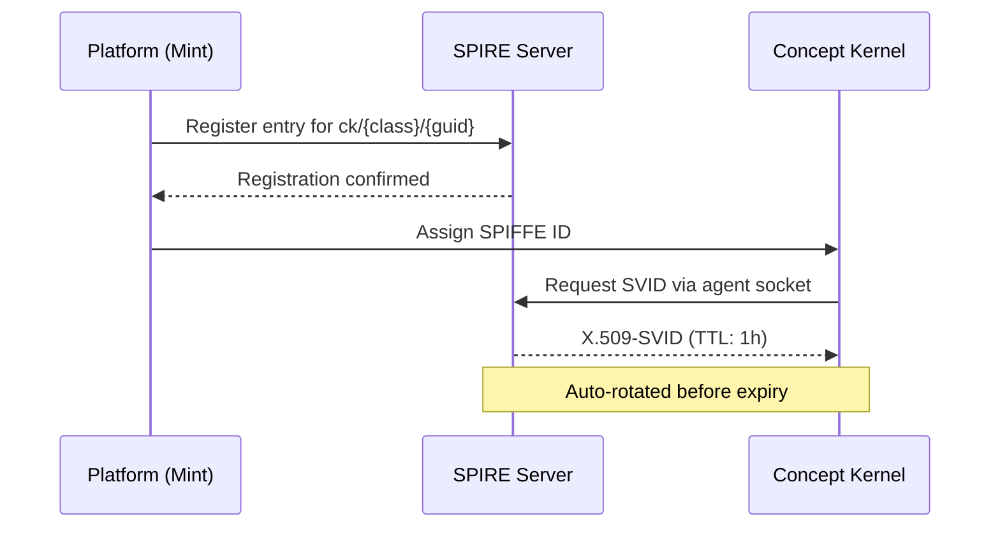
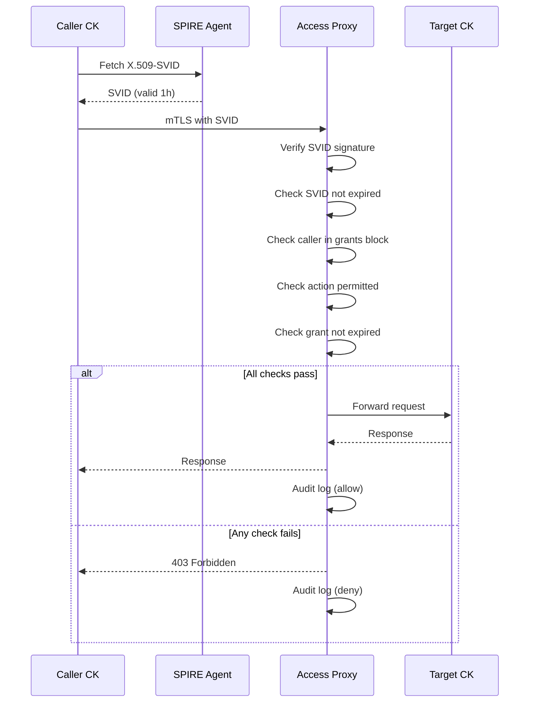

# SPIFFE, Grants, and Security

## SPIFFE Workload Identity

Every Concept Kernel is a SPIFFE workload. Every cross-kernel action requires a valid SVID. Permissions are action-scoped, time-bounded, and audited. SPIRE handles the entire certificate lifecycle automatically.

### Identity Assignment at Mint

Every CK receives a stable SPIFFE identity at mint time. The SPIFFE ID is derived deterministically from the kernel class and GUID. It never changes for the lifetime of the Material Entity -- even as the CK loop or TOOL loop commit refs advance.

```
# SPIFFE ID format -- assigned at mint, permanent
spiffe://{domain}/ck/{kernel_class}/{guid}

# Examples:
spiffe://{domain}/ck/Finance.Employee/7f3e-a1b2-c3d4-e5f6
spiffe://{domain}/ck/CK.Query/9a1b-c2d3-e4f5-g6h7
spiffe://{domain}/ck/predicates.isDependentOn/bb3c-d4e5-f6a7-b8c9
```



### SPIFFE and the Awakening Sequence

The awakening sequence gains a SPIFFE verification step. The CK verifies its own SVID is valid and active before proceeding. If the CK cannot obtain a valid SVID from the local SPIRE agent, awakening halts.

| Order | File / Action | Question Answered |
|-------|---------------|-------------------|
| 1 | `conceptkernel.yaml` | I am -- class, GUID, BFO:0000040 |
| 2 | `README.md` | I exist because -- purpose and goals |
| 3 | `CLAUDE.md` | I behave like this -- rules, agreements, folder map |
| 4 | `SKILL.md` | I can do these things -- reusable capabilities |
| 5 | `CHANGELOG.md` | I have already become -- completed evolution |
| **5a** | **SPIRE agent** | **I am cryptographically who I claim -- SVID obtained and verified; grants block loaded into access proxy** |
| 6 | `ontology.yaml` | My world has this shape -- TBox schema |
| 7 | `rules.shacl` | I am constrained by -- validation rules |

---

## Grants Block and ODRL Mapping

The grants block in `conceptkernel.yaml` replaces all binary `ck:isAccessibleBy` declarations. It is the sole source of cross-CK permission truth -- and in v3.4, it is recognised as the CKP implementation of ODRL.

::: tip The grants block IS the ODRL Policy
Every ODRL concept maps directly to a grants block primitive. No separate policy language is needed.
:::

| Autonomous Operations ODRL Concept | CKP Grants Block Equivalent | Example |
|------------------------|----------------------------|---------|
| `odrl:Policy` | The entire `grants:` block | The kernel's complete permission declaration |
| `odrl:Permission` | `actions:` list for a given identity | `actions: [read-identity, invoke-tool]` |
| `odrl:Prohibition` | Absence from actions list = implicitly prohibited | CK not in any identity's actions -> access denied |
| `odrl:Constraint` | `expires:` field on a grant entry | `expires: 2026-06-01T00:00:00Z` |
| `odrl:Duty` | `audit: true` -- obligation to log the access | Every access written to `ledger/` |
| `odrl:Asset` | The kernel itself -- all three volumes | Target = `ckp://Kernel#Finance.Employee:v1.0` |
| `odrl:Party` | SPIFFE identity string or access tier | `spiffe://{domain}/ck/CK.Query/...` |

### Grants Block Example

```yaml
# conceptkernel.yaml -- v3.1 with grants block
kernel_class:  Finance.Employee
kernel_id:     7f3e-a1b2-c3d4-e5f6
bfo_type:      BFO:0000040
owner:         operator@example.org

grants:
  - identity:  spiffe://{domain}/ck/CK.Query/9a1b-...
    actions:   [read-storage, read-index, read-llm]
    expires:   2027-01-01T00:00:00Z
    audit:     true

  - identity:  spiffe://{domain}/ck/Finance.Payroll/cc4d-...
    actions:   [read-storage, read-index]
    expires:   2026-12-31T00:00:00Z
    audit:     true

  - identity:  spiffe://{domain}/ck/CK.AuditFinal/dd5e-...
    actions:   [read-identity, read-storage, read-ledger]
    expires:   never
    audit:     true

  - identity:  spiffe://{domain}/agent/agent-kernel
    actions:   [invoke-tool, read-identity, read-skill]
    expires:   2026-06-01T00:00:00Z
    audit:     true
```

### Grant Lifecycle

| Event | How It Happens | What Changes |
|-------|---------------|-------------|
| **Created** | Operator edits grants block, commits to CK loop | SPIRE entry updated; grant active on next version promotion |
| **Expires** | `expires` field passes | SPIRE stops issuing SVIDs for that entry; access silently blocked |
| **Revoked early** | Operator removes grant, commits + promotes | SPIRE entry deleted; existing SVIDs expire within TTL (max 1h) |
| **SVID rotation** | SPIRE rotates automatically before TTL | Caller gets new cert transparently; no disruption |
| **Trust domain change** | SPIRE bundle update propagated to all agents | All SVIDs re-validated against new bundle |
| **CK decommissioned** | Platform removes SPIRE entries for all three CK SVIDs | All grants to/from this CK revoked within 1h |

---

## Action Vocabulary and Seven Types (v3.2)

v3.2 classifies all actions into seven types that determine context assembly, output format, and instance record.

| Type | Verbs / Pattern | Context Loaded | Instance Record | BFO |
|------|----------------|----------------|-----------------|-----|
| **inspect** | `status`, `show`, `list`, `version` | Target identity only | None -- stateless | -- |
| **check** | `check.*`, `validate`, `probe.*` | Target + rules + schema | `proof.json` | BFO:0000015 |
| **mutate** | `create`, `update`, `complete`, `assign` | Target + grants + pre-state | `ledger.json` (before/after) | BFO:0000015 |
| **operate** | `execute`, `render`, `run`, `spawn`, `chat` | Full workspace (identity + skills + memory) | sealed instance + `conversation/` | BFO:0000015 |
| **query** | `fleet.*`, `catalog`, `search` | Fleet-wide scan | None -- stateless | -- |
| **deploy** | `deploy.*`, `apply`, `route.*` | Target + manifests + cluster state | deployment record | BFO:0000015 |
| **transfer** | `export.*`, `import.*`, `sync`, `regenerate` | Source + destination + mapping | transfer receipt | BFO:0000015 |

::: details Action Type Resolution Examples
```
task.create      -> suffix 'create'     -> mutate
check.identity   -> prefix 'check.*'    -> check
fleet.catalog    -> suffix 'catalog'    -> query
spawn            -> exact 'spawn'       -> operate
deploy.inline    -> prefix 'deploy.*'   -> deploy
export.backup    -> prefix 'export.*'   -> transfer
```
:::

::: warning Actions Not Grantable to External Identities
No external identity may ever be granted `write-storage`, `write-tool`, or any action that mutates the CK loop (identity files, schema, rules). These are reserved for the kernel's own runtime and the operator CI pipeline. The sovereign boundary of the Material Entity is absolute.
:::

### SVID Verification Flow

Every cross-kernel request is authenticated by SPIRE before it reaches the target CK's volumes:



### NATS Topic Authentication

NATS connections require a SPIFFE JWT-SVID as the connection credential. A CK can only publish to its own `ck.{guid}.*` topics and subscribe to topics for which it holds a valid grant.

```python
# NATS connection authenticated by SPIFFE JWT-SVID
spiffe_jwt = spire_agent.fetch_jwt_svid(audience='nats.{domain}')

nats.connect('nats://nats.{domain}:4222',
             user=f'spiffe://{domain}/ck/{class}/{guid}',
             password=spiffe_jwt)

# Subject-level ACLs derived from grants block:
#   publish:   ck.{own-guid}.*           (always allowed)
#   subscribe: ck.{other-guid}.*          (only if grant exists)
```

---

## Security -- Loop Isolation via Volume Drivers

The separation axiom is enforced at the infrastructure level through volume driver `readOnly` flags -- not at the application level.

| DL Box | Loop | Volume `readOnly` | Consequence |
|--------|------|-------------------|-------------|
| TBox | CK | `true` | Runtime process cannot modify identity or ontology |
| RBox | TOOL | `true` | Runtime process cannot modify its own code |
| ABox | DATA | `false` | Runtime process writes instances, proofs, ledger |

::: warning Separation Axiom -- Physically Enforced
A storage write NEVER causes a CK commit. A tool execution NEVER modifies identity files. An identity change NEVER directly mutates stored instances. Volume driver `readOnly` makes this physically impossible, not merely a convention.
:::

### SPIFFE Infrastructure Requirements

| Component | Role | Deployment |
|-----------|------|------------|
| **SPIRE Server** | Issues SVIDs; maintains registration entries; rotates certs | Single workload with HA via leader election |
| **SPIRE Agent** | Runs on every node; provides SVID to local workloads via socket | Per-node agent; mounts socket at `/run/spire/sockets/` |
| **CK Access Proxy** | Intercepts inbound cross-CK requests; verifies SVID + grants | Sidecar process in every CK workload |
| **NATS SPIFFE Plugin** | Validates JWT-SVIDs on NATS connections; enforces topic ACLs | NATS server configuration |
| **Filesystem mTLS** | Requires client cert (SVID) on all filer connections | Filesystem TLS config |
| **Identity Provider Bridge** | Links OIDC identity (human) to SVID (workload) in audit chain | Identity provider custom mapper |

### CK.Agent -- Agent Kernel (v3.2)

An agent kernel is a first-class kernel: `CK.Agent`, a kernel that can read fleet context, build action plans, and execute tasks across the fleet. A `LOCAL.*` prefix means it runs without SPIFFE and is never deployed to the cluster.

```yaml
# CK.Agent -- kernel identity
apiVersion:        conceptkernel/v3
kernel_class:      CK.Agent
namespace_prefix:  CK
domain:            {domain}
type:              agent
governance:        AUTONOMOUS

# Capabilities:
# - read-identity, read-skill, read-storage for any fleet kernel
# - open/resume conversations bound to tasks and goals
# - queries CK.Discovery + CK.ComplianceCheck for fleet status

# Audit chain (three factors):
#   GPG commit (developer) + OIDC (identity provider user) + SVID (agent kernel)
```

::: tip Migration Path: LOCAL to Cluster
Same C-P-A triplet as any other kernel: (C) compile context-building logic to Wasm, (P) push to registry, (A) apply CK.Agent custom resource to cluster. The `LOCAL.*` prefix is dropped and SPIFFE identity is assigned at cluster deployment.
:::
