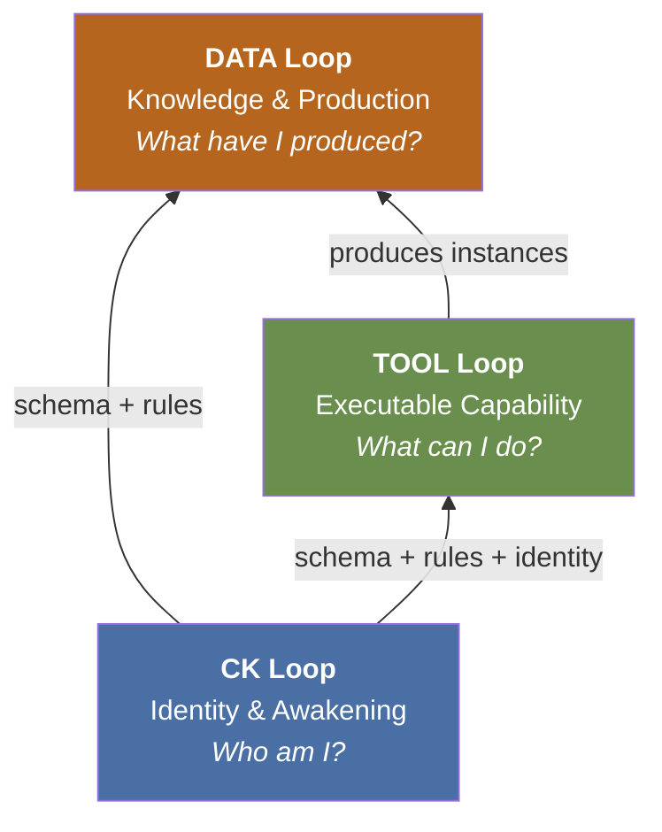
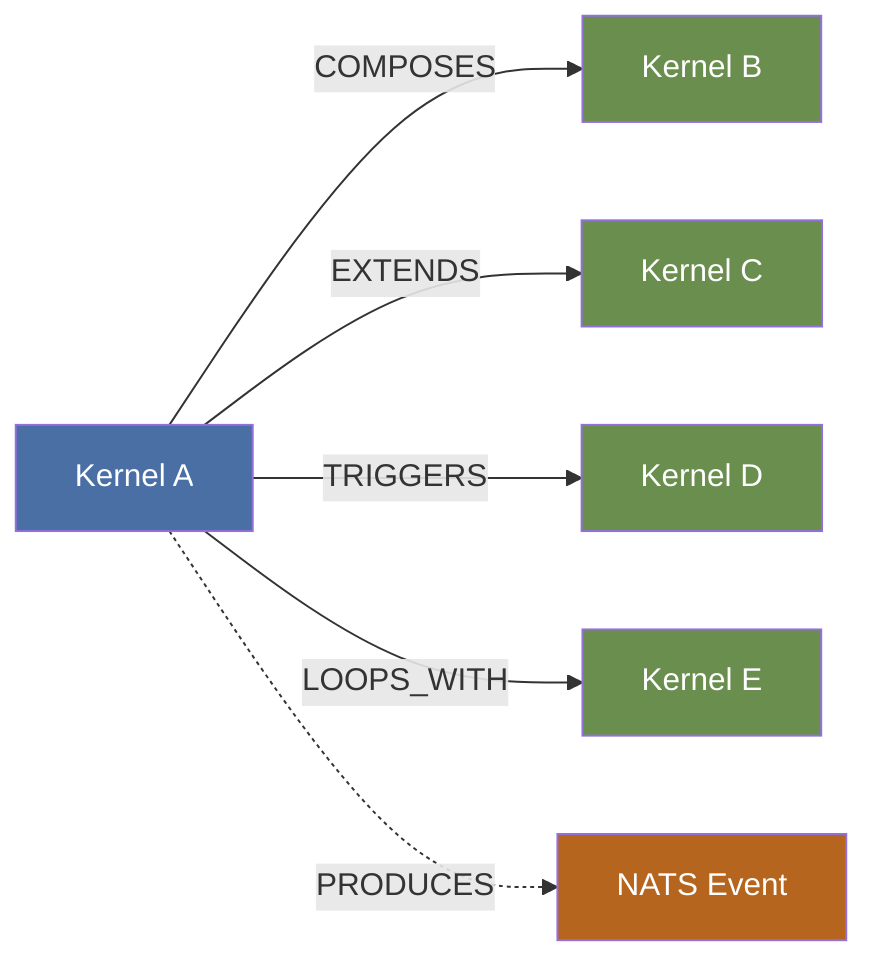

# The Three Loops as One System

## Dependency Order

The loops are not peers. They exist in a deliberate dependency order that reflects the purpose of the Material Entity:



| Loop | Exists For | Depends On | Serves |
|------|-----------|------------|--------|
| **DATA** | Accumulating what the CK knows and has produced | TOOL (to produce instances), CK (for schema + rules) | Other CKs via `ck:isAccessibleBy`; the `web/` surface; `llm/` memory |
| **TOOL** | Executing the CK's capability | CK loop (for `ontology.yaml`, `rules.shacl`, identity) | DATA loop -- every tool execution writes to `storage/` |
| **CK** | Defining and sustaining the Material Entity | Nothing -- this is the root | TOOL loop (schema, rules, identity) and DATA loop (schema, rules) |

## What Cannot Cross Loop Boundaries

::: warning The Separation Axiom
A storage write (DATA) must never cause a CK loop commit. A tool execution (TOOL) must never rewrite `ontology.yaml` or `rules.shacl`. A CK loop commit must never write directly to `storage/`. These boundaries are enforced by write authority rules on each filesystem volume -- not by convention.
:::

| Boundary | What Is Forbidden | Why |
|----------|-------------------|-----|
| **TOOL -> CK loop** | Tool execution writing to any file in the CK root volume | CK identity is operator-governed -- runtime cannot alter who the CK is |
| **DATA -> CK loop** | Storage writes causing commits to `conceptkernel.yaml` or schema | Identity and schema are design-time artifacts -- not derived from outputs |
| **DATA -> TOOL** | Instance data retroactively modifying tool source or config | Tools are versioned independently -- instances are their outputs, not inputs to their definition |
| **CK -> DATA direct** | A CK loop commit writing an instance into `storage/` | Instances are produced by tool execution -- they require the full tool-to-storage contract |
| **CK B -> CK A writes** | Any kernel writing to another kernel's CK or TOOL volume | Volumes are sovereign -- another CK may only read DATA loop outputs via declared access |

## Cross-CK Cooperation -- SPIFFE Identity Model

Cross-kernel cooperation is governed by SPIFFE workload identities, not binary role flags. Every CK is assigned a stable SPIFFE SVID at mint time. Access grants are action-scoped. Certificates are short-lived and rotated by SPIRE automatically.

| Cooperation Pattern | SPIFFE Mechanism | Enforced By |
|--------------------|------------------|-------------|
| Read another CK's storage | SPIFFE grant: `action=read-storage`, caller SVID verified | SPIRE mTLS + filesystem ACL |
| Invoke another CK's tool | SPIFFE grant: `action=invoke-tool`, caller SVID verified | SPIRE cert + CKI-Spawner identity check |
| Read CK identity files | SPIFFE grant: `action=read-identity` (explicit, audited) | SPIRE mTLS on CK loop volume read |
| React to schema changes | NATS subject requires SVID-bound NATS credential | SPIRE JWT-SVID on NATS connection |
| Compose predicate instances | Each leg of handshake verified by SVID chain | SPIRE trust bundle across predicate CK |

## The Three Loops as Autonomous Operations Business Engine (v3.4)

Every autonomous operations operational pattern maps to a specific CKP mechanism:

| Autonomous Operations Pattern | CKP Implementation | Status |
|-------------------|-------------------|--------|
| Unlimited autonomous directions | Goal kernel instances -- each goal is a direction | Implemented |
| Formal task descriptions | `task.yaml` with typed inputs, outputs, quality_criteria | Partial |
| Capability advertisement | `spec.actions` + `capability:` block in conceptkernel.yaml | Implemented |
| Audience profile accumulation | `i-audience-{session}/` instances in web-serving kernel | Future |
| Provenance for all actions | PROV-O fields in every `manifest.json`; GPG+OIDC+SVID chain | Partial |
| Deployment as ontological event | `i-deploy-{ts}/` instance with manifests and probe result | Implemented |
| SHACL reactive business rules | `rules.shacl` reactive logic layer | Future |
| Economic events (ValueFlows) | Sealed instances with `vf:EconomicEvent` typing | Future |

---

# Action Composition via Edges

A kernel's effective action set includes not only its own declared actions but also the actions of kernels it references through outbound edges. This is the operational expression of the cooperation model: a kernel that COMPOSES another gains its capabilities without reimplementing them.

::: tip Effective Action Formula
```
effective_actions(CK) = own_actions(CK)
                      + union( own_actions(edge.target)
                        for edge in CK.edges.outbound )
```
:::

## Edge Predicates and Composition Styles



| Edge Predicate | Composition Style | Context Assembly | Example |
|---------------|-------------------|------------------|---------|
| **COMPOSES** | Parent calls child actions directly (module) | Load target SKILL.md into parent context | `Acme.Visualizer` COMPOSES `Acme.UI.Layout` -> `layout.set` available |
| **EXTENDS** | Child adds capabilities to parent | Child SKILL.md extends parent's action catalog | `Acme.AdvancedEditor` EXTENDS `Acme.Editor` |
| **TRIGGERS** | Parent fires child after own action completes | Sequential -- child context loaded after parent | `Task.Kernel` TRIGGERS `ComplianceCheck` on `task.complete` |
| **LOOPS_WITH** | Bidirectional -- both can call each other | Both SKILL.md files loaded; circular guard needed | `Goal.Kernel` LOOPS_WITH `Task.Kernel` |
| **PRODUCES** | Event-driven, no request/reply | No direct context sharing -- NATS event only | `Acme.Cymatics` PRODUCES `event.Acme.Cymatics` |

::: warning LOOPS_WITH Circular Guard
When assembling context for an operate action that follows a `LOOPS_WITH` edge, mark the source CK as visited before walking the edge. Do not load the same SKILL.md twice. A visited set prevents infinite context recursion.
:::
