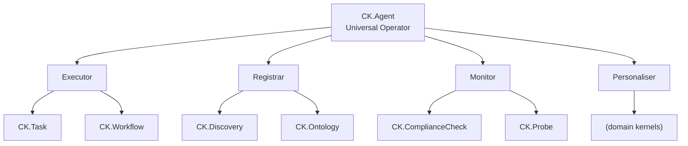

# System Kernel Taxonomy

System kernels are platform Material Entities in the `CK.*` namespace. Each follows the same three-loop structure as domain kernels. Domain CLIs invoke them; the platform CLI (CK.CLI) manages their lifecycle.

## Four Autonomous Operations Archetypes

v3.4 maps system kernels to four autonomous operations kernel archetypes. CK.Agent is the universal operator -- it can inhabit any archetype by loading the target kernel's context.

| Autonomous Operations Archetype | CKP Kernels | qualities.type | Autonomous Operations Role |
|---------------------|-------------|----------------|-----------------|
| **Executor** | CK.Task, CK.Workflow | node:hot | Receives formal task description, executes playbook, writes sealed instance with PROV-O trace |
| **Registrar** | CK.Discovery, CK.Ontology | service | Publishes fleet capability catalog; answers fleet.catalog queries; maintains semantic registries |
| **Monitor** | CK.ComplianceCheck, CK.Probe | service | Validates fleet against spec; detects anomalies; executes SHACL reactive rules; health monitoring |
| **Personaliser** | (domain kernels) | node:cold | Adapts content per audience profile; writes `i-audience-{session}/` instances; serves web/ surface |
| **Universal Operator** | CK.Agent | agent | Reads any kernel context (identity+skills+memory), executes tasks, manages conversations -- inhabits any archetype |

## System Kernel Catalog

| Kernel Class | Purpose | Tool Form | Primary DATA Output |
|-------------|---------|-----------|---------------------|
| CK.Create | Scaffolds new CK -- 3 volumes, 3 git repos, 8 awakening files, .ck-guid, apiVersion v3, compliance check on mint | bash | New CK directory tree |
| CK.Artifact | C-P-A triplet: compile tool -> Wasm, push to registry, apply CK custom resource | bash | CK custom resource in cluster |
| CK.Validate | SHACL validation of instances before storage write | Wasm | proof.json |
| CK.LinkCreate | 3-way predicate handshake -- creates PredicateKernelInstance | Wasm | Predicate storage instance |
| CK.IndexBuild | Rebuilds index/ for a given CK's storage | Wasm | Updated index/ files |
| CK.Query | Federated query across all CK storage volumes via URN resolver + filesystem scan | Wasm | Query result set |
| CK.AuditFinal | Verifies git graph integrity, symlinks, proofs across local storage | bash | Audit report in ledger/ |
| CK.Project | Defines federated namespace -- the project identity root | bash | Project instance in storage/ |
| CK.ComplianceCheck | Fleet validator -- 13 check types (v3.3 adds check.mutation_frequency) | Python | check.report instance (proof.json per check) |
| CK.Task | Task lifecycle manager -- pending -> in_progress -> completed; NATS-only mutations | Python | `storage/i-task-{conv_guid}/` with sealed data.json |
| CK.Goal | Goal manager -- owner priority, spans multiple CKs, groups tasks | Python | Goal instance in storage/ referencing task IDs |
| CK.Discovery | Fleet discovery -- kernel list, health status, namespace catalog | Python | Fleet status instance |
| CK.Agent | Agent kernel -- reads fleet context, builds action plans, executes tasks, manages conversations | agent | Conversation sessions in CK.Task instances |

::: tip
All system kernels are in the `CK.*` namespace. Domain kernels use project-specific namespace prefixes like `TG.*`, `CS.*`, etc.
:::

::: warning
CK.Task passes all 13 compliance checks identically to every other CK. There is no special exemption for system kernels -- they are held to the same standard as domain kernels.
:::
