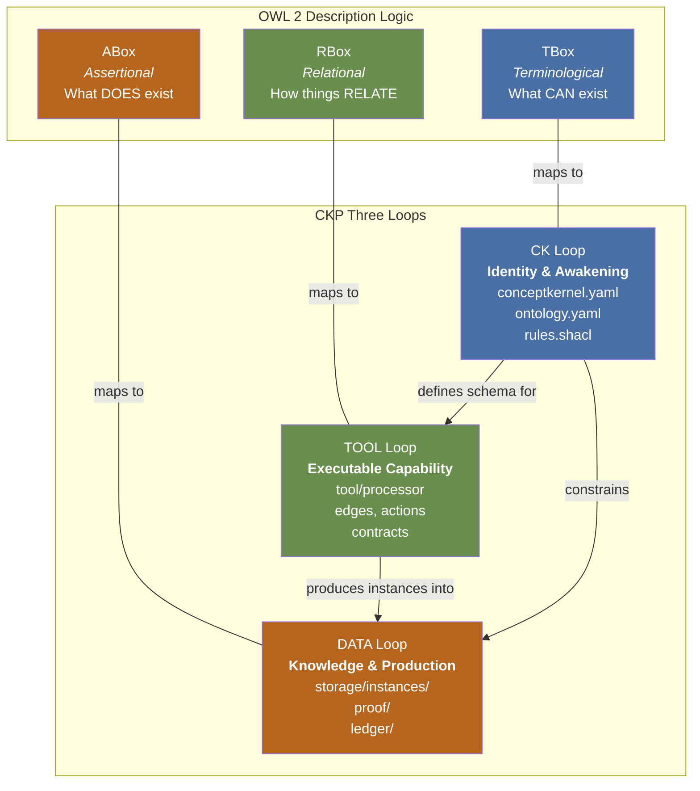
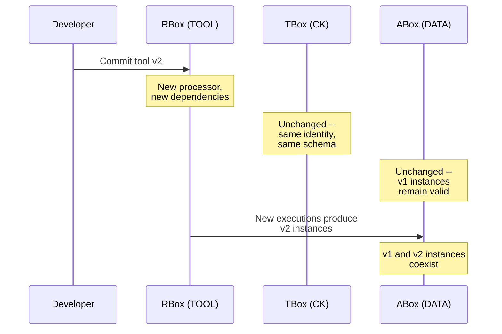

# The Three Loops as Description Logic Boxes

The three CKP loops map directly to the three boxes of OWL 2 Description Logic. This is the central architectural insight of CKP v3.5.



## The Mapping

```
CK Loop   -> TBox (terminological)   -- what CAN exist
TOOL Loop -> RBox (relational)       -- how things RELATE
DATA Loop -> ABox (assertional)      -- what DOES exist
```

This is not a metaphor. Each loop is physically realized as an independently-versioned volume:

| DL Box | CKP Loop | Physical Realization | Contents |
|--------|----------|---------------------|----------|
| **TBox** | CK Loop | `ck-{guid}-ck` volume | `conceptkernel.yaml`, `ontology.yaml`, `rules.shacl` -- defines the kernel's type |
| **RBox** | TOOL Loop | `ck-{guid}-tool` volume | `tool/processor`, edges, actions, contracts -- defines how the kernel relates and operates |
| **ABox** | DATA Loop | `ck-{guid}-storage` volume | `storage/instances/`, `proof/`, `ledger/` -- holds what the kernel has produced (individuals of the type defined in the TBox) |

::: warning Critical Implication
The three boxes are independently versioned. A change to the RBox (tool upgrade) does not require a TBox change (identity) or invalidate ABox individuals (existing instances). This separation is enforced at the filesystem volume level, not by convention.
:::

## Example: Tool Upgrade

A kernel upgrades its tool from v1 to v2:

1. The **RBox** (TOOL loop) changes -- new processor, new dependencies
2. The **TBox** (CK loop) is untouched -- identity and schema remain the same
3. The **ABox** (DATA loop) is untouched -- existing instances produced by v1 remain valid

The kernel's identity does not change. Only the relational box -- how it operates -- is versioned forward.



## Future: Database-Backed Boxes

The filesystem is the current physical layer. In future versions:

- **TBox** definitions may be served from a graph database (RDF/SPARQL)
- **ABox** instances may be served from a document database
- **RBox** (tool) remains filesystem -- it is executable code, not query results

The three-loop separation makes this migration transparent: swap the storage layer per loop without affecting the others.

::: tip Why This Matters
The DL box mapping gives CKP formal foundations in description logic. Every kernel is a micro-ontology: its TBox declares what can exist, its RBox declares how things relate, and its ABox asserts what does exist. Standard DL reasoning (subsumption, satisfiability, instance checking) applies at the kernel level.
:::
