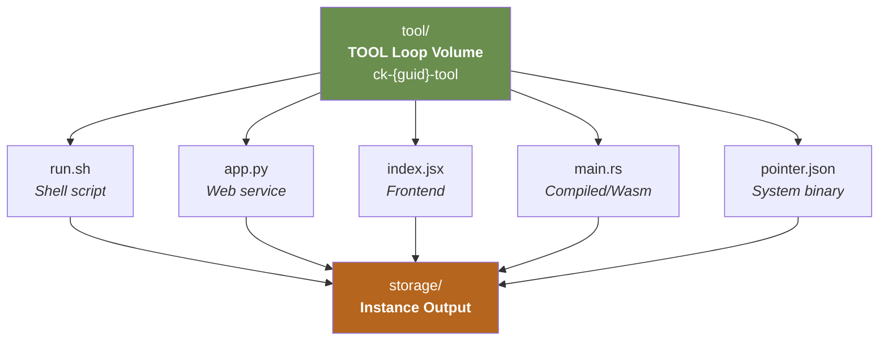

# TOOL Loop: Executable Capability

> **TOOL Loop -- What can I do?**

The TOOL loop is the capability organ of the Material Entity. It is the executable artifact the CK brings to the world -- independently versioned, independently deployable, and completely agnostic about what form it takes. A tool can be a shell script, a web service, a frontend project, or a Wasm binary. The only contract is that it lives under `tool/` and has its own git history.

## The Tool as Independent Repo

`tool/` is a separately-mounted volume on the distributed filesystem with its own git history. This means the tool can be updated, branched, and versioned completely independently of the CK's identity files. A SKILL.md update does not require a tool recompile. A tool refactor does not require a new ontology.yaml. The two repos evolve on their own schedules.

| Tool Form | What lives in `tool/` | Execution Context |
|-----------|----------------------|-------------------|
| Shell script | `run.sh` -- self-contained, may reference system binaries | Direct shell execution; system PATH applies |
| Web service | app entry point, requirements, routers, models | Runtime; runs as long-lived service process |
| Frontend project | entry point, package manifest, components, public assets | Runtime; built and served or SSR'd |
| Compiled / Wasm | source, build manifest -- compiled to .wasm artifact | Wasm runtime via Polyglot Matrix |
| System pointer | `pointer.json` -- `{ "binary": "/usr/local/bin/ffmpeg" }` | System binary invoked directly; no compilation |



## The Tool-to-Storage Contract

The tool's only obligation toward the DATA loop is to write a conforming instance into `storage/` when it produces an output. The instance must conform to the CK's `rules.shacl` before the write is accepted. Everything else -- proof generation, ledger entry, index update -- is handled by the platform after the tool writes `data.json`.

```json
{
  "instance_id":   "<short-tx>",
  "kernel_class":  "Finance.Employee",
  "kernel_id":     "7f3e-a1b2-c3d4-e5f6",
  "tool_ref":      "refs/heads/stable",
  "ck_ref":        "refs/heads/stable",
  "created_at":    "2026-03-14T10:00:00Z",
  "data": {
    "...instance payload -- must conform to ontology.yaml + rules.shacl"
  }
}
```

::: warning Minimum Contract
The tool MUST include `tool_ref` and `ck_ref` in every instance output. These fields create the provenance link between what was produced (ABox) and which version of the tool (RBox) and identity (TBox) produced it. Without these fields, the instance cannot be traced.
:::

## TOOL Loop NATS Topics

```
ck.{guid}.tool.commit          # TOOL repo -- new commit (tool updated)
ck.{guid}.tool.ref-update      # Tool branch pointer moved
ck.{guid}.tool.promote         # Tool version promoted to stable
ck.{guid}.tool.invoked         # Tool execution started
ck.{guid}.tool.completed       # Tool execution finished successfully
ck.{guid}.tool.failed          # Tool execution failed
```

::: tip Independence Principle
The TOOL loop is the only loop whose form is unconstrained. Shell scripts, web services, frontends, compiled binaries, and system pointers are all valid tools. The protocol does not care what the tool IS -- only that it writes conforming instances to `storage/` and includes provenance refs in its output.
:::
