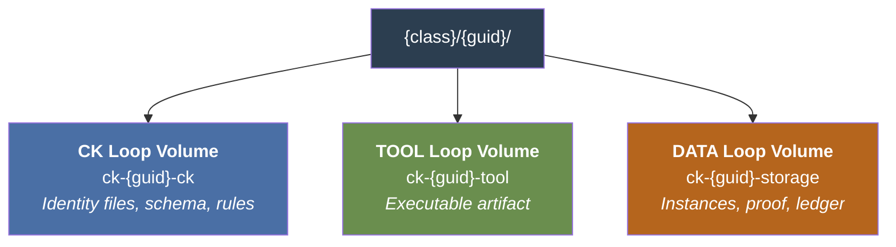
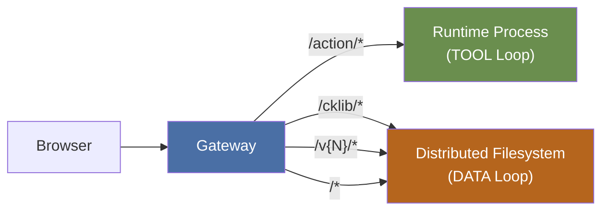

# Topology

## Unified Tree -- What the CK Sees

Every Concept Kernel presents a single unified filesystem tree to all processes working inside it. From inside the CK, there is no visible seam between the three volumes. From the distributed filesystem, each root is an independently-mounted volume with its own git history, retention policy, and write authority.

::: tip Mount Convention
This convention is a platform standard applied identically to every Concept Kernel on mint. It is never declared in `conceptkernel.yaml` -- that file carries identity only. The platform routes the paths to volumes automatically. Three volumes, one tree.
:::

::: details Full Unified Tree
```
{ns}/{project}/concepts/{KernelName}/{guid}/
|
|  -- IDENTITY & AWAKENING FILES (OPS root) --
|
|- conceptkernel.yaml          <- I am   (apiVersion: conceptkernel/v3,
|                                          namespace_prefix, domain, project, BFO:0000040)
|- .ck-guid                    <- canonical SPID UUID (filesystem identity)
|- README.md                   <- Why I am   (purpose, goals, context)
|- CLAUDE.md                   <- How I am   (OPS root -- agent reads here
|                                          automatically. NOT in storage/llm/)
|- SKILL.md                    <- What I can do   (action catalog)
|- CHANGELOG.md                <- What I have become   (completed evolution)
|- ontology.yaml               <- Shape of my world   (LinkML TBox schema)
|- rules.shacl                 <- My constraints   (SHACL validation rules)
|- serving.json                <- Which version of me is active
+- .policy                     <- Local governance rules (GPG, signing)
|
|  -- TOOL (virtual mount) --
|
|- tool/                       <- TOOL loop root (volume: ck-{guid}-tool)
|   |- run.sh                    . shell script
|   |- app.py                    . web service
|   |- index.jsx                 . frontend project
|   |- main.rs / Cargo.toml      . compiled / Wasm
|   +- [system pointer]          . reference to system-installed binary
|
|  -- STORAGE (virtual mount) --
|
+- storage/                    <- DATA loop root (volume: ck-{guid}-storage)
    |- instance-<short-tx>/     <- OR  i-task-{conv_guid}/  for task instances
    |   |- manifest.json           who, what, when, bindings
    |   |- data.json               sealed output -- write-once at completion
    |   |- conversation_ref.json   { conv_guid, path } pointer to agent session
    |   |- ledger.json             append-only state log
    |   |- proof.json              validation result
    |   +- conversation/           occurrent records
    |- proof/
    |- ledger/
    |   +- audit.jsonl
    |- index/
    |- llm/                     <- runtime memory (DATA loop)
    |   |- context.jsonl
    |   |- memory.json
    |   +- embeddings/
    +- web/
```
:::

## Physical Volume Layout

Three volumes are provisioned per CK on mint. Each has an independent git history. The filesystem routes path prefixes to volumes transparently.



### Volume Topology

```
filesystem://
|
+- {class}/                         e.g.  concepts/Finance.Employee/
    +- {guid}/
        |
        |- [CK loop volume]         ck-{guid}-ck
        |     path:      /{class}/{guid}/
        |     git:       yes -- developer commits, permanent
        |     retention: permanent (identity never expires)
        |     write:     operator / CI pipeline
        |     read:      any kernel (for awakening + serving)
        |
        |- tool/  [TOOL loop volume] ck-{guid}-tool
        |     path:      /{class}/{guid}/tool/
        |     git:       yes -- tool author commits, permanent
        |     retention: permanent (tool history is audit trail)
        |     write:     tool developer / CI pipeline
        |     read:      kernel runtime (for execution)
        |
        +- storage/  [DATA loop volume] ck-{guid}-storage
              path:      /{class}/{guid}/storage/
              git:       yes -- append-only, archival
              retention: policy-governed (configurable per class)
              write:     kernel runtime only
              read:      declared ck:isAccessibleBy kernels only
```

### Volume Comparison

| Property | CK Loop (`ck-{guid}-ck`) | TOOL Loop (`ck-{guid}-tool`) | DATA Loop (`ck-{guid}-storage`) |
|----------|--------------------------|-----------------------------|---------------------------------|
| Contents | Identity files, schema, rules, serving.json | Executable artifact -- any form | Instances, proof, ledger, index, llm, web |
| Git semantics | Append DAG -- branch + merge | Append DAG -- branch + merge | Append-only -- no rewrites, no deletes |
| Who writes | Operator, developer, CI pipeline | Tool developer, CI pipeline | Kernel runtime exclusively |
| Who reads | Any kernel at awakening, routing layer | Runtime executor, CKI spawner | CKs declared in `ck:isAccessibleBy` |
| Versioning goal | Track CK identity evolution | Track capability evolution | Accumulate knowledge and proof |
| Can be wiped | No -- permanent record of what CK was | No -- tool history is audit trail | No -- instances are immutable once written |
| GC policy | None -- all commits retained forever | None -- all tool versions retained | Archival after policy period (never deleted) |

::: tip Platform Standard -- Not Per-CK Config
The three mount paths (`/`, `/tool/`, `/storage/`) are identical for every Concept Kernel. They are defined once at platform level and applied automatically on kernel mint. `conceptkernel.yaml` carries identity only -- it does not declare mounts.
:::

## Version Materialisation

Each volume is a git repository on the distributed filesystem. Git provides deduplication, history, branching, and atomic rollback.

### Explicit Version Directories

Versions are explicit paths on the filesystem. No weighted canary, no header-based routing. Each active version is a directory:

```
/{conceptkernel}/storage/web/v1/    <- version 1
/{conceptkernel}/storage/web/v2/    <- version 2 (current)
```

`serving.json` declares which versions are active and which is current:

```json
{
  "versions": [
    { "name": "v1", "active": true },
    { "name": "v2", "active": true, "current": true },
    { "name": "v3", "active": false, "deprecated_at": "2026-04-01" }
  ]
}
```

Deprecation is announced with the `deprecated_at` field. Old versions are removed when `active: false`.

### Consumer Resolution

Per v3.4 S7.4.3:

- `depends_on: ckp://Instance#i-task-{guid}` -- HEAD (always-latest)
- `depends_on: ckp://Instance#i-task-{guid}@b2c1f4` -- pinned commit (frozen input)

Both valid simultaneously. No coordination required.

### Gateway Routes Per Version

```yaml
rules:
  - matches: [{ path: { type: PathPrefix, value: /v1/ } }]
    # -> filesystem storage/web/v1/
  - matches: [{ path: { type: PathPrefix, value: /v2/ } }]
    # -> filesystem storage/web/v2/
  - matches: [{ path: { type: PathPrefix, value: / } }]
    # -> filesystem storage/web/v2/ (current)
```

Standard Gateway API. No extensions, no custom filters.

## Gateway Split Routing

Web content lives in the DATA loop at `storage/web/`. The gateway routes public HTTP traffic directly to the distributed filesystem -- not through the runtime process.



No FUSE overhead for web serving. The runtime process only runs the TOOL loop.

::: details Full Route Rule Pattern
```yaml
rules:
  # API actions -> runtime process
  - matches:
      - path: { type: PathPrefix, value: /action/ }
    backendRefs:
      - name: {service_name}
        port: 80

  # Edge dependencies -> filesystem
  - matches:
      - path: { type: PathPrefix, value: /cklib/ }
    filters:
      - type: URLRewrite
        urlRewrite:
          path:
            type: ReplacePrefixMatch
            replacePrefixMatch: /{project}/concepts/SharedLib/storage/web/
    backendRefs:
      - name: {filesystem_service}

  # Explicit version paths -> filesystem
  - matches:
      - path: { type: PathPrefix, value: /v1/ }
    filters:
      - type: URLRewrite
        urlRewrite:
          path:
            replacePrefixMatch: /{project}/concepts/{conceptkernel}/storage/web/v1/
    backendRefs:
      - name: {filesystem_service}

  # Current version (catch-all) -> filesystem
  - matches:
      - path: { type: PathPrefix, value: / }
    filters:
      - type: URLRewrite
        urlRewrite:
          path:
            replacePrefixMatch: /{project}/concepts/{conceptkernel}/storage/web/v2/
    backendRefs:
      - name: {filesystem_service}
```
:::
