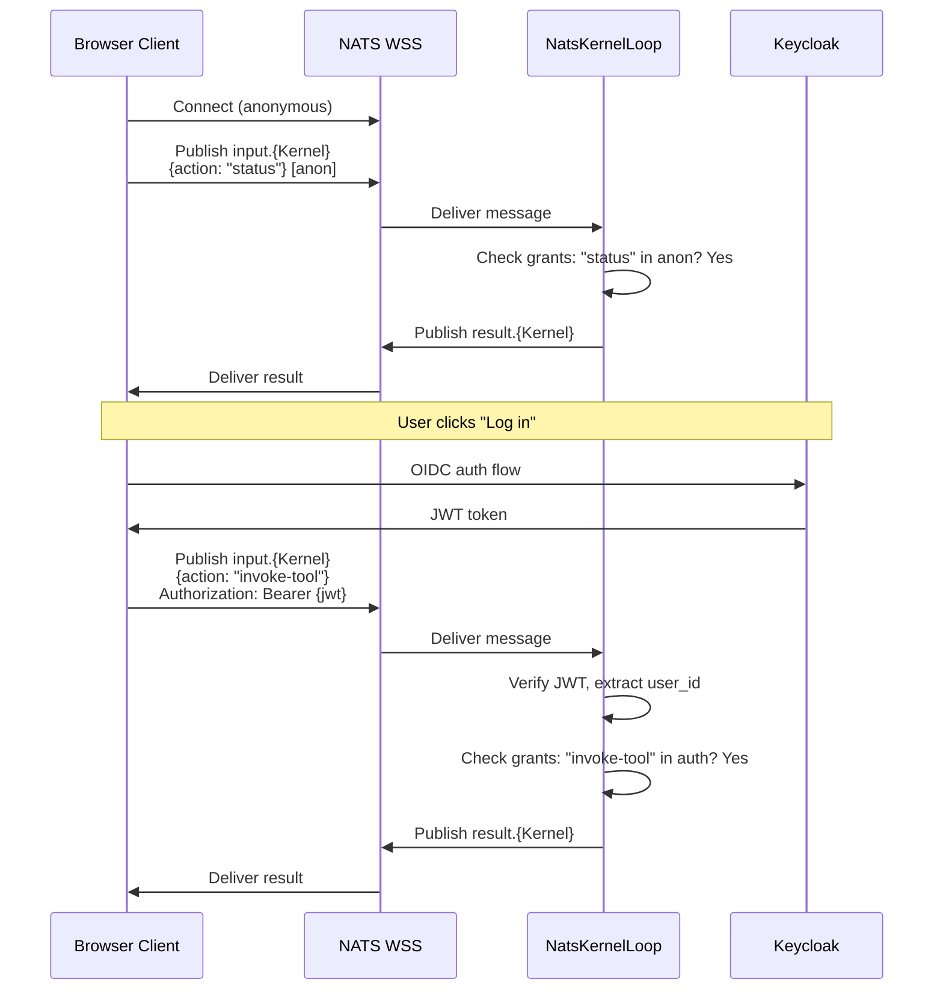

# Authentication

## Why Authentication Needed an Ontology Class

v3.5 kernels had no concept of user identity. Every NATS message was anonymous. The web shell (when it arrived) had no way to distinguish users or restrict actions. This created a fundamental gap: the `access: auth` field on actions had no enforcement mechanism.

The v3.6 answer is not to bolt on auth as middleware. It is to make authentication a **first-class ontological concept** -- declared in the same `ontology.yaml` that declares kernel types, actions, and edges. If auth is not in the ontology, it does not exist in the cluster.

## Three Authentication Levels

CKP supports three authentication levels over NATS: anonymous (`anon`), authenticated (`auth`), and owner (`owner`). A single authentication model works identically for browsers (WSS) and server-side kernels (TCP), eliminating the class of bugs where "it works in dev but not in production" because the auth path differs.

| Access Level | NATS Mechanism | CKP Mapping | Typical Use |
|-------------|----------------|-------------|-------------|
| `anon` | No auth required on NATS connection | `grants.identity: anon` actions | Status checks, public queries, read-only browsing |
| `auth` | JWT token in NATS connection credentials or message headers | `grants.identity: auth` actions | Data input, tool invocation, session participation |
| `owner` | JWT with kernel-owner claim | `grants.identity: owner` actions | Configuration, teardown, grant management |

The three-level model maps directly to the grants block in `conceptkernel.yaml`, creating a single source of truth for access control. See [Namespace Security -- Grants Block](./namespace-security#grants-block----access-control) for the full grants schema.

### Topic ACL Rules per Auth Level

Access level determines which NATS topics a client can publish to and subscribe to. These ACLs are enforced by the NATS server configuration, not by kernel code.

| Level | Can Publish To | Can Subscribe To |
|-------|---------------|-----------------|
| `anon` | `input.{Kernel}` | `result.{Kernel}`, `event.{Kernel}` |
| `auth` | `input.{Kernel}`, `admin.{Kernel}` | `result.{Kernel}`, `event.{Kernel}`, `metrics.{Kernel}`, `stream.{Kernel}` |
| `owner` | All kernel topics | All kernel topics |

:::tip Why Anon Can Publish to Input
Anonymous users must be able to invoke actions that the kernel has explicitly granted to `anon` (e.g., `status`). The grants block controls which actions are permitted, not the transport layer. Allowing `anon` to publish to `input` while restricting the action set via grants provides the right separation of concerns.
:::

### Kernel Type Authentication Requirements

| Kernel Type | Connection Auth | Message Auth | Notes |
|-------------|----------------|-------------|-------|
| `node:hot` | SPIFFE JWT-SVID | SPIFFE JWT-SVID | Always connected, always authenticated |
| `node:cold` | SPIFFE JWT-SVID | SPIFFE JWT-SVID | Authenticated on startup, connection held for session |
| `agent` | SPIFFE JWT-SVID | SPIFFE JWT-SVID | Long-lived connection with streaming |
| `inline` | WSS (anon or Keycloak) | Keycloak JWT in headers | Browser client, per-message auth |
| `static` | None | None | No NATS connection |

## SPIFFE JWT-SVID Integration

Server-side kernel-to-kernel communication uses SPIFFE JWT-SVIDs as NATS connection credentials. Every Concept Kernel is a SPIFFE workload with a stable identity assigned at mint time.

```python
# Caller obtains JWT-SVID from SPIRE agent:
spiffe_jwt = spire_agent.fetch_jwt_svid(audience='nats.{domain}')

# NATS connection:
nats.connect('nats://nats.{domain}:4222',
             user=f'spiffe://{domain}/ck/{class}/{guid}',
             password=spiffe_jwt)
```

Subject-level ACLs are derived from the grants block:
- **publish:** `ck.{own-guid}.*` is always allowed (own topics).
- **subscribe:** `ck.{other-guid}.*` is allowed only if a grant exists and the requested action matches.

### SPIRE Certificate Lifecycle

SPIRE handles the entire certificate lifecycle automatically:

1. SVID issued at kernel startup from local SPIRE agent.
2. SVID valid for 1 hour (configurable TTL).
3. SPIRE rotates SVID automatically before expiry.
4. No kernel code manages certificates.

:::info Why This Matters
SPIFFE provides workload identity without shared secrets. Each kernel gets a cryptographically verifiable identity at mint time. SPIRE manages the full lifecycle -- issuance, rotation, revocation -- so kernel code never touches certificates. The SPIFFE ID (`spiffe://{domain}/ck/{class}/{guid}`) maps directly to the grants block, creating a unified identity model from Kubernetes namespace to NATS topic ACL.
:::

## Anonymous-to-Authenticated Escalation

Browser clients MAY connect anonymously and escalate to authenticated mid-session without NATS reconnection. This is a critical UX feature: a user can browse public kernel status anonymously, then log in to invoke authenticated actions without losing their NATS connection.



The escalation flow:

1. Client connects to NATS WSS without credentials (anonymous).
2. Client publishes to `input.{Kernel}` -- only `anon`-granted actions are permitted by the grants block.
3. Client authenticates via Keycloak (or equivalent OIDC provider) and obtains a JWT.
4. Client includes `Authorization: Bearer {jwt}` in subsequent NATS message headers.
5. `NatsKernelLoop` verifies the JWT and grants `auth`-level access for that message.

Token refresh occurs transparently. The client refreshes via the identity provider and includes the new token in the next message's headers. No NATS reconnection is required because authentication is per-message (via headers), not per-connection.

### JWT Claims Used by CKP

| Claim | Usage |
|-------|-------|
| `preferred_username` | Mapped to `X-User-ID` for audit and identity |
| `sub` | Unique subject identifier |
| `aud` | Audience -- MUST match the kernel's `auth.client_id` |
| `exp` | Expiration timestamp -- MUST be checked |
| `realm_access.roles` | Used for `owner` level determination |
| `azp` | Authorised party -- the client_id that obtained the token |

## AuthConfig Schema

Every CK.Project instance MAY declare an `auth` block in its project declaration. If omitted, the project operates in anonymous-only mode -- all actions with `access: auth` are unreachable.

```yaml
auth:
  provider: keycloak       # keycloak | none
  instance: keycloak-name  # Keycloak CR on cluster
  realm: realm-name        # Keycloak realm
  client_id: ck-web        # OIDC public client
  issuer_url: https://id.example.com/realms/realm-name
  create_realm: false      # true = operator creates realm
  redirect_uris: []        # required if create_realm
  web_origins: []          # required if create_realm
```

The schema is deliberately minimal. CKP is not an auth framework -- it delegates to Keycloak for the actual OIDC machinery. What CKP controls is the **declaration** (what auth exists) and the **provisioning** (how auth reaches the cluster).

### Two Modes

The `create_realm` flag governs whether the operator is a consumer or creator of Keycloak infrastructure:

**Mode 1: Reuse existing realm** (default, `create_realm: false`)

The project attaches to a Keycloak realm that already exists. The operator verifies the OIDC endpoint, injects the issuer URL into deployments, and moves on. Zero Keycloak write permissions required.

This works when the existing realm has a wildcard redirect URI (e.g., `https://*.tech.games/*`) that covers the new project's hostname. The reference deployment uses this: `delvinator.tech.games` reuses the `techgames` realm.

**Mode 2: Create own realm** (`create_realm: true`)

The operator generates a `KeycloakRealmImport` CR and applies it to the cluster. The Keycloak operator provisions the realm, client, and cryptographic key provider. The new realm is specific to this project.

The reference deployment demonstrates this: `hello.tech.games` creates its own `hello` realm because it runs in a different namespace and needs its own redirect URIs.

### Why Two Modes?

The reuse/create split reflects a real operational trade-off:

| Concern | Reuse | Create |
|---------|-------|--------|
| Keycloak write permissions | None needed | `keycloakrealmimports: get, list, create` |
| Shared user base | Yes -- same realm means same users | No -- separate realm, separate users |
| Operator simplicity | Just verify endpoint | Generate CR, wait for provisioning |
| Teardown | Nothing to clean up | Realm retained (identity outlives compute) |

The operator MUST NOT modify or delete existing realms. It can birth realms but never destroy them. This is a deliberate asymmetry: identity is more permanent than compute.

## deploy.auth -- The Reconciliation Step

`deploy.auth` is a step in the CK.Operator reconciliation lifecycle. It executes between `deploy.routing` and `deploy.endpoint`:

```
deploy.namespace    -- create/verify project namespace
deploy.storage.ck   -- create CK loop PV (ReadOnlyMany)
deploy.storage.data -- create DATA loop PV (ReadWriteMany)
deploy.processors   -- create Deployments, Services
deploy.web          -- create web server Deployment
deploy.routing      -- create HTTPRoute
deploy.auth         -- provision auth (THIS STEP)
deploy.endpoint     -- verify external endpoint HTTP 200
```

### Step-by-Step Execution

The `deploy.auth` step is idempotent -- running it multiple times on the same project produces the same result.

| Step | Action | Failure Mode |
|------|--------|-------------|
| 1 | Read auth block from project declaration | If missing or `provider: none`: skip remaining steps |
| 2 | If `create_realm: true`: create `KeycloakRealmImport` CR | Skip if CR already exists (idempotent) |
| 3 | Inject `KEYCLOAK_ISSUER` env var into processor deployments | Deployment update |
| 4 | Inject `KEYCLOAK_CLIENT_ID` env var into processor deployments | Deployment update |
| 5 | Inject auth config into web `index.html` ConfigMap | ConfigMap update |
| 6 | Verify: OIDC discovery endpoint returns HTTP 200 | Deploy blocks until reachable |
| 7 | Verify: JWKS endpoint returns HTTP 200 with keys | Deploy blocks until reachable |

### KeycloakRealmImport Generation

When `create_realm: true`, the operator generates a full Keycloak realm import:

```yaml
apiVersion: k8s.keycloak.org/v2alpha1
kind: KeycloakRealmImport
metadata:
  name: {subdomain}-realm
  namespace: keycloak-operator
  labels:
    conceptkernel.org/project: {hostname}
spec:
  keycloakCRName: {instance}
  realm:
    realm: {realm}
    displayName: "{subdomain} (CKP)"
    enabled: true
    clients:
      - clientId: {client_id}
        publicClient: true
        standardFlowEnabled: true
        directAccessGrantsEnabled: true
        redirectUris: {redirect_uris}
        webOrigins: {web_origins}
        defaultClientScopes: [openid, profile, email]
        protocolMappers:
          - name: audience
            protocol: openid-connect
            protocolMapper: oidc-audience-mapper
            config:
              access.token.claim: "true"
              id.token.claim: "true"
              included.client.audience: {client_id}
    components:
      org.keycloak.keys.KeyProvider:
        - name: eddsa-key-provider
          providerId: eddsa-generated
          config:
            active: ["true"]
            algorithm: ["EdDSA"]
            enabled: ["true"]
            priority: ["200"]
```

Key design decisions:
- **Public client** (`publicClient: true`) -- no client secret needed. The web shell is a browser SPA; it cannot keep secrets.
- **Direct access grants** -- enables the password grant flow that `ck-client.js` uses from the browser.
- **EdDSA key provider** -- Ed25519 signatures. Faster and shorter than RSA. Priority 200 overrides the default RSA provider.
- **Audience mapper** -- ensures the JWT `aud` claim contains the client ID, which processors validate.

## Verification

Auth verification adds checks to the proof chain. All checks must pass before the deploy is marked ready.

| Check | Method | Expected |
|-------|--------|----------|
| `oidc_discovery` | `curl {issuer_url}/.well-known/openid-configuration` | HTTP 200 |
| `jwks_reachable` | `curl {issuer_url}/protocol/openid-connect/certs` | HTTP 200 + `keys` array present |
| `env_injected` | Inspect processor deployment env vars | `KEYCLOAK_ISSUER` and `KEYCLOAK_CLIENT_ID` present |
| `web_config_injected` | Inspect web ConfigMap | Auth config present in `window.__CK_CONFIG` |

The first two checks (`oidc_discovery` and `jwks_reachable`) bring the total from 13 (v3.5.2) to 15 (v3.5.5+). The latter two are internal consistency checks.

::: warning Verification Order Matters
`oidc_discovery` runs before `jwks_reachable`. If OIDC discovery fails, the JWKS check is skipped -- there is no point validating keys if the issuer endpoint is unreachable. This is the same halt-on-failure principle used throughout the proof chain.
:::

## Teardown Semantics

Auth resources follow a clear lifecycle rule: **identity outlives compute**. Users who authenticated against a realm retain their identity even after all kernel compute is removed.

| Resource Type | Teardown Action | Rationale |
|---------------|----------------|-----------|
| Deployments | **Deleted** | Compute is ephemeral |
| Services | **Deleted** | Routing follows compute |
| ConfigMaps | **Deleted** | Configuration follows compute |
| HTTPRoutes | **Deleted** | Routing follows compute |
| ConceptKernel CRs | **Deleted** | Logical representation of running kernels |
| PersistentVolumes | **Retained** | Data is the kernel's accumulated knowledge |
| KeycloakRealmImport | **Retained** | Identity outlives compute |
| Keycloak instance | **Untouched** | Shared across projects |
| Namespace | **Retained** | Anchors PVCs and realm |

All operator-created resources carry a `conceptkernel.org/project` label, enabling cross-namespace inventory:

```bash
kubectl get pv,keycloakrealmimport -A -l conceptkernel.org/project=hello.tech.games
```

## RBAC for Realm Creation

CK.Operator requires additional RBAC for `create_realm: true` mode:

```yaml
- apiGroups: [k8s.keycloak.org]
  resources: [keycloakrealmimports]
  verbs: [get, list, create]
```

Note the deliberate absence of `patch`, `update`, and `delete`. The operator can birth realms but MUST NOT modify or destroy existing ones. This is enforced at the Kubernetes RBAC level -- not by convention.

:::warning Why No Update or Delete
Granting `update` or `delete` on realms would allow the operator to destroy user accounts or change security settings. The protocol deliberately limits the operator to `create` -- it can bring identity into existence but cannot alter it after creation. This matches the broader CKP principle that compute is ephemeral but identity persists. Manual Keycloak administration is required for realm modification or deletion.
:::

## Multi-Project Auth: The Hello.Greeter Test

v3.5.7 deployed `Hello.Greeter` to `hello.tech.games` as a proof that auth works across multiple projects with different realm strategies:

| Project | Hostname | Realm | Mode | Namespace |
|---------|----------|-------|------|-----------|
| Delvinator | delvinator.tech.games | techgames | Reuse | ck-delvinator |
| Hello | hello.tech.games | hello | Create | ck-hello |

Both projects:
- Pass 15/15 verification checks (including auth)
- Show working login in the web shell
- Have independent namespace isolation

The `hello` realm was created by the operator via `KeycloakRealmImport`. The `techgames` realm was pre-existing. Both produce valid JWTs that processors can verify.

## Architectural Consistency Check

::: details Logical Analysis: Auth and the Three-Loop Model

**Question:** Does auth belong in the CK loop, the TOOL loop, or the DATA loop?

**Answer:** Auth config is declared in the CK.Project ontology -- this is **CK loop** territory (TBox). The auth provider, realm, and client ID are identity declarations, not runtime state. They change at design time, not at runtime.

However, JWTs themselves are **DATA loop** artifacts. A JWT is an instance: it has a creation time, an expiry, claims, and a signature. It is produced by Keycloak (an external process) and consumed by kernel processors. The JWT is not stored in the DATA loop (it lives in browser memory), but it follows the same pattern: a runtime artifact governed by a design-time schema.

**Question:** Why not embed auth directly in NatsKernelLoop?

**Answer:** Because not all kernels need auth. A `LOCAL.*` kernel running on a developer machine has no Keycloak. An `AUTONOMOUS` kernel with SPIFFE mTLS uses a different identity model entirely. Auth is a concern of the **project**, not the kernel. The kernel sees env vars (`KEYCLOAK_ISSUER`, `KEYCLOAK_CLIENT_ID`) injected by the operator -- it does not know how those values got there.

**Gap identified:** The current auth model covers browser-to-kernel authentication (JWT via NATS headers). It does NOT cover kernel-to-kernel authentication, which requires SPIFFE SVIDs. This is acknowledged in the v3.5 spec (Chapter 16) and deferred to a future SPIFFE integration milestone.
:::

## Conformance Requirements

### NATS Authentication (Chapter 17)

| Criterion | Level |
|-----------|-------|
| Server-side kernels MUST use SPIFFE JWT-SVID for NATS auth | REQUIRED |
| Browser clients MUST connect via WSS | REQUIRED |
| Anonymous-to-authenticated escalation MUST be supported without reconnection | REQUIRED |
| JWT MUST be verified server-side before handler dispatch | REQUIRED |
| Token refresh MUST NOT require NATS reconnection | REQUIRED |
| NATS topic ACLs MUST be enforced by the NATS server | REQUIRED |

### AuthConfig and Provisioning (Chapter 18)

| Criterion | Level |
|-----------|-------|
| CK.Operator MUST inject auth env vars when auth is declared | REQUIRED |
| CK.Operator MUST verify OIDC discovery endpoint before marking deploy ready | REQUIRED |
| CK.Operator MUST verify JWKS endpoint before marking deploy ready | REQUIRED |
| CK.Operator MUST NOT modify existing Keycloak realms | REQUIRED |
| CK.Operator MUST NOT delete KeycloakRealmImport on teardown | REQUIRED |
| CK.Operator MUST label all auth resources with `conceptkernel.org/project` | REQUIRED |
| If `auth.provider` is `keycloak`, `realm`, `client_id`, `issuer_url` MUST be present | REQUIRED |
| If `create_realm: true`, `redirect_uris` MUST contain at least one entry | REQUIRED |
| Auth config (issuer, realm, client_id) MUST be injected by the operator, not hardcoded in kernel code | REQUIRED |

See also: [Namespace Security](./namespace-security) for grants enforcement and ODRL projection, [Loop Isolation](./isolation) for volume-level security, [NATS Messaging](./nats) for topic conventions and transport details, [Message Envelope](./message-envelope) for JWT verification in the NatsKernelLoop processing cycle.
