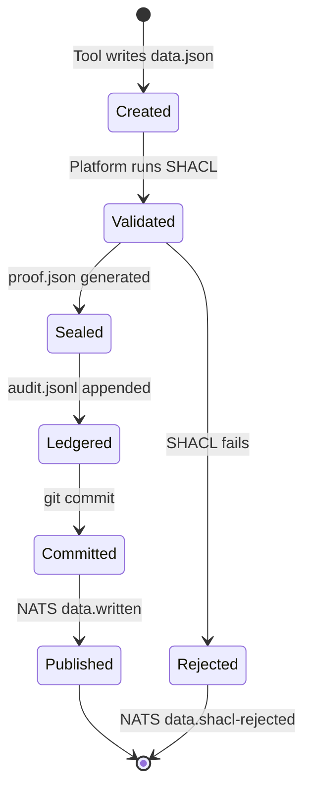
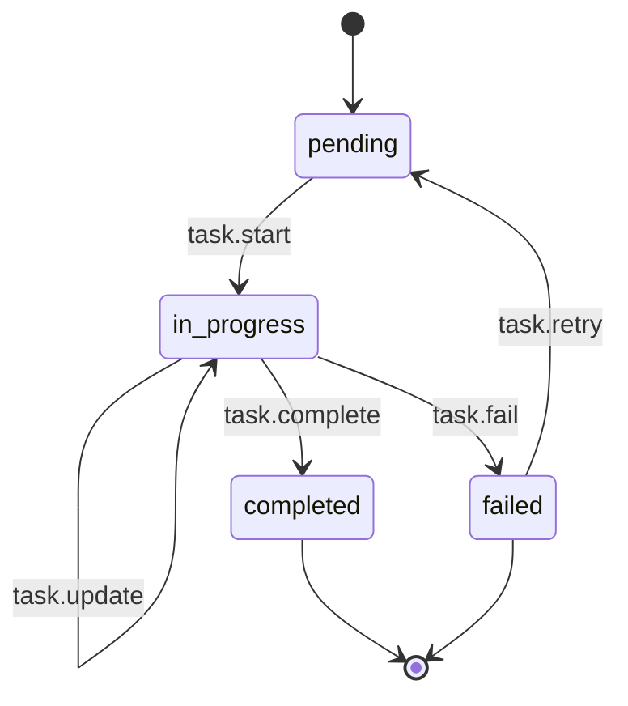
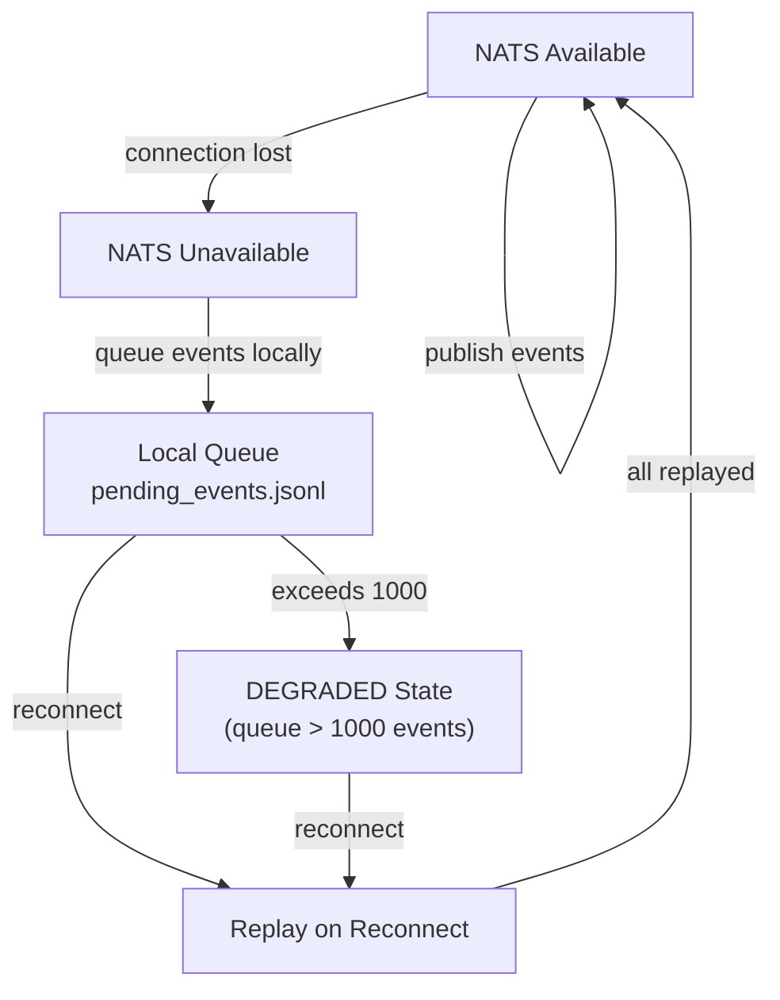

# DATA Loop -- Knowledge and Production

> Chapter 8 of the CKP v3.6 Specification -- *Normative*

## Purpose

The DATA loop is the memory organ of the Material Entity. It is the accumulation of everything the kernel has created, verified, and come to know. Instances live here. Proofs live here. The audit ledger lives here. LLM context lives here. The web surface lives here. Nothing is ever rewritten. The storage volume grows over time and is the kernel's most valuable asset.

The DATA loop exists because knowledge must outlive any individual process execution. A kernel that loses its accumulated data loses its purpose. By isolating knowledge in a dedicated, append-only volume, CKP ensures that identity upgrades and tool changes never risk data loss.

In Description Logic terms, the DATA loop is the **ABox**. Its contents are individuals -- specific instances of the types defined in the TBox ([CK loop](./ck-loop)).

## The Instance Tree

Every tool execution that produces an output creates one instance folder. CKP distinguishes two instance kinds: **sealed instances** (write-once from first write) and **task instances** (lifecycle state tracked in `ledger.json` via NATS; `data.json` sealed at completion).

```
data/                              # DATA loop root (v3.6.1: renamed from data/)
                                   # Mounted at /ck/{kernel}/data/ in pod
                                   # Sourced from /ck-data/{hostname}/{kernel}/{version}/

# -- TYPED INSTANCES (direct children of the kernel) --
|- instance-<short-tx>/            # sealed instance — the kernel's typed output
|   |- manifest.json              # who, what, when, bindings
|   |- data.json                  # write-once output sealed on first write
|   |- proof.json                 # validation result (check-type actions)
|   +- ledger.json                # before/after for mutate-type actions

# -- TASK INSTANCE (task kernel) --
|- i-task-{conv_guid}/
|   |- manifest.json              # status, target_ck, goal_id, priority, order
|   |- conversation_ref.json      # { conv_guid, path } pointer to agent session
|   |- data.json                  # write-once -- sealed at task.complete NATS event ONLY
|   |- ledger.json                # append-only state log -- all mutations via NATS
|   +- conversation/              # operate-type: append-only session records
|       |- c-{conv_id_1}.jsonl    #   first session
|       +- c-{conv_id_2}.jsonl    #   resumed session

# -- PROJECT-INSTANCE DATA (per-project, per-version) --
|- proof/                          # verification evidence
|- ledger/                         # audit trail
|   +- audit.jsonl
|- index/                          # derived search indices
|   |- by_timestamp.json
|   |- by_task_id.json
|   +- by_confidence.json
|- llm/                            # LLM interaction logs
|   |- context.jsonl
|   |- memory.json
|   +- embeddings/
+- web/                            # runtime web data (uploads, generated pages)
```

::: tip Instances vs Project Data (v3.6.1)
**Instances** (`instance-<tx>/`, `i-task-{guid}/`) are the kernel's typed output — they ARE the data type defined in `ontology.yaml`. They are direct children of the DATA loop root.

**Project data** (`proof/`, `ledger/`, `index/`, `llm/`, `web/`) is operational state specific to this project deployment. It supports the kernel's operation but is not the kernel's typed output.

Both live in the DATA loop at `/ck-data/{hostname}/{kernel}/{version}/`, mounted at `/ck/{kernel}/data/` in the pod.
:::

### Sealed Instances vs Task Instances

| Aspect | Sealed Instance | Task Instance |
|--------|----------------|---------------|
| Directory pattern | `instance-<short-tx>/` | `i-task-{conv_guid}/` |
| `data.json` sealed | On first write | At `task.complete` NATS event only |
| State tracking | None (atomic write) | `ledger.json` via NATS lifecycle events |
| Conversation records | Not present | `conversation/` subdirectory (append-only) |

## PROV-O Provenance

Every instance record MUST include PROV-O provenance fields linking the instance to the action that created it, the operator who authorised it, and the kernel that produced it. This implements the fleet audit principle: every autonomous action traces to its playbook, its executing agent, and its input data.

::: danger
Implementations that omit PROV-O fields from instance records are **non-conformant**. Provenance is not optional -- it is a MUST-level requirement.
:::

### Mandatory Fields

| PROV-O Field | Purpose | Example |
|-------------|---------|---------|
| `prov:wasGeneratedBy` | The action execution that created this instance | `ckp://Action#Task.task.create-1773518402000` |
| `prov:wasAssociatedWith` | The actor (human or system) who authorised the action | `ckp://Actor#operator` |
| `prov:wasAttributedTo` | The kernel that produced this instance | `ckp://Kernel#AgentKernel:v1.0` |
| `prov:generatedAtTime` | ISO 8601 timestamp of instance creation | `2026-03-14T20:00:02Z` |
| `prov:used` | Input artifacts consumed by the action | List of CKP URNs |

### Example Instance with Provenance

```json
{
  "instance_id":              "i-task-1773518402",
  "prov:wasGeneratedBy":      "ckp://Action#Task.task.create-1773518402000",
  "prov:wasAssociatedWith":   "ckp://Actor#operator",
  "prov:wasAttributedTo":     "ckp://Kernel#AgentKernel:v1.0",
  "prov:generatedAtTime":     "2026-03-14T20:00:02Z",
  "prov:used": [
    "ckp://Kernel#ACME.Cymatics:v1.0/conceptkernel.yaml",
    "ckp://Kernel#ACME.Cymatics:v1.0/CLAUDE.md"
  ]
}
```

The three-factor audit chain -- GPG + OIDC + SVID -- is the full provenance implementation. Every instance traces to its playbook, its executing agent, and its input data.

## DATA Loop NATS Topics

Conformant implementations MUST publish the following NATS topics for DATA loop events. All topics use the pattern `ck.{guid}.data.*`.

| Topic | When Published |
|-------|---------------|
| `ck.{guid}.data.written` | New instance written to `data/` |
| `ck.{guid}.data.indexed` | Index files updated |
| `ck.{guid}.data.proof-generated` | `proof/` entry created |
| `ck.{guid}.data.ledger-entry` | `audit.jsonl` appended |
| `ck.{guid}.data.accessed` | `data/` read by another kernel (audit) |
| `ck.{guid}.data.exported` | Dataset derived from `data/` for consumers |
| `ck.{guid}.data.amended` | Instance amendment committed and proof rebuilt |
| `ck.{guid}.data.shacl-rejected` | SHACL validation failed on write attempt |
| `ck.{guid}.data.nats-degraded` | Kernel entered degraded state due to NATS unavailability |

## Instance Lifecycle -- Create, Seal, Ledger

Instance lifecycle follows a strict progression:



**Create:** The tool writes `data.json` to a new instance directory. The platform validates against `rules.shacl`, generates `proof.json`, appends to the ledger, and commits.

**Seal:** Once `data.json` is written, it is sealed. For sealed instances, this happens on first write. For task instances, this happens at the `task.complete` NATS event. No further modification is permitted.

**Ledger:** Every state transition is recorded in `ledger.json` with before/after values, timestamps, and actor identity. The ledger is append-only and MUST survive process restarts.

### Task State Transitions

| From | Event | To | Side Effects |
|------|-------|----|-------------|
| `pending` | `task.start` | `in_progress` | `ledger.json` appended |
| `in_progress` | `task.update` | `in_progress` | `ledger.json` appended with delta |
| `in_progress` | `task.complete` | `completed` | `data.json` sealed, `ledger.json` appended, `result.{KernelName}` published |
| `in_progress` | `task.fail` | `failed` | `ledger.json` appended, `event.{KernelName}` published |
| `completed` | (none) | (terminal) | No further transitions permitted |
| `failed` | `task.retry` | `pending` | New `ledger.json` entry, counter incremented |



## Instance Versioning and Mutation Policy

Git on the `data/` volume makes instances natively versioned. The kernel's `ontology.yaml` declares the mutability policy for all instances it produces:

```yaml
# ontology.yaml -- instance mutability declaration
instance_mutability: sealed               # default -- data.json never changes
instance_mutability: amendments_allowed   # additions permitted, proof rebuilt
instance_mutability: full_versioning      # data.json replaceable, full history kept
```

| Policy | `data.json` Behaviour | Proof Behaviour | Use Case |
|--------|----------------------|-----------------|----------|
| `sealed` | Write-once, never modified | Generated once at creation | Audit records, compliance artifacts |
| `amendments_allowed` | Original preserved; `data_amendment_{ts}.json` added | Rebuilt to cover all files | Living documents, accumulating datasets |
| `full_versioning` | Replaceable; full git history retained | Rebuilt on each replacement | Iterative outputs, draft-to-final workflows |

::: tip Write-Once Rule
`data.json` is NEVER modified after first write for sealed instances. For task instances, lifecycle mutations (`pending` -> `in_progress` -> `completed`) are invoked via NATS and recorded append-only in `ledger.json`. The `data.json` file is written exactly once at the `task.complete` NATS event. No tooling SHALL open `data.json` between creation and completion.
:::

## NATS Availability and Durability

Task lifecycle NATS messages MUST use JetStream with `at_least_once` delivery guarantee. If NATS is unavailable, the following degradation protocol applies:

| Rule | Behaviour |
|------|-----------|
| 1 | Task state transitions queue locally in `data/ledger/pending_events.jsonl` |
| 2 | On NATS reconnection, pending events replay in order |
| 3 | If the local queue exceeds **1,000 events**, the kernel enters `degraded` state and publishes `ck.{guid}.data.nats-degraded` on reconnection |
| 4 | `data.json` MUST NOT be written without NATS confirmation of the `task.complete` event |

::: warning
Conformant implementations MUST implement **all four** degradation rules. The local queue file (`pending_events.jsonl`) MUST be append-only and MUST survive process restarts. This ensures no state transitions are lost during NATS outages.
:::



## Part II Conformance Criteria (DATA Loop)

| ID | Requirement | Level |
|----|------------|-------|
| L-9 | Every instance MUST include PROV-O provenance fields | Core |
| L-10 | `data.json` MUST NOT be modified after first write (sealed) or after `task.complete` (task) | Core |
| L-11 | Instance mutability policy MUST be declared in `ontology.yaml` and enforced by platform | Core |
| L-12 | NATS degradation protocol (four rules) MUST be implemented | Core |
