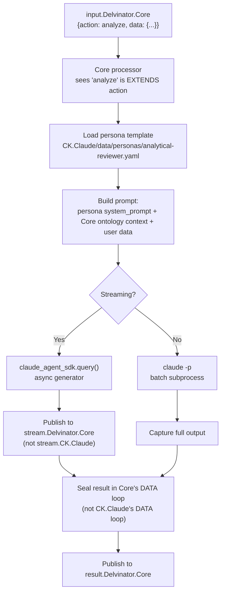

# EXTENDS Predicate and CK.Claude

## The Design Problem: Claude Is Not Built-In

A naive approach to adding LLM capability to concept kernels would be to embed Claude calls in every kernel's processor. This is wrong for three reasons:

1. **Not every kernel needs Claude.** A kernel that calculates checksums or routes NATS messages has no use for an LLM. Embedding Claude would add unnecessary dependencies.
2. **Different kernels need different Claude behaviors.** An analytical reviewer and a friendly assistant use the same model but with different prompts, tool permissions, and output formats.
3. **Claude capability should be composable.** If Kernel A can analyze data with Claude, and Kernel B composes Kernel A, then Kernel B should inherit the analysis capability -- without B knowing that Claude exists.

The v3.6 answer is to make Claude a **concept kernel** (`CK.Claude`) that other kernels reference via the `EXTENDS` edge predicate. The capability is mounted, not inherited.

## EXTENDS vs COMPOSES vs TRIGGERS

v3.6 introduces EXTENDS as the fifth edge predicate. Understanding it requires contrasting it with the existing predicates:

| Predicate | What Happens | Actions Appear On | Example |
|-----------|-------------|-------------------|---------|
| **COMPOSES** | Source inherits target's existing actions | Source kernel | Core COMPOSES ComplianceCheck -- Core gets `check.all` |
| **TRIGGERS** | Source can invoke target's actions remotely | Target kernel | ExchangeParser TRIGGERS IntentMapper -- parser calls `classify` on mapper |
| **PRODUCES** | Source generates output for target's input | Neither (data flow) | ThreadScout PRODUCES ExchangeParser -- output feeds input |
| **CONSUMES** | Source reads target's output | Neither (data flow) | Core CONSUMES TaxonomySynthesis -- reads synthesized data |
| **EXTENDS** | Source gains NEW actions backed by target's capability | **Source kernel** | Core EXTENDS CK.Claude -- Core gains `analyze` |

The critical distinction between COMPOSES and EXTENDS:

- **COMPOSES** exposes the target's EXISTING actions on the source. `check.all` already exists on CK.ComplianceCheck; COMPOSES makes it available on Core.
- **EXTENDS** creates ENTIRELY NEW actions on the source, backed by the target's capability. `analyze` does NOT exist on CK.Claude; EXTENDS creates it on Core, using Claude as the execution engine.

## Edge Declaration

```yaml
# In conceptkernel.yaml of the source kernel
spec:
  edges:
    outbound:
      - target_kernel: CK.Claude
        predicate: EXTENDS
        config:
          persona: analytical-reviewer
          actions:
            - name: analyze
              description: "Deep analysis using Claude"
              access: auth
            - name: summarize
              description: "Summarize instances using Claude"
              access: auth
          constraints:
            max_tokens: 4096
            tools: ["Read", "Grep"]
            model: sonnet
```

The `actions` list defines what NEW actions the source kernel gains. The `persona` field references which personality template Claude uses. The `constraints` field bounds the Claude invocation.

## CK.Claude Identity

CK.Claude is an `agent`-type system kernel. Its purpose is not to be invoked directly -- it is to provide Claude capability to other kernels via EXTENDS.

```yaml
kernel_class:      CK.Claude
namespace_prefix:  CK
type:              agent
governance:        AUTONOMOUS
```

CK.Claude is a first-class system kernel. When deployed to a cluster, it operates as a `node:hot` persistent subscriber. In local development, it operates as a `LOCAL.CK.Claude` kernel without SPIFFE.

### Agent Kernel Type

The `agent` type is a kernel type that supports long-running conversational sessions with LLM inference. Agent kernels differ from other types in three ways:

| Characteristic | Agent | node:hot | node:cold |
|----------------|-------|----------|-----------|
| NATS pattern | Persistent subscriber | Persistent subscriber | Started on message |
| Streaming | MUST publish to `stream.{kernel}` | MAY publish to `stream.{kernel}` | MAY publish |
| Session support | MUST support multi-turn sessions | OPTIONAL | NOT APPLICABLE |
| Persona templates | MUST serve from `data/personas/` | NOT APPLICABLE | NOT APPLICABLE |
| Context window | Maintains conversation context | Stateless per message | Stateless per message |

### Direct Actions

CK.Claude itself declares minimal actions. Its primary value is delivered through EXTENDS edges, not through direct invocation.

| Action | Type | Description |
|--------|------|-------------|
| `status` | inspect | Return kernel status and available personas |
| `personas.list` | query | List available persona templates |
| `personas.get` | inspect | Return a specific persona template |
| `chat` | operate | Direct LLM conversation (no persona mounting) |

### File Structure

CK.Claude's DATA loop contains persona templates:

```
CK.Claude/
  conceptkernel.yaml    # CK loop -- identity
  CLAUDE.md             # behavioral instructions
  SKILL.md              # actions: message, analyze, summarize
  ontology.yaml         # defines persona, constraint types
  data/
    personas/
      analytical-reviewer.yaml
      strict-auditor.yaml
      creative-explorer.yaml
      code-implementer.yaml
      documentation-writer.yaml
```

## Persona Template Registry

CK.Claude maintains persona templates in `data/personas/`. Each template defines a specialised LLM behaviour that other kernels can mount via EXTENDS. Persona templates are versioned via the DATA loop's git history. A kernel that EXTENDS CK.Claude with a specific persona receives the current version of the template at invocation time.

### 5 Standard Personas

A persona defines the behavioral shape of a Claude invocation:

```yaml
# data/personas/analytical-reviewer.yaml
name: analytical-reviewer
system_prompt: |
  You are a precise analytical reviewer. You examine data structures,
  identify patterns, and produce structured assessments. You never
  speculate -- only report what the evidence shows.
tools: [Read, Grep, Glob]
output_format: structured
temperature: 0.1
```

```yaml
# data/personas/strict-auditor.yaml
name: strict-auditor
system_prompt: |
  You are a strict auditor. You evaluate proposals against ontological
  rules and produce pass/fail verdicts with evidence citations.
  No suggestions, no alternatives -- only verdicts.
tools: [Read, Grep]
output_format: structured
temperature: 0.0
```

```yaml
# data/personas/creative-explorer.yaml
name: creative-explorer
system_prompt: |
  You are a creative explorer. You generate novel approaches,
  brainstorm alternatives, and find unexpected connections.
tools: [Read, Grep, Glob, Bash]
output_format: markdown
temperature: 0.8
```

```yaml
# data/personas/code-implementer.yaml
name: code-implementer
system_prompt: |
  You are a precise code implementer. You write clean, tested,
  well-documented code that follows the project's conventions.
tools: [Read, Grep, Glob, Bash, Edit, Write]
output_format: code
temperature: 0.2
```

```yaml
# data/personas/documentation-writer.yaml
name: documentation-writer
system_prompt: |
  You are a documentation writer. You produce clear, accurate,
  well-structured documentation from code and specifications.
tools: [Read, Grep, Glob]
output_format: markdown
temperature: 0.4
```

### Persona Template Fields

| Field | Type | Required | Description |
|-------|------|----------|-------------|
| `name` | string | REQUIRED | Persona identifier matching `config.persona` |
| `system_prompt` | string | REQUIRED | System prompt injected into the LLM context |
| `tools` | list[string] | OPTIONAL | Tool allowlist for the LLM session |
| `output_format` | string | OPTIONAL | `structured`, `markdown`, `code`, or `freeform` |
| `temperature` | float | OPTIONAL | LLM temperature parameter |

Different kernels mount different personas:

| Kernel | Persona | Use Case |
|--------|---------|----------|
| Delvinator.Core | `analytical-reviewer` | Structured data analysis |
| CK.Consensus | `strict-auditor` | Proposal evaluation |
| CK.Operator | `code-implementer` | Kernel scaffolding |

## get_effective_actions() -- Action Resolution

When the operator or web shell needs a kernel's full action list, it calls `get_effective_actions()` in `cklib/actions.py`. This function resolves all edge types:

1. Start with the kernel's own `spec.actions.common` and `spec.actions.unique`
2. For each COMPOSES edge: inherit target's existing actions
3. For each EXTENDS edge: create new actions from edge config with persona + constraints metadata

The resolved action list is what appears in:
- The web shell action sidebar
- The ConceptKernel CRD `.spec.actions`
- The `status` response when a kernel is queried

### Implementation in cklib/actions.py

```python
def resolve_composed_actions(kernel_yaml, concepts_dir):
    """COMPOSES: inherit target's existing actions."""
    actions = []
    for edge in kernel_yaml['spec']['edges']['outbound']:
        if edge['predicate'] == 'COMPOSES':
            target = load_kernel(edge['target_kernel'], concepts_dir)
            actions.extend(target['spec']['actions']['unique'])
    return actions

def get_effective_actions(kernel_yaml, concepts_dir):
    """Full action list: own + COMPOSES + EXTENDS."""
    actions = kernel_yaml['spec']['actions']['common'] + \
              kernel_yaml['spec']['actions']['unique']
    actions += resolve_composed_actions(kernel_yaml, concepts_dir)

    for edge in kernel_yaml['spec']['edges']['outbound']:
        if edge['predicate'] == 'EXTENDS':
            config = edge['config']
            for action in config['actions']:
                action['_extends'] = {
                    'target': edge['target_kernel'],
                    'persona': config.get('persona'),
                    'constraints': config.get('constraints', {})
                }
                actions.append(action)
    return actions
```

## Runtime Dispatch

When `input.Delvinator.Core` receives `{action: "analyze", data: {...}}`:



Key design decisions in this flow:

1. **Stream to source kernel's topic.** The user subscribed to `stream.Delvinator.Core`. If events went to `stream.CK.Claude`, the user would need to know about the EXTENDS relationship to find the output.
2. **Seal in source kernel's DATA loop.** The analysis result is Core's instance, shaped by Core's ontology. CK.Claude's DATA loop is for CK.Claude's own data -- not for every kernel that extends it.
3. **Persona loaded from target's storage.** The persona template lives in CK.Claude's DATA loop, not Core's. Core does not own the persona -- it references it via the edge.

## Why Not Just Call Claude Directly?

Six architectural reasons:

| Concern | Direct Claude Call | EXTENDS CK.Claude |
|---------|-------------------|-------------------|
| **Ontological grounding** | Ad-hoc, untyped output | Typed in source kernel's ontology |
| **Access control** | No governance | Source kernel's grants govern who can invoke |
| **Provenance** | No trace | Instance traces to source kernel's action |
| **Personality** | Global or ad-hoc | Per-kernel persona selection |
| **Composability** | Not composable | `analyze` can be further composed by kernels that COMPOSE Core |
| **Location independence** | Requires Claude locally | EXTENDS works via NATS relay -- Claude can be local or remote |

The EXTENDS predicate makes Claude capability an **ontological edge**, not a runtime dependency. A kernel that does not EXTEND CK.Claude has no LLM capability -- it is purely algorithmic. A kernel that does EXTEND it gains specific, persona-shaped, access-controlled LLM actions that are indistinguishable from its native actions.

## 7 Action Types

CKP classifies all actions into seven types that determine context assembly, output format, and instance recording. These are a closed set -- conformant implementations MUST support all entries and MUST NOT define additional types without specification amendment.

| Type | Verbs / Pattern | Context Loaded | Instance Record | BFO (execution) |
|------|----------------|----------------|-----------------|-----------------|
| `inspect` | `status`, `show`, `list`, `version` | Target identity only | None (stateless) | -- |
| `check` | `check.*`, `validate`, `probe.*` | Target + rules + schema | `proof.json` | BFO:0000015 |
| `mutate` | `create`, `update`, `complete`, `assign` | Target + grants + pre-state | `ledger.json` (before/after) | BFO:0000015 |
| `operate` | `execute`, `render`, `run`, `spawn`, `chat` | Full workspace | Sealed instance + `conversation/` | BFO:0000015 |
| `query` | `fleet.*`, `catalog`, `search` | Fleet-wide scan | None (stateless) | -- |
| `deploy` | `deploy.*`, `apply`, `route.*` | Target + manifests + cluster state | Deployment record | BFO:0000015 |
| `transfer` | `export.*`, `import.*`, `sync`, `regenerate` | Source + destination + mapping | Transfer receipt | BFO:0000015 |

### Action Type Resolution

Action type is resolved by suffix/prefix matching against the action name. The matching order is: exact match, prefix match, suffix match. First match wins.

| Action Name | Match Rule | Resolved Type |
|-------------|-----------|---------------|
| `task.create` | suffix `create` | `mutate` |
| `check.identity` | prefix `check.*` | `check` |
| `fleet.catalog` | suffix `catalog` | `query` |
| `spawn` | exact `spawn` | `operate` |
| `deploy.inline` | prefix `deploy.*` | `deploy` |
| `export.backup` | prefix `export.*` | `transfer` |
| `status` | exact `status` | `inspect` |
| `chat` | exact `chat` | `operate` |

### Stateful vs Stateless

| Category | Types | Instance Record | Audit Requirement |
|----------|-------|-----------------|-------------------|
| Stateless | `inspect`, `query` | None | OPTIONAL (if `audit: true` in grants) |
| Stateful | `check`, `mutate`, `operate`, `deploy`, `transfer` | REQUIRED | REQUIRED (always) |

Stateful action types MUST produce an instance record with PROV-O provenance fields linking the instance to the action that created it, the operator who authorised it, and the kernel that produced it.

## Edge Predicate Registry

For a deep dive into all five edge predicates, see [Edge Predicates and Action Composition](./edges).

| Predicate | Source Role | Target Role | NATS Materialisation | Instance Ownership |
|-----------|-----------|-------------|----------------------|--------------------|
| `COMPOSES` | Hub (parent) | Spoke (child) | Subscribe `result.{spoke}` ; publish `input.{spoke}` | Each writes its own |
| `TRIGGERS` | Trigger source | Triggered target | Subscribe `event.{source}` with action filter | Each writes its own |
| `PRODUCES` | Event producer | Event consumer | Subscribe `event.{source}` | Each writes its own |
| `EXTENDS` | Capability consumer | Capability provider | Subscribe `result.{provider}` | Consumer writes all |
| `LOOPS_WITH` | Peer A | Peer B | Both subscribe `event.{peer}` | Each writes its own |

### Edge Subscription Materialisation

Edge predicates materialise as NATS subscriptions at kernel startup. No edge subscription code is written in the processor -- the `NatsKernelLoop` derives subscriptions from the `conceptkernel.yaml` edges block.

| Edge Predicate | NATS Subscription Created | Activation Trigger |
|----------------|---------------------------|--------------------|
| `PRODUCES` | Target subscribes to `event.{source}` | Target auto-invokes default action |
| `TRIGGERS` | Target subscribes to `event.{source}` with `trigger_action` | Target invokes the specified action |
| `COMPOSES` | Hub subscribes to `result.{spoke}`, publishes to `input.{spoke}` | Hub dispatches, receives results |
| `EXTENDS` | Source subscribes to `result.{target}`, dispatches via persona | Source forwards EXTENDS actions to target |
| `LOOPS_WITH` | Both subscribe to each other's `event.*` topics | Bidirectional invocation with circular guard |

### Ontological Graph Materialisation

After successful deployment, [CK.Operator](./operator) SHOULD publish kernel metadata and edges as RDF triples to a SPARQL endpoint (reference implementation: Jena Fuseki `/ckp` dataset). Each kernel becomes a `ckp:Kernel` individual typed as `bfo:0000040` (Material Entity). Edges become RDF object properties using CKP predicates.

```turtle
<ckp://Kernel#Delvinator.Core:v1.0> a ckp:Kernel, bfo:0000040 ;
    rdfs:label "Delvinator.Core" ;
    ckp:hasType "node:cold" ;
    ckp:belongsToProject <ckp://Project#delvinator.tech.games> .

<ckp://Kernel#Delvinator.Core:v1.0> ckp:composes
    <ckp://Kernel#CK.ComplianceCheck:v1.0> .
```

Named graphs per project (`urn:ckp:fleet:{hostname}`) enable per-project SPARQL queries. Graph materialisation is best-effort; deploy MUST succeed even if SPARQL endpoint is unreachable.

### Compliance Validation

[CK.ComplianceCheck](./compliance) validates edges and actions using the registries:

- **`check.edges`:** Every edge target MUST exist. Every predicate MUST be in the registry. No duplicate edges. EXTENDS edges MUST define `config.actions`.
- **`check.nats`:** Every kernel MUST declare `spec.nats` with input/result/event topics. Edge subscriptions MUST be derivable from declared edges.
- **`check.edge_materialisation`:** Edge targets exist and NATS topics resolve.

## Architectural Consistency Check

::: details Logical Analysis: EXTENDS Design

**Question:** If CK.Claude is a concept kernel, does it have its own three loops?

**Answer:** Yes. CK.Claude has:
- CK loop: conceptkernel.yaml, CLAUDE.md, SKILL.md, ontology.yaml (defines Persona, Constraint types)
- TOOL loop: tool/processor.py (handles message/analyze/summarize actions via Claude)
- DATA loop: data/personas/ (persona templates), data/instances/ (its own results when invoked directly)

CK.Claude CAN be invoked directly (via TRIGGERS or NATS publish). But its primary use is as an EXTENDS target.

**Question:** What prevents a circular EXTENDS (A EXTENDS B EXTENDS A)?

**Answer:** Nothing in the current implementation. The `get_effective_actions()` function does not detect cycles. A circular EXTENDS would create an infinite loop in action resolution. This is a gap -- the compliance check (`check.edges`) should detect and reject circular EXTENDS paths.

**Question:** Can a kernel EXTENDS multiple targets?

**Answer:** Yes. A kernel could EXTENDS CK.Claude for LLM capability AND EXTENDS some future CK.Search for search capability. Each EXTENDS edge adds its own actions. There is no conflict as long as action names are unique.

**Contradiction check:** The spec says EXTENDS creates "new actions on the source kernel backed by target's capability." But the persona template lives in the target's DATA loop. This means the source kernel depends on the target's DATA loop content at runtime -- a cross-loop read. Is this a separation axiom violation?

**Resolution:** No. The separation axiom prohibits a kernel from WRITING to another kernel's loops. READING another kernel's DATA loop is permitted through declared access (grants). The EXTENDS edge declaration IS the grant. CK.Claude's persona templates are read-only shared assets, analogous to how COMPOSES reads another kernel's action catalog.
:::

## Conformance Requirements

- EXTENDS MUST create new actions on the source kernel, not expose the target's actions
- The `config.persona` field MUST reference a valid persona template on the target kernel
- Actions created by EXTENDS MUST be listed in the source kernel's action sidebar
- Instances produced by EXTENDS actions MUST be sealed in the source kernel's DATA loop
- Provenance MUST trace to the source kernel's action, with `prov:used` linking to CK.Claude
- The EXTENDS target MUST be a kernel with LLM capability (type `agent` or with `claude_agent_sdk`)
- Stream events from EXTENDS actions MUST be published to `stream.{source_kernel}`, not `stream.{target_kernel}`
