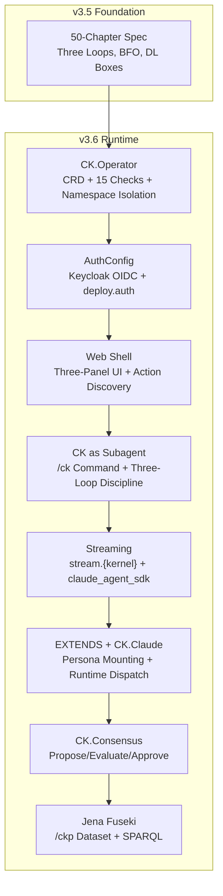

# Introduction to CKP v3.6

## The Shift: From Specification to Runtime

CKP v3.5 defined the foundation: the three-loop model, BFO 2020 grounding, Description Logic box mapping, and a 50-chapter specification. It answered the question "what IS a concept kernel?"

v3.6 answers a different question: **how do you operate one?**

v3.5 gives you the ontology. v3.6 gives you the operator, the auth, the web shell, the Claude integration, the consensus loop, and the graph store. v3.5 is the constitution; v3.6 is the government.

| Concern | v3.5 (Foundation) | v3.6 (Runtime) |
|---------|-------------------|----------------|
| Identity | conceptkernel.yaml, awakening sequence | ConceptKernel CRD -- `kubectl get ck` |
| Authentication | (not addressed) | AuthConfig ontology, Keycloak provisioning |
| User interface | (not addressed) | Three-panel web shell, action discovery |
| Developer workflow | (not addressed) | `/ck Operator` -- subagent with kernel identity |
| LLM integration | (not addressed) | EXTENDS predicate, persona mounting, streaming |
| Governance | STRICT/RELAXED/AUTONOMOUS modes | CK.Consensus -- propose/evaluate/approve loop |
| Knowledge graph | Ontology declared in Turtle | Jena Fuseki /ckp dataset, SPARQL-queryable fleet |
| Proof | Defined in spec | 15-check evidence-based verification, SHA-256 hashed |
| Logging | (not specified) | Structured JSON stdout, `stream.{kernel}` topic |

## Release Train Model

v3.6 is not a single release. It is the **sum of v3.5.5 through v3.5.16** -- twelve independently shippable increments that each add one operational capability. The versions compose: each builds on all previous, and the full v3.6 release is the composition of all twelve.

```
v3.5.0  Foundation (spec, three-loop, BFO ontology)              RELEASED
v3.5.1  Full 50-chapter specification                            RELEASED
v3.5.2  CRD, namespace isolation, evidence-based proof           DEPLOYED
v3.5.3  AuthConfig + deploy.auth (delta spec)                    SPEC
v3.5.4  CK-as-subagent, streaming, consensus, EXTENDS (delta)   SPEC
v3.5.5  AuthConfig implementation + Keycloak integration         DEPLOYED
v3.5.6  Web shell (console.html in CK.Lib.Js)                   DEPLOYED
v3.5.6.1 Console config resolution + action discovery fix        DEPLOYED
v3.5.7  Hello.Greeter kernel + multi-project deploy              DEPLOYED
v3.5.8  CK as Claude Code subagent                               DEPLOYED
v3.5.9  Claude streaming via NATS                                DEPLOYED
v3.5.10 EXTENDS predicate + CK.Claude kernel                    DEPLOYED
v3.5.11 CK.Consensus kernel                                     DEPLOYED
v3.5.12 Jena Fuseki /ckp ontology dataset                       DEPLOYED
v3.5.13 Ontological graph materialisation                        PLANNED
v3.5.14 Multi-user NATS sessions                                 PLANNED
v3.5.15 Task execution engine                                    PLANNED
v3.5.16 Agent Teams                                              PLANNED
---------------------------------------------------------------------
v3.6    Full release -- sum of all above
```

### Why This Model

Each version is independently deployable and testable. This means:

1. **No big-bang releases.** Each increment ships when ready.
2. **Each version has proof.** The 15-check verification runs after every deploy -- if it passes, the version is live.
3. **Rollback is per-version.** If v3.5.9 (streaming) breaks something, roll back streaming without losing v3.5.8 (subagent).
4. **The spec evolves with the code.** Delta specifications (v3.5.2, v3.5.3, v3.5.4) were written BEFORE implementation. The implementation validates the spec.

### Spec-First, Then Code

The implementation order follows a deliberate pattern:

1. **Delta spec written** (v3.5.2 through v3.5.4) -- defines WHAT and WHY
2. **Implementation** (v3.5.5 through v3.5.12) -- builds the WHAT
3. **Proof verification** -- every deploy runs 13-15 checks to confirm the WHAT matches the spec
4. **Documentation** (this site) -- explains HOW it works architecturally

This is why v3.5.3 (AuthConfig spec) was written before v3.5.5 (AuthConfig implementation), and why v3.5.4 D7 (Consensus spec) was written before v3.5.11 (Consensus implementation).

## What v3.6 Adds: The Operational Stack

v3.6 builds seven layers of operational capability on top of the v3.5 foundation:



Each layer depends on all layers below it. The web shell needs auth. Streaming needs the subagent pattern. EXTENDS needs streaming. Consensus needs EXTENDS (for CK.Claude strict-auditor). The graph needs the full fleet deployed.

## Cluster State After v3.6

The reference deployment (`delvinator.tech.games` + `hello.tech.games`) demonstrates the full stack:

| Component | State | Evidence |
|-----------|-------|---------|
| CK.Operator | Running in `ck-system` namespace | `kubectl get deploy -n ck-system` |
| ConceptKernel CRD | Installed | `kubectl get ck -A` shows 7 kernels |
| Delvinator fleet | 6 kernels, 15/15 checks each | `kubectl get ck -n ck-delvinator` |
| Hello.Greeter | 1 kernel, 15/15 checks | `kubectl get ck -n ck-hello` |
| Keycloak realms | `techgames` (reused), `hello` (created) | OIDC discovery 200 on both |
| Web shell | Live at both hostnames | `curl -sI https://delvinator.tech.games/cklib/console.html` |
| NATS | Connected, structured JSON logs | `kubectl logs` on any processor |
| Jena Fuseki | /ckp dataset, 2,797 triples | `jena.conceptkernel.dev/ckp/sparql` |

## Reading This Documentation

The v3.6 docs are organized by capability, not by version number. Each page explains:

- **WHY** the capability exists (the problem it solves)
- **HOW** it works architecturally (the design decisions)
- **WHAT** was actually deployed (the evidence)

| Page | Covers |
|------|--------|
| [Auth](/v3.6/auth) | AuthConfig ontology, deploy.auth, Keycloak integration (v3.5.5, v3.5.7) |
| [Web Shell](/v3.6/web-shell) | console.html, three-panel layout, action discovery (v3.5.6, v3.5.6.1) |
| [Operator](/v3.6/operator) | CK.Operator lifecycle, 15-check proof, CRD, namespace isolation (v3.5.2, v3.5.5, v3.5.7) |
| [Subagent](/v3.6/subagent) | /ck command, CK loop as agent context, three-loop discipline (v3.5.4, v3.5.8) |
| [Streaming](/v3.6/streaming) | stream.{kernel} topic, claude_agent_sdk mapping (v3.5.9) |
| [EXTENDS](/v3.6/extends) | EXTENDS predicate, CK.Claude, persona mounting (v3.5.10) |
| [Consensus](/v3.6/consensus) | CK.Consensus kernel, propose/evaluate/approve (v3.5.11) |
| [Graph](/v3.6/graph) | Jena Fuseki, /ckp dataset, SPARQL queries (v3.5.12) |
| [Sessions](/v3.6/sessions) | Multi-user NATS sessions (v3.5.14, planned) |
| [Task Engine](/v3.6/task-engine) | Consensus-driven headless execution (v3.5.15, planned) |
| [Agent Teams](/v3.6/agent-teams) | Multi-kernel coordination (v3.5.16, planned) |
| [Changelog](/v3.6/changelog) | Full version-by-version changelog |

::: info Logical Analysis Note
Three of the thirteen pages (Sessions, Task Engine, Agent Teams) cover planned features that are not yet implemented. They are included because the v3.5.4 delta specification defines them normatively, and the architecture is designed to support them. They are clearly marked as PLANNED.
:::
