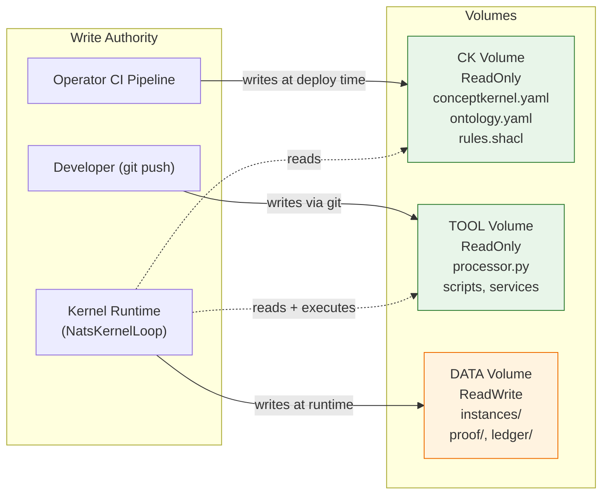

# Loop Isolation via Volume Drivers

## The Separation Axiom

A storage write (DATA) MUST NEVER cause a CK loop commit. A tool execution (TOOL) MUST NEVER modify identity files. An identity change (CK) MUST NEVER directly mutate stored instances. These boundaries are enforced by write authority rules on each filesystem volume -- not by convention, not by code review, not by best practice, but by infrastructure.

:::danger This is THE Core Security Principle
Convention-based separation fails under pressure. A developer debugging a production issue will bypass a "should not write" rule if the volume permits it. A compromised tool process will write wherever it can. Volume-level read-only enforcement makes the separation axiom a physical constraint. The kernel runtime literally cannot modify its own identity or code at runtime, regardless of what the handler attempts.
:::

## Volume Driver Enforcement

Each of the three loops maps to a filesystem volume with explicit read/write permissions enforced by the container runtime and volume driver.

| DL Box | Loop | Volume `readOnly` | Write Authority | Consequence |
|--------|------|--------------------|-----------------|-------------|
| TBox | CK | `true` | Operator CI pipeline only | Runtime process cannot modify identity, ontology, or schema |
| RBox | TOOL | `true` | Developer via git push only | Runtime process cannot modify its own code |
| ABox | DATA | `false` | Kernel runtime (via NatsKernelLoop) | Runtime process writes instances, proofs, ledger entries |

The Description Logic analogy is deliberate:

- **TBox (CK loop):** Terminological assertions -- what the kernel IS. Class definitions, ontology, rules. Read at awakening, never written at runtime.
- **RBox (TOOL loop):** Role assertions -- what the kernel CAN DO. Executable code, handlers, processors. Deployed by developer, executed at runtime, never self-modified.
- **ABox (DATA loop):** Assertional knowledge -- what the kernel HAS PRODUCED. Instances, proofs, ledger entries. Written at runtime as the kernel accumulates knowledge.

## Forbidden Boundary Crossings

Every row in the table below represents a class of bugs or security vulnerabilities that the separation axiom prevents by construction.

| Boundary | What Is Forbidden | Why |
|----------|-------------------|-----|
| TOOL -> CK loop | Tool execution writing to any CK root file (`conceptkernel.yaml`, `ontology.yaml`, `rules.shacl`, etc.) | CK identity is operator-governed. A tool that can rewrite its own identity violates sovereignty. |
| DATA -> CK loop | Storage writes causing commits to identity or schema files | Schema is a design-time artifact. Runtime data accumulation must not alter the kernel's definition. |
| DATA -> TOOL | Instance data modifying tool source code | Tools are versioned independently via git. Data should inform future tool versions through the consensus loop, not by direct mutation. |
| CK -> DATA direct | CK loop commit writing an instance to `data/` | Instances require the full tool-to-storage contract: execution, proof generation, ledger entry. A CK commit bypasses all of this. |
| CK(B) -> CK(A) writes | Any kernel writing to another kernel's CK or TOOL volume | Volumes are sovereign. Each kernel's identity boundary is absolute. Cross-kernel influence is through NATS messages and edges, never through filesystem writes. |

:::warning No Exceptions
A tool that can rewrite `ontology.yaml` can change the validation rules that govern its own output. A kernel that can write to another kernel's CK loop can impersonate it. These are not theoretical risks -- they are the failure modes that the protocol exists to prevent.
:::

## serving.json Exception

`serving.json` is the sole file in the CK loop that is mutated at runtime by the platform. The platform holds write authority to this file via a volume sub-path mount or sidecar mechanism. The CK loop volume MUST remain ReadOnlyMany for all other files.

Version promotion (stable/canary/develop) is a platform operation that must take effect without a developer commit. The `serving.json` file is the minimal surface area needed for runtime version control. Its write-through mechanism MUST be documented by the implementation because it represents the only breach of the CK loop read-only invariant.

Acceptable write-through mechanisms:

1. Volume sub-path mount with `readOnly: false` on the `serving.json` path only.
2. Sidecar process with write access to the `serving.json` path via a shared emptyDir.
3. CSI driver with per-file access control.

## Container Sealing

Beyond volume-level isolation, kernel containers MUST be sealed against privilege escalation and host access.

| Requirement | Value | Rationale |
|-------------|-------|-----------|
| `runAsNonRoot` | `true` | Kernel code never needs root |
| `readOnlyRootFilesystem` | `true` | Only mounted volumes are writable |
| `allowPrivilegeEscalation` | `false` | No setuid/setgid |
| `capabilities.drop` | `["ALL"]` | No Linux capabilities |
| `seccompProfile.type` | `RuntimeDefault` | Default seccomp filtering |

These settings are applied via the Kubernetes SecurityContext on every kernel pod. Combined with volume-level isolation, they create a defence-in-depth posture: even if a handler contains a vulnerability, the container cannot escalate privileges, access the host filesystem, or modify its own volumes.

## Destructive Operation Safeguards

CK.Operator MUST implement safeguards for operations that could destroy accumulated knowledge:

| Operation | Safeguard | Rationale |
|-----------|-----------|-----------|
| `project.teardown` | Deletes compute; RETAINS PVs | DATA loop is the kernel's accumulated knowledge. Destroying compute is reversible; destroying data is not. |
| Volume deletion | REQUIRES explicit `--force-delete-data` flag | Accidental volume deletion is catastrophic. A flag forces deliberate intent. |
| Instance deletion | NOT SUPPORTED | Sealed instances are immutable. Archival is permitted; deletion is not. |
| Git history pruning | PROHIBITED on CK and TOOL volumes | History is the kernel's provenance chain. Pruning breaks audit. |
| Git garbage collection on DATA | ONLY with explicit retention policy in `ontology.yaml` | DATA volume git objects may be large. GC is permitted only when the kernel's ontology explicitly allows it. |

:::danger
Sealed instances are immutable. There is no `delete instance` operation. Archival is permitted; deletion is not. This is not an oversight -- it is the strongest guarantee CKP provides. Once knowledge is produced with a proof chain, it cannot be retroactively destroyed.
:::

## Conformance Requirements

| Criterion | Level |
|-----------|-------|
| CK and TOOL volumes MUST be mounted ReadOnly at runtime | REQUIRED |
| Only the DATA volume MUST be writable by the kernel runtime | REQUIRED |
| Cross-kernel volume writes MUST be prohibited | REQUIRED |
| `serving.json` write-through mechanism MUST be documented | REQUIRED |
| Container security context MUST enforce non-root, read-only root FS, no privilege escalation | REQUIRED |
| `project.teardown` MUST retain persistent volumes | REQUIRED |
| Sealed instances MUST NOT be deletable | REQUIRED |
| Git history MUST NOT be pruned on CK or TOOL volumes | REQUIRED |

See also: [BFO Grounding](./bfo-grounding) for the DL box correspondence that motivates the three-loop split, [Namespace Security](./namespace-security) for the Kubernetes-level network isolation that complements volume isolation, [Authentication](./auth) for how grants enforcement interacts with the separation axiom.
