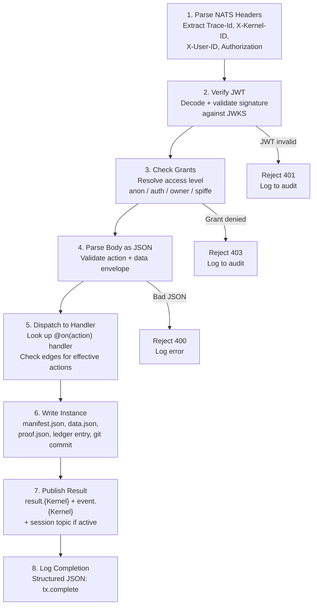

# Message Envelope and NatsKernelLoop

## Message Envelope

Every NATS message in CKP carries a structured envelope consisting of headers and a JSON body. A consistent envelope eliminates per-kernel message format negotiations. Any client -- browser, CLI, or kernel -- can construct a valid message by following this single schema. Any observer -- log aggregator, audit system, or debugging tool -- can parse any message without kernel-specific knowledge.

### Required NATS Message Headers

Every NATS message MUST include the following headers. Additional headers MAY be present but MUST NOT alter routing or dispatch semantics.

| Header | Type | Required | Description |
|--------|------|----------|-------------|
| `Trace-Id` | string | REQUIRED | Unique correlation ID for the request/response pair. Format: `tx-{uuid}`. Propagated through all downstream messages in the same transaction. |
| `X-Kernel-ID` | string | REQUIRED | Identity of the sending kernel or client. For browsers: `browser`. For kernels: kernel class name (e.g., `CK.Task`). |
| `X-User-ID` | string | REQUIRED | Identity of the human user. For anonymous: `anonymous`. For authenticated: `preferred_username` from JWT claims. |
| `Authorization` | string | CONDITIONAL | `Bearer {jwt}` -- REQUIRED for `auth` and `owner` level actions. MUST be omitted (not empty) for anonymous requests. |
| `Nats-Msg-Id` | string | RECOMMENDED | Idempotency key for JetStream deduplication. |

:::info Why Trace-Id
Distributed tracing across a multi-kernel pipeline requires a single correlation identifier. The `Trace-Id` header is created by the originating client and propagated unchanged through all NATS messages in the same transaction. Log entries, instance records, and proof records all reference this trace ID, enabling end-to-end audit reconstruction.
:::

### Message Body Schema

The JSON body MUST conform to the `{ action, data }` envelope:

```json
{
  "action": "task.create",
  "data": {
    "target_kernel": "ckp://Kernel#Finance.Employee:v1.0",
    "description": "Onboard new employee record"
  }
}
```

| Field | Type | Required | Description |
|-------|------|----------|-------------|
| `action` | string | REQUIRED | Action name to invoke on the target kernel. MUST match an entry in the kernel's `SKILL.md` action catalog or an effective action from edges. |
| `data` | object | REQUIRED | Action-specific payload. Schema varies per action. MAY be empty (`{}`). |

### Result Message Format

Result messages published to `result.{kernel}` use the same envelope with additional fields:

```json
{
  "action": "task.create",
  "data": {
    "instance_id": "i-tx-3fff0e38-1773518402",
    "status": "created"
  },
  "trace_id": "tx-a8f3c1d2-e4f5-6789-abcd-ef0123456789",
  "kernel": "CK.Task",
  "timestamp": "2026-04-05T16:37:25Z"
}
```

| Field | Type | Required | Description |
|-------|------|----------|-------------|
| `trace_id` | string | REQUIRED | Echoed from the request `Trace-Id` header |
| `kernel` | string | REQUIRED | Kernel class name that produced the result |
| `timestamp` | string | REQUIRED | ISO 8601 timestamp of result generation |
| `error` | string | OPTIONAL | Error message if the action failed |

## Structured JSON Logging

Kernel processors MUST output structured JSON to stdout. This is the sole log format. Unstructured log output MUST NOT be written to stdout.

```json
{"ts":"2026-04-05T16:37:23Z","level":"info","kernel":"Delvinator.Core","event":"nats.connected","endpoint":"nats://nats.nats.svc:4222"}
{"ts":"2026-04-05T16:37:23Z","level":"info","kernel":"Delvinator.Core","event":"nats.subscribed","topic":"input.Delvinator.Core"}
{"ts":"2026-04-05T16:37:23Z","level":"info","kernel":"Delvinator.Core","event":"ready"}
{"ts":"2026-04-05T16:37:25Z","level":"info","kernel":"Delvinator.Core","event":"rx","trace":"tx-a8f3c1","action":"status","user":"anonymous"}
```

| Field | Type | Required | Description |
|-------|------|----------|-------------|
| `ts` | string | REQUIRED | ISO 8601 timestamp |
| `level` | string | REQUIRED | One of: `debug`, `info`, `warn`, `error` |
| `kernel` | string | REQUIRED | Kernel class name |
| `event` | string | REQUIRED | Dotted event identifier (e.g., `nats.connected`, `rx`, `tx`, `error.dispatch`) |

Additional fields MAY be present. The `trace`, `action`, `user`, `endpoint`, and `topic` fields are common but not required on every line.

:::tip
Structured JSON logging enables log aggregation via standard Kubernetes tooling (Loki, Fluentd, Elasticsearch) without configuration. Every log line is machine-parseable. The `kernel` and `event` fields allow filtering by kernel class and lifecycle phase without regular expressions.
:::

**Persistent Storage.** Logs MAY be written to `storage/logs/` (DATA loop) with daily rotation. This enables post-pod log analysis for kernels that accumulate operational history.

## Stream Topics for Real-Time Events

Kernels with LLM or streaming capability SHOULD publish per-token events to `stream.{kernel}`. This enables browser clients to render Claude responses in real time without polling.

| Field | Type | Required | Description |
|-------|------|----------|-------------|
| `type` | string | REQUIRED | Event type: `content_block_delta`, `tool_use`, `AssistantMessage`, `ResultMessage` |
| `trace_id` | string | REQUIRED | Correlation ID matching the originating request |
| `kernel_urn` | string | REQUIRED | URN of the source kernel |
| `data` | object | REQUIRED | Event payload (e.g., `{"text": "..."}` for content deltas) |

Handler implementations receive a `stream` callback:

```python
@on("analyze")
async def handle_analyze(self, data, stream=None):
    async for chunk in claude_response:
        if stream:
            await stream("content_block_delta", {"text": chunk.text})
    return {"summary": final_result}
```

The `stream` callback publishes to `stream.{kernel}` with the `Trace-Id` from the originating request. Clients subscribe to `stream.{kernel}` and filter by `trace_id` to isolate their own streaming session.

## Python-JavaScript Interoperability

CK.Lib.Py and CK.Lib.Js MUST produce and consume identical message formats.

| Aspect | Status | Detail |
|--------|--------|--------|
| Subject naming | Aligned | Both use `input.{K}`, `result.{K}`, `event.{K}`, `stream.{K}` |
| NATS headers | Consistent | `Trace-Id`, `X-Kernel-ID`, `X-User-ID`, `Authorization`, `Nats-Msg-Id` |
| JSON codec | Compatible | JS `JSONCodec().encode()` <-> Python `json.dumps().encode()` |
| Body structure | `{ action, data }` envelope | Implementations MUST validate this structure |
| Stream events | Compatible | Both publish/consume `{ type, trace_id, kernel_urn, data }` |

---

## NatsKernelLoop Processing Cycle

`NatsKernelLoop` is the runtime loop that bridges the NATS transport and the kernel processor. It is implemented in CK.Lib.Py (`nats_loop.py`) and is the sole entry point for message-driven kernel execution.

:::info Why This Matters
Centralising NATS connection management, JWT verification, grants checking, instance writing, and result publication in a single loop enforces the three-loop separation axiom. Handler functions (TOOL loop) receive parsed data and return dicts. They never touch `storage/` directly, never manage NATS connections, and never verify credentials. This separation is not advisory -- it is structural.
:::

### Startup Sequence

When `--listen` is invoked, `NatsKernelLoop` executes the following startup sequence:

| Step | Action | Log Event |
|------|--------|-----------|
| 1 | Connect to NATS (TCP or WSS) | `nats.connected` |
| 2 | Subscribe to `input.{KernelName}` | `nats.subscribed` |
| 3 | Read `conceptkernel.yaml` edges block | (internal) |
| 4 | Materialise edge subscriptions (see below) | `nats.edge.subscribed` per edge |
| 5 | Subscribe to `session.*` if session-capable | `nats.session.subscribed` |
| 6 | Emit `ready` log event | `ready` |

### Edge Subscription Materialisation

Edge predicates in `conceptkernel.yaml` are not just metadata -- they materialise as NATS subscriptions at kernel start time. No edge subscription code is written in the processor. The loop derives subscriptions from the ontology declaration.

| Edge Predicate | NATS Subscription | Activation Trigger |
|----------------|-------------------|--------------------|
| `PRODUCES` | Subscribe to `event.{source}` | Target auto-invokes default action |
| `TRIGGERS` | Subscribe to `event.{source}` with `trigger_action` filter | Target invokes the named action |
| `COMPOSES` | Subscribe to `result.{spoke}` ; can publish to `input.{spoke}` | Hub dispatches, receives results |
| `EXTENDS` | Subscribe to `result.{child}` | Parent forwards unknown actions to child |
| `LOOPS_WITH` | Subscribe to `event.{peer}` (both directions) | Bidirectional invocation with circular guard |

```python
# Pseudocode: edge subscription materialisation at startup
for edge in kernel.edges.outbound:
    if edge.predicate == "COMPOSES":
        await nats.subscribe(f"result.{edge.target_kernel}")
    elif edge.predicate == "TRIGGERS":
        await nats.subscribe(f"event.{edge.source_kernel}")
    elif edge.predicate == "PRODUCES":
        await nats.subscribe(f"event.{edge.source_kernel}")
    elif edge.predicate == "EXTENDS":
        await nats.subscribe(f"result.{edge.target_kernel}")
    elif edge.predicate == "LOOPS_WITH":
        await nats.subscribe(f"event.{edge.target_kernel}")
```

:::tip
Declarative edge subscriptions eliminate a class of bugs where a developer forgets to subscribe to a topic that the ontology declares. If the edge exists in `conceptkernel.yaml`, the subscription exists at runtime. If the edge is removed, the subscription disappears. No code change is required.
:::

### 8-Step Message Processing Cycle

For each message received on any subscribed topic, `NatsKernelLoop` executes:



**Detailed step breakdown:**

1. **Parse NATS headers** -- Extract `Trace-Id`, `X-Kernel-ID`, `X-User-ID`, and `Authorization` header.
2. **Verify JWT** (if `Authorization` header present) -- Decode and validate JWT signature against JWKS. Extract `preferred_username` as verified `user_id`. On failure: reject with 401, log to audit.
3. **Check grants** -- Resolve user access level (`anon` / `auth` / `owner` / `spiffe`). Look up requested action in the grants block. On failure: reject with 403, log to audit.
4. **Parse body as JSON** -- Validate `{ action, data }` envelope. On failure: reject with 400, log error.
5. **Dispatch to handler** -- Look up `@on(action)` handler in processor. If not found, check effective actions from edges. If `EXTENDS` action, load persona and invoke target. Execute handler with parsed data.
6. **Write instance** (if stateful action type) -- Create `storage/instances/i-{trace}-{ts}/`, write `manifest.json`, `data.json` (handler return value), generate `proof.json`, append `ledger.json`, commit to git on DATA volume.
7. **Publish result** -- Publish to `result.{KernelName}`, publish to `event.{KernelName}`, and if session active, publish to `session.{project}.{id}`.
8. **Log completion** -- Structured JSON: `{"ts":..., "level":"info", "kernel":..., "event":"tx.complete"}`.

:::warning The Three-Loop Contract in Action
Steps 1--3 enforce access control (CK loop authority). Step 5 invokes the handler (TOOL loop execution). Steps 6--7 write the result (DATA loop storage). The handler in step 5 never performs steps 6 or 7 directly. It returns data; the loop writes. This is the [separation axiom](./isolation) in runtime form.
:::

### JWT Verification

`NatsKernelLoop` MUST verify JWT tokens in the `Authorization` header before dispatching to handlers. The pattern of trusting `X-User-ID` headers without verification is a known vulnerability.

```python
# Required verification before dispatch
auth_header = headers.get("Authorization", "")
if auth_header.startswith("Bearer "):
    token = auth_header[7:]
    claims = verify_jwt(token, jwks_url=kernel.auth.issuer_url)
    user_id = claims.get("preferred_username", "anonymous")
else:
    user_id = "anonymous"
# Then check grants for this user_id + requested action
```

The `verify_jwt` function MUST:

1. Fetch the JWKS from the issuer's `.well-known/openid-configuration`.
2. Validate the token signature against the JWKS keys.
3. Check token expiration (`exp` claim).
4. Check token audience (`aud` claim) if configured.
5. Return decoded claims on success; raise on failure.

### NATS Availability and Durability

Task lifecycle NATS messages MUST use JetStream. If NATS becomes unavailable during operation:

| Condition | Kernel Behaviour |
|-----------|-----------------|
| NATS unreachable at startup | Retry with exponential backoff; do not enter `ready` state |
| NATS connection lost during operation | Queue events locally in `storage/ledger/pending_events.jsonl` |
| Local queue exceeds 1000 events | Enter `degraded` state |
| NATS reconnects | Replay pending events in order; publish `ck.{guid}.data.nats-degraded` if degraded |
| `task.complete` without NATS confirmation | Block -- `data.json` MUST NOT be written |

### Kernel Type and NATS Pattern

Different kernel types use NATS differently:

| Kernel Type | NATS Pattern | Subscribe | Publish | Auth |
|-------------|-------------|-----------|---------|------|
| `node:hot` | Persistent subscriber | `input.{kernel}` (always listening) | `result.{kernel}`, `event.{kernel}` | SPIFFE JWT-SVID |
| `node:cold` | Started on message | `input.{kernel}` (trigger, then listen) | `result.{kernel}`, `event.{kernel}` | SPIFFE JWT-SVID |
| `agent` | Persistent subscriber | `input.{kernel}` (always listening) | `result.{kernel}`, `event.{kernel}`, `stream.{kernel}` | SPIFFE JWT-SVID |
| `inline` | Browser client | `result.{kernel}`, `event.{kernel}` | `input.{kernel}` | Keycloak JWT |
| `static` | No NATS connection | None | None | None |

## Conformance Requirements

| Criterion | Level |
|-----------|-------|
| Every NATS message MUST include `Trace-Id`, `X-Kernel-ID`, and `X-User-ID` headers | REQUIRED |
| Message body MUST use the `{ action, data }` envelope | REQUIRED |
| Result messages MUST include `trace_id`, `kernel`, and `timestamp` | REQUIRED |
| Kernel processors MUST output structured JSON to stdout | REQUIRED |
| Each log line MUST include `ts`, `level`, `kernel`, `event` | REQUIRED |
| Streaming kernels SHOULD publish to `stream.{kernel}` | RECOMMENDED |
| Stream events MUST include `type`, `trace_id`, `kernel_urn`, `data` | REQUIRED |
| `NatsKernelLoop` MUST be the sole message dispatch entry point | REQUIRED |
| JWT verification MUST occur before handler dispatch | REQUIRED |
| Grants MUST be checked before handler dispatch | REQUIRED |
| Handlers MUST NOT write to `storage/` directly | REQUIRED |
| Instance creation MUST occur inside the loop, not the handler | REQUIRED |
| Edge subscriptions MUST be materialised from `conceptkernel.yaml` at startup | REQUIRED |
| Processor code MUST NOT contain hardcoded edge subscriptions | REQUIRED |
| Task lifecycle messages MUST use JetStream | REQUIRED |
| NATS unavailability MUST trigger local event queuing | REQUIRED |
| Results MUST be published to `result.{kernel}` and `event.{kernel}` | REQUIRED |

See also: [NATS Messaging](./nats) for topic convention and per-loop topics, [Authentication](./auth) for JWT verification details, [Loop Isolation](./isolation) for the three-loop separation axiom.
