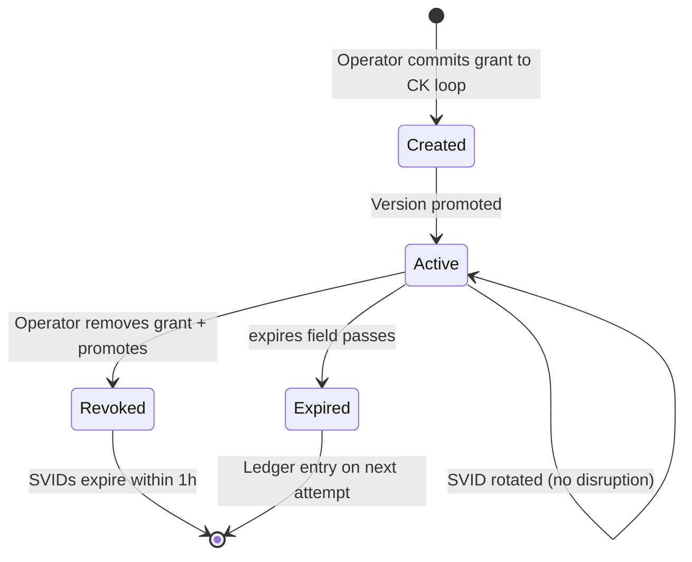

# Namespace Isolation and Grants Enforcement

## Overview

This page defines the per-project Kubernetes namespace security boundary and the grants block that controls cross-kernel access. Together, they implement defence in depth: namespace isolation prevents network-level access, while grants enforcement prevents application-level access.

:::warning
Network policy alone is insufficient -- a kernel that can reach NATS can potentially subscribe to any topic. Grants enforcement alone is insufficient -- a compromised kernel could bypass application-level checks by accessing the filesystem directly. Both layers are required. Neither is optional.
:::

## Per-Project Namespace Resources

CK.Operator MUST create the following five Kubernetes resources in each project namespace. These resources establish the security boundary within which all project kernels operate.

| Resource | Name | Purpose |
|----------|------|---------|
| ServiceAccount | `ckp-runtime` | Pod identity; `automountServiceAccountToken: false` |
| NetworkPolicy | `ckp-default-deny` | Deny all ingress and egress by default |
| NetworkPolicy | `ckp-allow-nats` | Allow egress to NATS service (port 4222) |
| NetworkPolicy | `ckp-allow-dns` | Allow egress to kube-dns (port 53) |
| NetworkPolicy | `ckp-allow-gateway` | Allow ingress from gateway namespace (port 80) |

## Default Deny

All pods in the project namespace are isolated by default. Only explicitly allowed traffic passes. The `ckp-default-deny` NetworkPolicy matches all pods in the namespace and denies all ingress and egress.

```yaml
apiVersion: networking.k8s.io/v1
kind: NetworkPolicy
metadata:
  name: ckp-default-deny
  namespace: ck-{project}
spec:
  podSelector: {}
  policyTypes:
    - Ingress
    - Egress
```

:::info Why Default Deny
Default-deny is the only safe starting point for a namespace that runs untrusted or semi-trusted workloads. Kernel tool code is developer-written and may contain vulnerabilities. By denying all traffic and explicitly allowing only NATS, DNS, and gateway ingress, the blast radius of a compromised kernel is limited to its own DATA loop volume.
:::

## ServiceAccount

The `ckp-runtime` ServiceAccount has `automountServiceAccountToken: false`. This prevents processor pods from accessing the Kubernetes API. The separation axiom extends to the control plane -- kernel code cannot inspect or modify cluster resources.

```yaml
apiVersion: v1
kind: ServiceAccount
metadata:
  name: ckp-runtime
  namespace: ck-{project}
automountServiceAccountToken: false
```

A kernel that can access the Kubernetes API can read secrets, list pods, or even delete resources. Disabling the service account token mount removes this attack vector entirely. CK.Operator manages cluster resources on behalf of kernels; kernels never manage themselves.

## Allowed Egress: NATS

Kernels need to reach the NATS server for all inter-kernel communication. This policy allows egress to the NATS namespace on port 4222 only.

```yaml
apiVersion: networking.k8s.io/v1
kind: NetworkPolicy
metadata:
  name: ckp-allow-nats
  namespace: ck-{project}
spec:
  podSelector: {}
  policyTypes:
    - Egress
  egress:
    - to:
        - namespaceSelector:
            matchLabels:
              kubernetes.io/metadata.name: nats
      ports:
        - protocol: TCP
          port: 4222
```

## Allowed Egress: DNS

Kernels need DNS resolution for service discovery within the cluster. This policy allows egress to kube-dns on port 53 (both UDP and TCP).

```yaml
apiVersion: networking.k8s.io/v1
kind: NetworkPolicy
metadata:
  name: ckp-allow-dns
  namespace: ck-{project}
spec:
  podSelector: {}
  policyTypes:
    - Egress
  egress:
    - to:
        - namespaceSelector:
            matchLabels:
              kubernetes.io/metadata.name: kube-system
      ports:
        - protocol: UDP
          port: 53
        - protocol: TCP
          port: 53
```

## Allowed Ingress: Gateway

The gateway namespace needs to reach kernel web servers to serve the web shell and handle HTTP requests.

```yaml
apiVersion: networking.k8s.io/v1
kind: NetworkPolicy
metadata:
  name: ckp-allow-gateway
  namespace: ck-{project}
spec:
  podSelector: {}
  policyTypes:
    - Ingress
  ingress:
    - from:
        - namespaceSelector:
            matchLabels:
              kubernetes.io/metadata.name: gateway
      ports:
        - protocol: TCP
          port: 80
```

## Grants Block -- Access Control

The grants block in `conceptkernel.yaml` is the sole source of cross-kernel permission truth. It replaces all binary access declarations. The grants block implements a subset of ODRL permission semantics mapped to CKP's action-scoped model.

```yaml
grants:
  - identity:  spiffe://{domain}/ck/CK.Query/9a1b-...
    actions:   [read-storage, read-index, read-llm]
    expires:   2027-01-01T00:00:00Z
    audit:     true

  - identity:  anon
    actions:   [status, check.identity]
    expires:   never
    audit:     false

  - identity:  auth
    actions:   [read-identity, invoke-tool]
    expires:   never
    audit:     true

  - identity:  owner
    actions:   [read-identity, read-storage, invoke-tool, kernel.stop]
    expires:   never
    audit:     true
```

### Grant Entry Fields

| Field | Type | Required | Description |
|-------|------|----------|-------------|
| `identity` | string | REQUIRED | SPIFFE ID, `anon`, `auth`, or `owner` |
| `actions` | list[string] | REQUIRED | Permitted action names from the CKP action vocabulary |
| `expires` | string | REQUIRED | ISO 8601 timestamp or `never` |
| `audit` | boolean | OPTIONAL | If `true`, every access MUST be written to `data/ledger/` |

## ODRL Projection

The following table shows how grants block primitives project from ODRL concepts. This is a subset, not full equivalence. Prohibitions, policy composition, duty chains, and conflict resolution are not modelled.

| ODRL Concept | CKP Grants Equivalent | Notes |
|--------------|-----------------------|-------|
| `odrl:Policy` | The entire `grants:` block | One policy per kernel |
| `odrl:Permission` | `actions:` list for a given identity | Explicit allow list |
| `odrl:Prohibition` | Absence from `actions:` list | Implicit deny (not modelled explicitly) |
| `odrl:Constraint` | `expires:` field | Time-based only |
| `odrl:Duty` | `audit: true` | Obligation to log access |
| `odrl:Asset` | The kernel itself (all three volumes) | Target is the kernel URN |
| `odrl:Party` | SPIFFE identity string or access tier | Caller identity |

:::tip
CKP uses implicit deny: if an action is not listed in the grants block for a given identity, it is forbidden. There is no explicit "prohibit" entry. This simplifies the model at the cost of not supporting complex ODRL policy composition. If fine-grained policy composition becomes necessary across a fleet, ODRL adoption is the planned upgrade path (see [Ontology Model -- Deliberately Skipped Ontologies](./ontology-model#deliberately-skipped-ontologies)).
:::

## Grantable Actions

| Action | Type | Permits Access To | Loop |
|--------|------|-------------------|------|
| `read-identity` | inspect | `conceptkernel.yaml`, `README.md`, `CLAUDE.md`, `ontology.yaml` | CK |
| `read-skill` | inspect | `SKILL.md` only | CK |
| `read-tool-ref` | inspect | `serving.json` -- current version info | CK |
| `read-storage` | inspect | `data/instance-*/data.json`, `proof/` | DATA |
| `read-index` | inspect | `data/index/*` | DATA |
| `read-ledger` | inspect | `data/ledger/audit.jsonl` | DATA |
| `read-llm` | inspect | `data/llm/` | DATA |
| `read-web` | inspect | `data/web/` | DATA |
| `invoke-tool` | operate | Create CKI triggering tool execution | TOOL |

:::danger
No external identity MUST ever be granted `write-storage`, `write-tool`, or any action that mutates the CK loop. These are reserved for the kernel's own runtime and the operator CI pipeline. The sovereign boundary of the Material Entity is absolute.
:::

## Grant Lifecycle

| Lifecycle Event | How It Happens | What Changes |
|-----------------|----------------|--------------|
| Grant created | Operator edits grants block, commits to CK loop repo | New grant active on next version promotion |
| Grant expires | `expires` field passes | Access silently blocked; ledger entry on next attempt |
| Grant revoked | Operator removes grant, commits + promotes | Existing SVIDs expire within TTL (max 1h) |
| SVID rotation | SPIRE rotates automatically before TTL | No disruption to active connections |
| CK decommissioned | Platform removes SPIRE entries | All grants revoked within 1h |



## Namespace Isolation Verification

These resources are verified as part of the deployment proof:

| Check | Method | Expected |
|-------|--------|----------|
| `serviceaccount_exists` | `kubectl get sa ckp-runtime -n ck-{project}` | Exists |
| `default_deny_exists` | `kubectl get networkpolicy ckp-default-deny -n ck-{project}` | Exists |
| `nats_egress_exists` | `kubectl get networkpolicy ckp-allow-nats -n ck-{project}` | Exists |
| `dns_egress_exists` | `kubectl get networkpolicy ckp-allow-dns -n ck-{project}` | Exists |
| `gateway_ingress_exists` | `kubectl get networkpolicy ckp-allow-gateway -n ck-{project}` | Exists |
| `token_mount_disabled` | Inspect ServiceAccount `automountServiceAccountToken` | `false` |

## Conformance Requirements

| Criterion | Level |
|-----------|-------|
| CK.Operator MUST create all 5 security resources per project namespace | REQUIRED |
| Processor pods MUST use the `ckp-runtime` ServiceAccount | REQUIRED |
| NetworkPolicy MUST deny all traffic by default | REQUIRED |
| Only NATS (port 4222), DNS (port 53), and gateway (port 80) traffic MUST be allowed | REQUIRED |
| `automountServiceAccountToken` MUST be `false` on `ckp-runtime` | REQUIRED |
| Grants block MUST be the sole access control source | REQUIRED |
| `write-*` actions MUST NOT be grantable to external identities | REQUIRED |
| All audited access attempts MUST be logged to `data/ledger/` | REQUIRED |
| JWT verification MUST occur before handler dispatch on NATS | REQUIRED |
| Grant expiration MUST be enforced at verification time | REQUIRED |

See also: [Loop Isolation](./isolation) for volume-level enforcement that complements namespace isolation, [Authentication](./auth) for the three-level auth model and JWT verification, [NATS Messaging](./nats) for topic ACLs by auth level.
