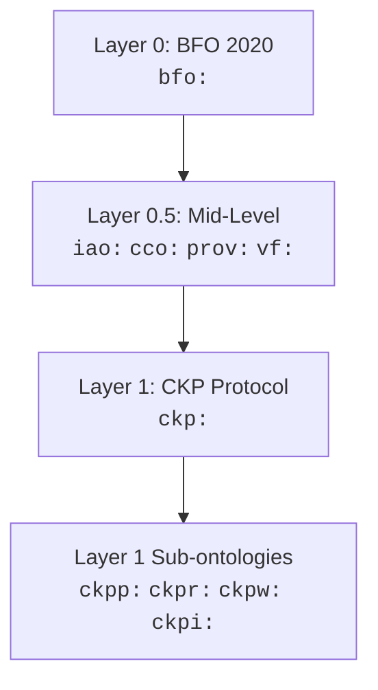

# Namespace Declarations

All namespace prefixes used in the CKP v3.6 specification are declared below. Conformant implementations MUST use these prefixes when emitting RDF, Turtle, or SPARQL.

## Namespace Prefix Table

| Prefix | Namespace URI | Description |
|--------|--------------|-------------|
| `ckp:` | `https://conceptkernel.org/ontology/v3.6/` | CKP Protocol (Layer 1) |
| `ckpp:` | `https://conceptkernel.org/ontology/v3.6/process#` | CKP Process sub-ontology |
| `ckpr:` | `https://conceptkernel.org/ontology/v3.6/relations#` | CKP Relations sub-ontology |
| `ckpw:` | `https://conceptkernel.org/ontology/v3.6/workflow#` | CKP Workflow sub-ontology |
| `ckpi:` | `https://conceptkernel.org/ontology/v3.6/improvement#` | CKP Self-Improvement sub-ontology |
| `bfo:` | `http://purl.obolibrary.org/obo/BFO_` | Basic Formal Ontology 2020 (Layer 0) |
| `iao:` | `http://purl.obolibrary.org/obo/IAO_` | Information Artifact Ontology (Layer 0.5) |
| `cco:` | `http://www.ontologyrepository.com/CommonCoreOntologies/` | Common Core Ontologies (Layer 0.5) |
| `prov:` | `http://www.w3.org/ns/prov#` | W3C Provenance Ontology (Layer 0.5) |
| `vf:` | `https://w3id.org/valueflows#` | ValueFlows REA Ontology (Layer 0.5) |
| `owl:` | `http://www.w3.org/2002/07/owl#` | Web Ontology Language |
| `rdfs:` | `http://www.w3.org/2000/01/rdf-schema#` | RDF Schema |
| `sh:` | `http://www.w3.org/ns/shacl#` | Shapes Constraint Language |

## Ontology Layering

The prefixes map onto a four-layer ontology import chain. Each layer imports from the layer below it:



- **Layer 0** -- BFO 2020 (ISO 21838-2). The upper ontology. All CKP entities ultimately trace their type to a BFO class.
- **Layer 0.5** -- Mid-level ontologies (IAO, CCO, PROV-O, ValueFlows). These provide domain-independent concepts like information artifacts, organisations, provenance, and economic events.
- **Layer 1** -- The CKP protocol ontology itself. Defines Concept Kernel, the three loops, actions, edges, instances, and all protocol-specific types.
- **Layer 1 Sub-ontologies** -- Process, Relations, Workflow, and Self-Improvement modules. These extend the core CKP ontology with specialised vocabularies.

## CKP Namespace Prefixes

The five `ckp*:` prefixes form a coherent family:

| Prefix | Scope | Key Classes |
|--------|-------|-------------|
| `ckp:` | Core protocol types | `ckp:ConceptKernel`, `ckp:Loop`, `ckp:Instance`, `ckp:Action` |
| `ckpp:` | Process execution | Occurrent tracking, action execution, task lifecycle |
| `ckpr:` | Relations between kernels | Edge predicates (COMPOSES, EXTENDS, TRIGGERS, PRODUCES, LOOPS_WITH) |
| `ckpw:` | Workflow orchestration | Goal-task decomposition, consensus flows |
| `ckpi:` | Self-improvement | Learning cycles, capability evolution |

## Usage in Practice

When writing Turtle or SPARQL against CKP data, declare prefixes at the top:

```turtle
@prefix ckp:  <https://conceptkernel.org/ontology/v3.6/> .
@prefix ckpr: <https://conceptkernel.org/ontology/v3.6/relations#> .
@prefix bfo:  <http://purl.obolibrary.org/obo/BFO_> .
@prefix iao:  <http://purl.obolibrary.org/obo/IAO_> .
@prefix prov: <http://www.w3.org/ns/prov#> .

<ckp://Kernel#ACME.Finance.Employee:v1.0>
    a ckp:ConceptKernel, bfo:0000040 ;
    ckp:hasLoop ckp:CKLoop, ckp:TOOLLoop, ckp:DATALoop ;
    prov:wasAttributedTo <ckp://Actor#operator> .
```

::: tip
The `ckp:` prefix URI includes the version (`v3.6/`). When a new major version of the protocol is released, the prefix URI will change accordingly. Implementations SHOULD NOT hard-code the version segment -- use the prefix declared in the kernel's `ontology.yaml`.
:::
