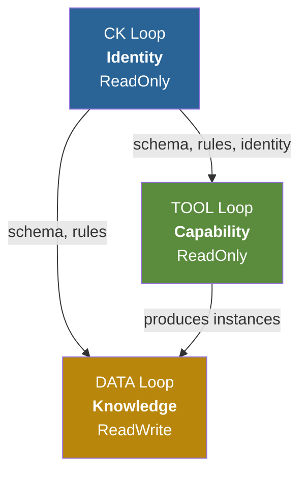
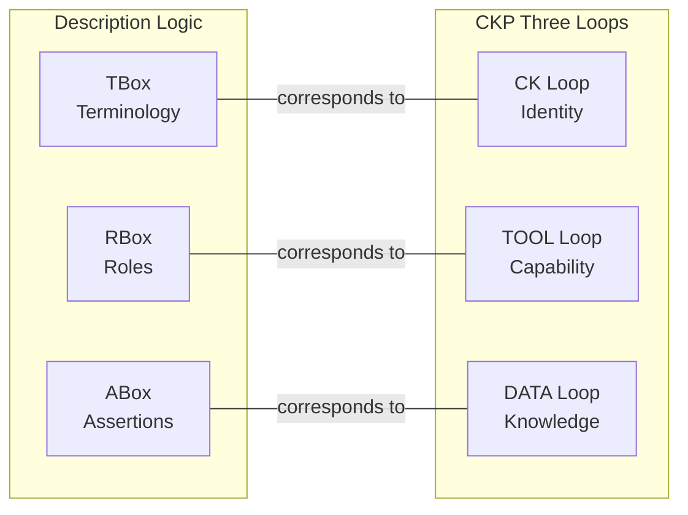

# The Three Loops as One System

> Chapter 9 of the CKP v3.6 Specification -- *Normative*

The three loops -- [CK](./ck-loop), [TOOL](./tool-loop), [DATA](./data-loop) -- are not independent subsystems bolted together. They are three aspects of the same Material Entity, governed by a strict dependency order and an inviolable separation axiom. This chapter defines how the loops compose into a single system.

## Dependency Order

The loops are not peers. They exist in a deliberate dependency order that reflects the purpose of the Material Entity:

| Loop | Exists For | Depends On | Serves |
|------|-----------|------------|--------|
| **DATA** | Accumulating what the kernel knows and has produced | TOOL (to produce instances), CK (for schema + rules) | Other kernels via grants block; the `web/` surface; `llm/` memory |
| **TOOL** | Executing the kernel's capability | CK loop (for `ontology.yaml`, `rules.shacl`, identity) | DATA loop -- every tool execution writes to `data/` |
| **CK** | Defining and sustaining the Material Entity | Nothing -- this is the root | TOOL loop (schema, rules, identity) and DATA loop (schema, rules) |

The dependency is strictly hierarchical: CK depends on nothing, TOOL depends on CK, DATA depends on both. There are no circular dependencies between loops.



## The Three-Loop Separation Axiom

::: danger AXIOM
A storage write (DATA) MUST NOT cause a CK loop commit. A tool execution (TOOL) MUST NOT rewrite `ontology.yaml` or `rules.shacl`. A CK loop commit MUST NOT write directly to `data/`. These boundaries SHALL be enforced by write authority rules on each filesystem volume -- not by convention.
:::

This axiom is the foundational invariant of CKP. Every conformant implementation MUST enforce it at the infrastructure level (volume driver `readOnly` flags, mount options, or equivalent platform mechanism). Violation of this axiom is a **fatal conformance failure**.

### Write Authority Summary

| Volume | Write Authority | ReadOnly at Runtime |
|--------|----------------|---------------------|
| `ck-{guid}-ck` | Operator, developer, CI pipeline | **Yes** (except `serving.json`) |
| `ck-{guid}-tool` | Tool developer, CI pipeline | **Yes** |
| `ck-{guid}-storage` | Kernel runtime exclusively | **No** -- this is the writable surface |

### Forbidden Cross-Loop Operations

| Boundary | What Is Forbidden | Why |
|----------|-------------------|-----|
| TOOL -> CK loop | Tool execution writing to any file in the CK root volume | CK identity is operator-governed -- runtime cannot alter who the kernel is |
| DATA -> CK loop | Storage writes causing commits to `conceptkernel.yaml` or schema | Identity and schema are design-time artifacts -- not derived from outputs |
| DATA -> TOOL | Instance data retroactively modifying tool source or config | Tools are versioned independently -- instances are their outputs, not inputs to their definition |
| CK -> DATA direct | A CK loop commit writing an instance into `data/` | Instances are produced by tool execution -- they require the full [tool-to-storage contract](./tool-loop#the-tool-to-storage-contract) |
| CK_B -> CK_A writes | Any kernel writing to another kernel's CK or TOOL volume | Volumes are sovereign -- another kernel MAY only read DATA loop outputs via declared access |

## Description Logic Box Correspondence

The three loops map directly to the three boxes of Description Logic:

| Loop | DL Box | Contains | Analogy |
|------|--------|----------|---------|
| **CK** | **TBox** (Terminological) | Class definitions, ontology, constraints, action catalogue | "What kinds of things exist in this kernel's world" |
| **TOOL** | **RBox** (Role) | Operational procedures, executable code, role axioms (approximate) | "How entities relate and transform" |
| **DATA** | **ABox** (Assertional) | Individuals -- specific instances of TBox-defined types | "What specific things have been created" |

This correspondence is not merely an analogy. The CK loop literally defines the terminological vocabulary (what classes of data the kernel produces). The DATA loop literally contains the individuals (specific instances of those classes). The TOOL loop contains the procedures that create individuals from class definitions.



## Cross-Kernel Cooperation

Cross-kernel cooperation is governed by SPIFFE workload identities, not binary role flags. Every kernel is assigned a stable SPIFFE SVID at mint time. Access grants are action-scoped -- a calling kernel can be permitted to invoke the tool without being permitted to read storage, and vice versa.

| Cooperation Pattern | Mechanism | Enforced By |
|--------------------|-----------|-------------|
| Read another kernel's storage | SPIFFE grant: `action=read-storage`, caller SVID verified | SPIRE mTLS + filesystem ACL |
| Invoke another kernel's tool | SPIFFE grant: `action=invoke-tool`, caller SVID verified | SPIRE cert + identity check |
| Read kernel identity files | SPIFFE grant: `action=read-identity` (explicit, audited) | SPIRE mTLS on CK loop volume read |
| React to schema changes | NATS subscription requires SVID-bound NATS credential | SPIRE JWT-SVID on NATS connection |
| Compose predicate instances | Each leg of handshake verified by SVID chain | SPIRE trust bundle across predicate CK |

::: tip
Cross-kernel access always goes through SPIFFE grants declared in `conceptkernel.yaml`. There is no implicit trust between kernels. Even read access to another kernel's storage must be explicitly granted and is audited.
:::

## Unified Filesystem Tree

Every Concept Kernel presents a single unified filesystem tree to all processes working inside it. From inside the kernel, there is no visible seam between the three volumes. From the distributed filesystem, each root is an independently-mounted volume with its own git history, retention policy, and write authority.

```
{ns}/{project}/concepts/{KernelName}/{guid}/
|
|  -- IDENTITY & AWAKENING FILES (CK loop volume: ck-{guid}-ck) --
|
|- conceptkernel.yaml          <- I am
|- .ck-guid                    <- Canonical SPID UUID
|- README.md                   <- Why I am
|- CLAUDE.md                   <- How I am (OPS root)
|- SKILL.md                    <- What I can do
|- CHANGELOG.md                <- What I have become
|- ontology.yaml               <- Shape of my world
|- rules.shacl                 <- My constraints
+- .policy                     <- Local governance rules
|
|  -- TOOL (sibling mount: ck-{project}-{kernel}-{version}-tool) --
|
|- tool/                       <- TOOL loop root
|
|  -- DATA (sibling mount: ck-{project}-{kernel}-{version}-data) --
|
+- data/                       <- DATA loop root -- append-only
    |- instance-<short-tx>/    <- sealed instance folder
    |- i-task-{conv_guid}/     <- task instance folder
    |- proof/
    |- ledger/
    |- index/
    |- llm/
    +- web/
```

::: tip Platform Convention (v3.6.1)
This filesystem layout is applied identically to every kernel. Three PVs mount as **sibling directories** under `/ck/{kernel}/`: `ck/` (ReadOnly), `tool/` (ReadOnly), `data/` (ReadWrite). The kernel name directory is not a volume — it is a namespace created by the kubelet. No volume is nested inside another volume. Version state lives in the CK.Project custom resource, not on disk. `serving.json` is retired (v3.6.1).
:::

## Commit Frequency as Governance Signal

Commit frequency per file is a first-class observable in CKP. Commit frequency maps predictably to loop membership and expected usage patterns. A file accumulating commits at the wrong rate is a governance anomaly that the compliance check kernel can detect.

| Frequency Band | Files | Loop | If Violated |
|---------------|-------|------|-------------|
| **High** -- runtime accumulation | `data/ledger.json`, `data/llm/context.jsonl`, `data/index/*` | DATA | Expected -- these are append-only logs |
| **Medium** -- developer-paced | `CLAUDE.md`, `SKILL.md`, `CHANGELOG.md` | CK | Expected -- identity evolves gradually |
| **Low** -- stable foundation | `conceptkernel.yaml`, `ontology.yaml`, `rules.shacl`, `README.md` | CK | Flag if >20 commits -- schema churn is a smell |
| **Variable** -- tool development | `tool/*` -- all tool source files | TOOL | Expected during active dev; low in production |
| **Near-zero** -- sealed outputs | `data/i-*/data.json` (sealed instances) | DATA | Flag if >1-3 commits -- mutation policy may be violated |

## Fleet Operations Engine

The three-loop model is the implementation substrate for the fleet's autonomous operational fabric. Every fleet operational pattern maps to a specific CKP mechanism.

| Fleet Pattern | CKP Implementation | Status |
|--------------|---------------------|--------|
| Unlimited autonomous directions | Goal kernel instances -- each goal is a direction; tasks distributed across kernels | Implemented |
| Formal task descriptions | `task.yaml` in task kernel `data/` with typed inputs, outputs, `quality_criteria`, `acceptance_conditions` | Partial |
| Capability advertisement to registries | `spec.actions` + `capability:` block in `conceptkernel.yaml`; discovery kernel `fleet.catalog` | Implemented |
| Audience profile accumulation | `i-audience-{session}/` instances in web-serving kernel `data/` | Future |
| Provenance for all autonomous actions | PROV-O fields in every `manifest.json`; GPG+OIDC+SVID three-factor audit chain | Implemented (MUST) |
| Deployment as ontological event | `i-deploy-{ts}/` instance with manifests, probe result, operator identity | Implemented |
| SHACL reactive business rules | `rules.shacl` reactive logic layer; SHACL Advanced Rules for trigger conditions | Future |
| Economic events (ValueFlows/REA) | Sealed instances with `vf:EconomicEvent` typing; Commitment = amendable instance | Future |
| ODRL-to-grants mapping | Grants block implements a subset of ODRL permission semantics mapped to CKP's action-scoped model | Implemented (subset) |

## Part II Conformance Criteria (System Integration)

| ID | Requirement | Level |
|----|------------|-------|
| L-13 | Three-loop separation axiom MUST be enforced at infrastructure level | Core |
| L-14 | No kernel MAY write to another kernel's CK or TOOL volume | Core |
| L-15 | Cross-kernel access MUST use SPIFFE grants (except `LOCAL.*`) | Core |
