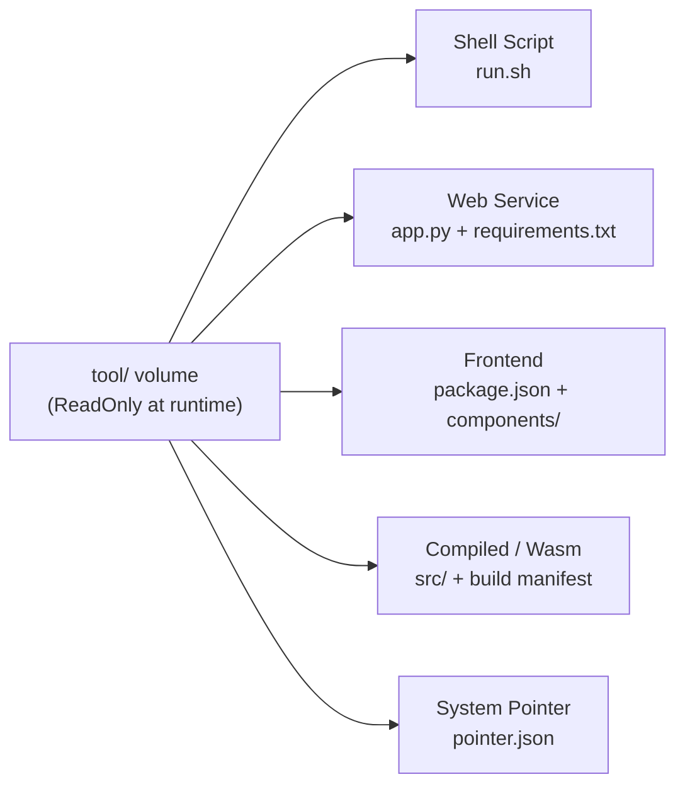
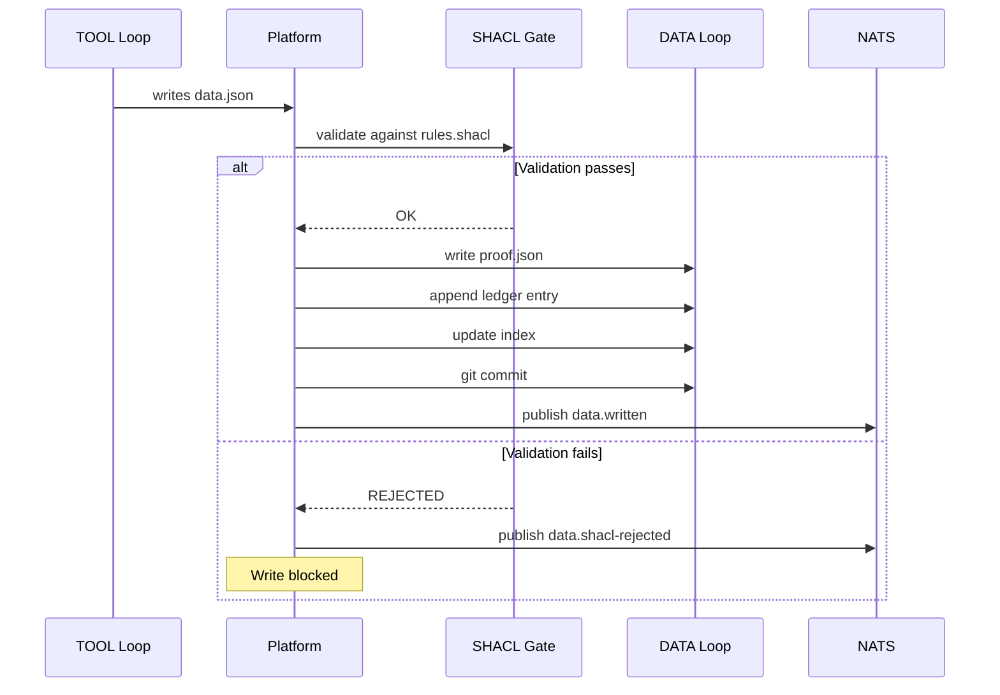

# TOOL Loop -- Executable Capability

> Chapter 7 of the CKP v3.6 Specification -- *Normative*

## Purpose

The TOOL loop is the capability organ of the Material Entity. It is the executable artifact the kernel brings to the world -- independently versioned, independently deployable, and completely agnostic about what form it takes. A tool can be a shell script, a web service, a frontend project, or a Wasm binary. The only contract is that it lives under `tool/` and has its own git history.

The TOOL loop exists because identity and capability are separate concerns. A kernel's identity (what it IS) should not change when its implementation (what it DOES) is upgraded. By isolating the tool in its own volume, CKP enables independent versioning: a tool can be updated from v1 to v2 without altering the kernel's identity or invalidating its accumulated data.

In Description Logic terms, the TOOL loop is the approximate **RBox**. It contains the operational procedures that determine how the kernel acts on the world. The mapping is approximate because the TOOL loop holds executable code, not formal role axioms.

## Tool Forms

The `tool/` directory is a separately-mounted volume on the distributed filesystem with its own git history. The tool can be updated, branched, and versioned completely independently of the CK's identity files.

| Tool Form | What Lives in `tool/` | Execution Context |
|-----------|-----------------------|-------------------|
| Shell script | `run.sh` -- self-contained, may reference system binaries | Direct shell execution; system PATH applies |
| Web service | App entry point, requirements, routers, models | Runtime; runs as long-lived service process |
| Frontend project | Entry point, package manifest, components, public assets | Runtime; built and served or SSR'd |
| Compiled / Wasm | Source, build manifest -- compiled to `.wasm` artifact | Wasm runtime via Polyglot Matrix |
| System pointer | `pointer.json` -- `{ "binary": "/usr/local/bin/ffmpeg" }` | System binary invoked directly; no compilation |



::: tip
The tool form is not declared in `conceptkernel.yaml` -- the platform discovers it by inspecting the `tool/` directory contents. This keeps identity and capability decoupled.
:::

## The Tool-to-Storage Contract

The tool's only obligation toward the [DATA loop](./data-loop) is to write a conforming instance into `storage/` when it produces an output. The instance MUST conform to the kernel's `rules.shacl` before the write is accepted. Everything else -- proof generation, ledger entry, index update -- is handled by the platform after the tool writes `data.json`.

```json
{
  "instance_id":   "<short-tx>",
  "kernel_class":  "Finance.Employee",
  "kernel_id":     "7f3e-a1b2-c3d4-e5f6",
  "tool_ref":      "refs/heads/stable",
  "ck_ref":        "refs/heads/stable",
  "created_at":    "2026-03-14T10:00:00Z",
  "data": {
    "name": "Jane Doe",
    "department": "Engineering"
  }
}
```

### Platform Post-Write Steps

The platform MUST execute the following steps after the tool writes `data.json`:

| Step | Action | Guarantee |
|------|--------|-----------|
| 1 | Validate `data.json` against `rules.shacl` | SHACL gate -- rejection blocks write |
| 2 | Generate `proof.json` in the instance directory | Proof record with hashes |
| 3 | Append a ledger entry to `storage/ledger/audit.jsonl` | Append-only audit trail |
| 4 | Update index files in `storage/index/` | Queryable instance registry |
| 5 | Commit to the DATA loop git repository | Version history preserved |
| 6 | Publish `ck.{guid}.data.written` to NATS | JetStream `at_least_once` guarantee |



## SHACL Validation Pipeline

SHACL validates RDF graphs. CKP instances are JSON files. The bridge operates as follows:

1. Each kernel's `ontology.yaml` SHOULD define a JSON-LD `@context` mapping instance fields to RDF predicates.
2. The platform converts `data.json` to RDF using the context before SHACL validation.
3. If no `@context` is defined in `ontology.yaml`, the SHACL gate accepts (permissive stub mode -- current default).
4. When `@context` is present, SHACL rejection blocks the write and the platform MUST publish `ck.{guid}.data.shacl-rejected` on NATS.

::: warning Current State
The SHACL validation pipeline is currently in **permissive stub mode** -- all writes are accepted. This is the default when `ontology.yaml` does not define a JSON-LD `@context`. Full SHACL enforcement activates when the `@context` is provided.
:::

## TOOL Loop NATS Topics

Conformant implementations MUST publish the following NATS topics for TOOL loop events. All topics use the pattern `ck.{guid}.tool.*`.

| Topic | When Published |
|-------|---------------|
| `ck.{guid}.tool.commit` | TOOL repo -- new commit (tool updated) |
| `ck.{guid}.tool.ref-update` | Tool branch pointer moved |
| `ck.{guid}.tool.promote` | Tool version promoted to stable |
| `ck.{guid}.tool.invoked` | Tool execution started |
| `ck.{guid}.tool.completed` | Tool execution finished successfully |
| `ck.{guid}.tool.failed` | Tool execution failed |

## Volume Driver Enforcement

The TOOL loop volume MUST be mounted **ReadOnly** at runtime. This is enforced at the infrastructure level by the volume driver, not by application logic. A conformant platform MUST configure the TOOL volume with `readOnly: true` (or the platform equivalent). The kernel runtime process MUST NOT be able to modify its own code.

| Volume | Who Writes | When | ReadOnly at Runtime |
|--------|-----------|------|---------------------|
| `ck-{guid}-ck` | Operator, developer, CI pipeline | Design time | `true` (except `serving.json`) |
| `ck-{guid}-tool` | Tool developer, CI pipeline | Development / release | `true` |
| `ck-{guid}-storage` | Kernel runtime exclusively | Execution time | `false` |

::: danger
Violation of volume-level ReadOnly enforcement is a **fatal conformance failure**. The [three-loop separation axiom](./three-loops#the-three-loop-separation-axiom) requires that no runtime process can alter its own identity (CK) or code (TOOL). This is not a convention -- it is enforced by infrastructure.
:::

## Part II Conformance Criteria (TOOL Loop)

| ID | Requirement | Level |
|----|------------|-------|
| L-6 | TOOL volume MUST be mounted ReadOnly at runtime | Core |
| L-7 | Platform MUST execute all six post-write steps after tool writes `data.json` | Core |
| L-8 | SHACL rejection MUST block writes and publish `shacl-rejected` event | Core |
