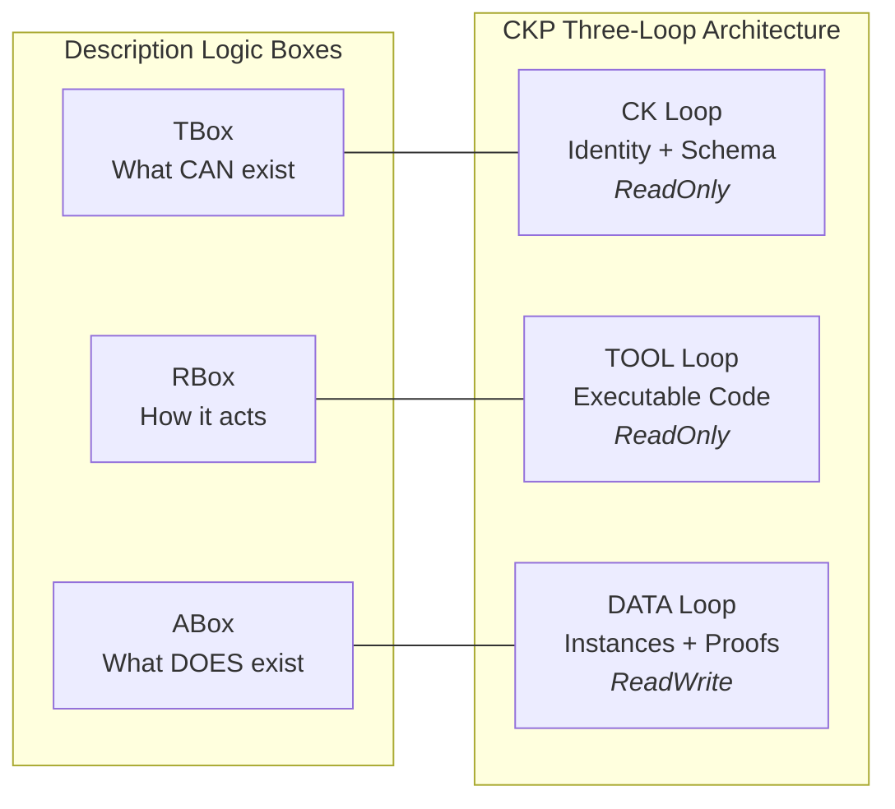

# BFO 2020 Grounding

## Why BFO 2020

CKP grounds its ontology in the Basic Formal Ontology (BFO) 2020, published as ISO 21838-2. This is a deliberate choice with three motivations:

1. **Interoperability.** BFO is the most widely adopted upper ontology in the Open Biomedical Ontologies (OBO) Foundry, defence (CCO), and manufacturing (IOF). Grounding CKP in BFO means that CKP classes can be aligned with any BFO-grounded domain ontology without custom bridging.

2. **Formal rigour.** BFO provides a small, well-axiomatised set of categories (36 classes) that distinguish between entities that persist through time (Continuants) and entities that unfold in time (Occurrents). This distinction maps directly to CKP's separation between kernel identity (Continuant) and action execution (Occurrent).

3. **Governance stability.** BFO is maintained by an ISO committee and changes rarely. CKP can depend on BFO's categories without risk of upstream churn.

:::info Why This Matters
Grounding in BFO is not academic decoration. It means every Concept Kernel can interoperate with thousands of existing ontologies in healthcare, defence, manufacturing, and finance -- all without custom bridging. The 36-class upper ontology gives CKP a shared vocabulary with the broader Semantic Web ecosystem.
:::

## The Concept Kernel as Material Entity

A Concept Kernel is typed as a Material Entity (`bfo:BFO_0000040`) by deliberate formal mapping. BFO's spatial-boundedness axiom is interpreted as filesystem-boundedness by protocol convention.

| BFO Material Entity Property | CKP Architectural Consequence |
|------------------------------|-------------------------------|
| Independently existing | The kernel has a GUID-based identity that persists across version changes, instance executions, and data accumulation |
| Spatially bounded | The kernel occupies a definite filesystem root: `{class}/{guid}/`. Everything inside this root belongs to this kernel and no other |
| Persists through time | The CK loop repo (git) records the kernel's evolution. New commits change capability without erasing history |
| Has parts | The three volumes are parts of the Material Entity: identity organ (CK), capability organ (TOOL), memory organ (DATA) |
| Participates in processes | When the kernel executes, it creates an Occurrent (`bfo:BFO_0000015`) governed by the TOOL loop, producing output in the DATA loop |
| Can cooperate with others | Dependencies on other kernels are declared in the CK loop. Cross-kernel access uses SPIFFE grants |

Conformant implementations MUST represent a kernel as an OWL individual of type `ckp:AutonomousKernel`:

```turtle
# Class declaration (TBox)
ckp:AutonomousKernel a owl:Class ;
    rdfs:subClassOf bfo:BFO_0000040 ,   # Material Entity
                    cco:Agent ;           # Agent (CCO)
    rdfs:label "Autonomous Kernel"@en .

# Individual kernel instance (ABox)
<urn:ckp:kernel:{guid}> a ckp:AutonomousKernel ;
    ckp:hasGUID     "{guid}"^^xsd:string ;
    ckp:hasClass    "{kernel_class}"^^xsd:string ;
    ckp:hasCKLoop   <urn:ckp:loop:ck:{guid}> ;
    ckp:hasTOOLLoop <urn:ckp:loop:tool:{guid}> ;
    ckp:hasDATALoop <urn:ckp:loop:data:{guid}> ;
    prov:wasGeneratedBy <urn:ckp:process:mint:{guid}> ;
    prov:wasAttributedTo <urn:ckp:agent:operator> ;
    prov:generatedAtTime "{timestamp}"^^xsd:dateTime .
```

### Dual Grounding: BFO + cco:Agent

A kernel is both a `bfo:MaterialEntity` and a `cco:Agent`. This dual grounding captures a fundamental truth: a kernel is a physical thing (it occupies filesystem space, has parts, persists through time) AND it is an agent (it acts, it has capabilities, it participates in organisations). Neither superclass alone is sufficient.

The dual grounding is declared in the OWL class hierarchy:

```turtle
ckp:AutonomousKernel a owl:Class ;
    rdfs:subClassOf bfo:BFO_0000040 , cco:Agent ;
    rdfs:label "Autonomous Kernel" ;
    rdfs:comment "A persistently-identified computational entity with three loops." .
```

This means every kernel inherits both the Material Entity axioms (spatial boundedness, temporal persistence, parthood) and the Agent axioms (capability, role participation, organisational membership).

## Kernel Types

CKP defines four kernel types. All four are Material Entities (`bfo:BFO_0000040`). They differ in deployment strategy and runtime characteristics, not in ontological status.

| Type | OWL Class | Deployment | Runtime | NATS |
|------|-----------|------------|---------|------|
| `node:hot` | `ckp:HotKernel` | Container + NATS listener | Always-on service process | Full publish/subscribe |
| `node:cold` | `ckp:ColdKernel` | Container, starts on message | On-demand trigger, exits after action | Subscribe on wake, publish result |
| `inline` | `ckp:InlineKernel` | Browser-side, no server | NATS WSS + JWT only | WSS publish/subscribe |
| `static` | `ckp:StaticKernel` | Filer-served web only | No process -- gateway serves files | No NATS (read-only web surface) |

:::tip
All four kernel types share the same ontological identity model. A `StaticKernel` with no NATS connection is still a Material Entity with a GUID, three loops, and a filesystem root. The type determines runtime behaviour, not identity.
:::

## Description Logic Box Correspondence

The three CKP loops map to the three boxes of OWL 2 Description Logic as a structural analogy:

```
CK Loop   -> TBox (terminological)   -- what CAN exist
TOOL Loop -> RBox (relational)       -- how the kernel acts
DATA Loop -> ABox (assertional)      -- what DOES exist
```

The TBox and ABox mappings are rigorous. The RBox mapping is approximate -- the TOOL loop contains executable code, not role axioms in the DL sense. Implementations MUST NOT rely on full DL-theoretic properties of the RBox for the TOOL loop.

| DL Box | CKP Loop | Contents | Physical Realisation | DL Rigour |
|--------|----------|----------|---------------------|-----------|
| TBox | CK Loop | `conceptkernel.yaml`, `ontology.yaml`, `rules.shacl` | Volume `ck-{guid}-ck`, ReadOnly | Rigorous |
| RBox | TOOL Loop | `tool/processor.py`, scripts, services, build artifacts | Volume `ck-{guid}-tool`, ReadOnly | Approximate |
| ABox | DATA Loop | `data/instances/`, `data/proof/`, `data/ledger/`, `data/index/`, `data/llm/`, `data/web/`, `data/logs/` | Volume `ck-{guid}-storage`, ReadWrite | Rigorous |

:::warning
The RBox mapping is deliberately approximate. The TOOL loop contains executable code -- Python handlers, scripts, build artifacts -- not Description Logic role axioms. Do not attempt to reason about TOOL loop contents using DL tools. The analogy is structural (the TOOL loop governs *how the kernel relates* to other things), not formal.
:::



## Conformance Requirements

| ID | Requirement | Level |
|----|------------|-------|
| O-1 | Kernel MUST be typed as `ckp:AutonomousKernel` (subclass of `bfo:BFO_0000040` and `cco:Agent`) | Core |
| O-2 | Implementation MUST use BFO 2020 as the upper ontology | Core |

See also: [Ontology Model](./ontology-model) for the four-layer import chain and published Turtle modules, [Loop Isolation](./isolation) for how the DL box correspondence maps to volume-level enforcement.
