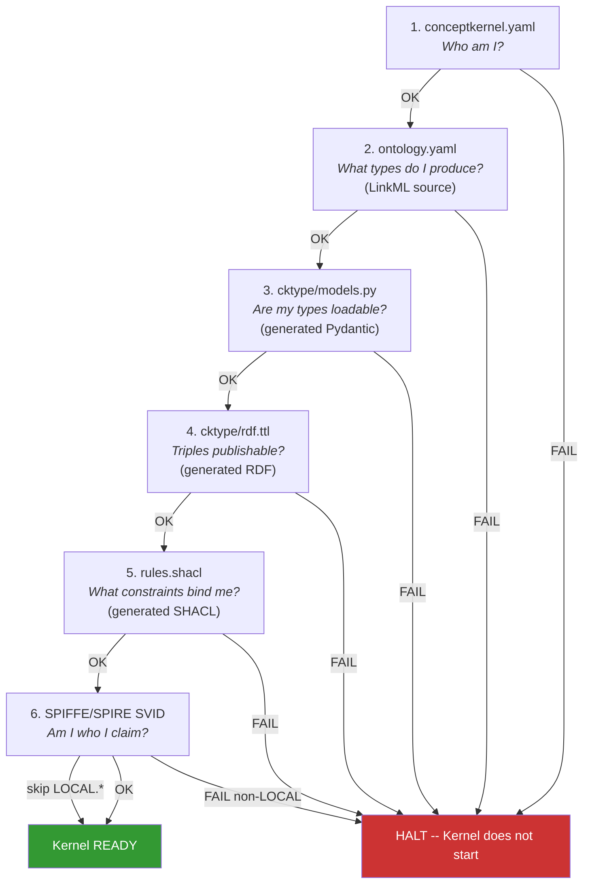

# CK Loop -- Identity and Awakening

> Chapter 6 of the CKP v3.7 Specification -- *Normative*

## Purpose

The CK loop is the identity organ of the Material Entity. It holds everything a Concept Kernel needs to read itself into existence. It is versioned by the developer -- the human or CI process that governs the kernel's evolution. It is the slowest-changing of the three loops and the only one that defines what the kernel fundamentally IS.

In Description Logic terms, the CK loop is the **TBox**. Its contents declare the terminological vocabulary: what classes of data the kernel produces, what constraints apply, what actions are available. The CK loop is ReadOnly at runtime -- the kernel process MUST NOT modify its own identity files.

The CK loop exists because a computational entity that cannot describe itself cannot be governed, composed, or trusted. Without a persistent, version-controlled identity, a kernel is a black box. With the CK loop, every kernel carries its own birth certificate, ontology, constraints, and action catalogue.

## Awakening Sequence

When a Concept Kernel wakes, it MUST load its **ontological identity** in strict order. The sequence is normative -- implementations MUST NOT reorder these steps. If any step fails, the kernel MUST NOT proceed.

The awakening sequence covers the **ontological** artefacts only -- the files that determine what the kernel IS as a typed, validated Material Entity. Human-facing artefacts (`README.md`, `SKILL.md`, `CLAUDE.md`, `CHANGELOG.md`) are companions, not awakening dependencies; see [Companion Human-Facing Artefacts](#companion-human-facing-artefacts) below.

The whole typed bundle (`cktype/models.py`, `cktype/rdf.ttl`, `rules.shacl`) is **regenerated from `ontology.yaml`** by the LinkML generator (`ck regenerate <kernel>`). `ontology.yaml` is the single authored source; the rest is derived. The awakening checks (`check.cktype`, `check.shacl`) verify the generated bundle is in sync with the source.

| Order | Artefact | Question Answered | Failure Behaviour |
|-------|----------|-------------------|-------------------|
| 1 | `conceptkernel.yaml` | Who am I? (URN, type, governance) | **Fatal** -- kernel MUST NOT start |
| 2 | `ontology.yaml` (LinkML) | What types do I produce? | **Fatal** -- no schema, no kernel |
| 3 | `cktype/models.py` (LinkML-generated Pydantic) | Are my types loadable? | **Fatal** -- runs `check.cktype` against `ontology.yaml`; rebuild via `ck regenerate <kernel>` |
| 4 | `cktype/rdf.ttl` (LinkML-generated triples) | Are my triples publishable to the fleet graph? | **Fatal** if absent or stale |
| 5 | `rules.shacl` (LinkML-generated SHACL) | What constraints validate writes? | **Fatal** -- runs `check.shacl` |
| 6 | SPIFFE/SPIRE SVID | Am I cryptographically who I claim? | **Fatal** for non-LOCAL kernels; skip for `LOCAL.*` prefix |
| -- | ~~`serving.json`~~ | ~~Which version am I?~~ | **Retired (v3.7)** -- version pins live in the project's `.ckproject` manifest |

::: danger Fatal Failure Points
Steps 1-5 are universally fatal -- they ARE the kernel's ontological identity. Step 6 (SPIFFE) is fatal for any kernel whose URN is not in the `LOCAL.*` namespace. Implementations that place SPIFFE verification anywhere other than after the typed bundle is loaded are non-conformant.
:::



## Companion Human-Facing Artefacts

Alongside the ontological identity, four human-facing artefacts live in `ck/`. They are **not** part of the awakening sequence. A kernel with all five ontological steps green is ready to run; the artefacts below are addressed to humans, agent prompts, and orchestrators.

| Artefact | Audience | Purpose | Required? |
|----------|----------|---------|-----------|
| `README.md` | humans, agents | Crucial usage instructions -- how to invoke, configure, and reason about the kernel | SHOULD be present (operationally critical even if not load-bearing) |
| `SKILL.md` | orchestrators, agents | Repeatable execution patterns -- how to drive the kernel through a task | SHOULD be present for any kernel that exposes meaningful actions |
| `CLAUDE.md` | agent runtime | Agent-mode prompt -- present only on kernels intended to be launched as a Claude (or compatible LLM) instance | Only on agent-type kernels |
| `CHANGELOG.md` | developers | Cosmetic dev log -- a readable record of edits | OPTIONAL |

::: tip Provenance lives in `data/proof/`, not `CHANGELOG.md`
Authoritative provenance for what a kernel has produced lives in the [DATA loop](./data-loop)'s `data/proof/` folder -- PROV-O-grounded, hash-chained, and append-only. `CHANGELOG.md` is a cosmetic developer convenience and carries no weight in compliance, audit, or reconciliation. Treat it as a README sibling, not as a record.
:::

::: warning Don't conflate the two layers
The companion artefacts here are **not** to be confused with the ontological approach. Identity, types, and constraints come from `conceptkernel.yaml` + `ontology.yaml` + `cktype/` + `rules.shacl`. Documentation, skills, and agent prompts come from the four files above. A kernel can change its README without affecting its ontology, and vice versa. The boundary is enforced by `check.cktype` / `check.shacl` running only against the ontological layer.
:::

## conceptkernel.yaml -- The Identity Document

This is the kernel's birth certificate. It carries identity only -- no mounts, no runtime config, no tool references. Those are platform concerns. The `capability:` block is the Capability Advertisement that powers the fleet discovery loop. The `spec.actions` block is the machine-readable service description queryable by discovery kernels and external agents.

```yaml
# conceptkernel.yaml -- CKP v3.7
apiVersion:        conceptkernel/v3
kernel_class:      Finance.Employee
kernel_id:         7f3e-a1b2-c3d4-e5f6
bfo_type:          BFO:0000040
owner:             operator@example.org
created_at:        2026-03-14T00:00:00Z
ontology_uri:      http://example.org/ck/finance-employee/v1

# Namespace and domain
namespace_prefix:  ACME
domain:            example.org
project:           Acme.Analytics

# Capability advertisement (fleet discovery loop)
capability:
  service_type:    "employee data governance"
  pricing_model:   free_tier      # free_tier | per_request | subscription | negotiated
  availability:    deployed       # deployed | staging | local
  sla:             best_effort    # best_effort | 99.9 | 99.99

# Action catalogue (discovery kernel fleet.catalog serves this)
spec:
  actions:
    common:
      - name: status
        description: Get kernel status and health
        access: anon
      - name: check.identity
        description: Validate kernel against CKP spec
        access: anon
    unique:
      - name: employee.create
        description: Create a new employee concept instance
        access: auth
        params: "name: str, department: str, role: str"
      - name: employee.query
        description: Query employee instances with filters
        access: anon

# Grants block (SPIFFE access control)
grants:
  - identity:  spiffe://example.org/ck/CK.Query/9a1b-c2d3-e4f5-g6h7
    actions:   [read-storage, read-index]
    expires:   2027-01-01T00:00:00Z
    audit:     true

# URN: ckp://Kernel#ACME.Finance.Employee:v1.0
```

### Validation Rules

Conformant implementations MUST validate `conceptkernel.yaml` against these rules:

| # | Rule | Consequence of Violation |
|---|------|--------------------------|
| 1 | `apiVersion` MUST be `conceptkernel/v3`. Version `v2` SHOULD produce a warning; unknown versions MUST be rejected. | Kernel does not start |
| 2 | `kernel_id` MUST be a valid UUID. | Kernel does not start |
| 3 | `bfo_type` MUST be `BFO:0000040`. | Kernel does not start |
| 4 | `namespace_prefix` MUST be present and non-empty. | Kernel does not start |
| 5 | `spec.actions.common` MUST include at least `status` and `check.identity`. | Kernel does not start |

### URN Pattern

Every kernel is addressable by a deterministic URN built from its identity fields:

```
ckp://Kernel#{namespace_prefix}.{kernel_class}:v{major}.{minor}
```

Example: `ckp://Kernel#ACME.Finance.Employee:v1.0`

## Version Materialisation (v3.7)

::: info serving.json Retired
`serving.json` was retired in v3.7. Version state now lives in the project's **`.ckproject` manifest** -- an instance record in [CK.Project](./project)'s DATA organ at `/ck-data/<project>/CK.Project/<version>/data/instances/.ckproject`, symlinked from `<project-root>/.ckproject` and reflected to the cluster via the `CKProject` custom resource's `spec.versions`. The CK loop volume is purely ReadOnlyMany with **no exceptions**. No write-through hack, no sidecar mechanism. See [Version Materialisation](./versioning) for the full model.
:::

Version declarations are part of the CK.Project custom resource. Each version specifies per-kernel git commit hashes for CK and TOOL loops independently:

```yaml
spec:
  versions:
    - name: v1.3.2
      route: /
      data: isolated
      kernels:
        - name: Hello.Greeter
          ck_ref: abc123f      # commit hash from CK repo
          tool_ref: def4567    # commit hash from TOOL repo
```

The operator materialises each version by streaming `git archive` from per-kernel master clones to the filer. Each loop has its own master clone — full-tree archive produces the loop content directly. No subtree filtering.

## CK Loop NATS Topics

Conformant implementations MUST publish the following NATS topics for CK loop events. All topics use the pattern `ck.{guid}.ck.*`.

| Topic | When Published |
|-------|---------------|
| `ck.{guid}.ck.commit` | CK loop repo -- new commit pushed |
| `ck.{guid}.ck.ref-update` | Branch pointer moved |
| `ck.{guid}.ck.promote` | Version promoted to stable |
| `ck.{guid}.ck.rollback` | Version rolled back |
| `ck.{guid}.ck.canary` | Canary weight updated |
| `ck.{guid}.ck.schema-change` | `ontology.yaml` or `rules.shacl` changed |
| `ck.{guid}.ck.depends-on` | Dependency on another kernel declared or updated |

## LOCAL.* Authentication

`LOCAL.*` kernels operate in an implicit trust domain. All grants are evaluated as `allow` -- the `LOCAL.*` prefix disables the SVID verification gate entirely. This means `LOCAL.*` kernels cannot restrict access to their DATA loop from other `LOCAL.*` kernels in the same project.

Cross-project access from `LOCAL.*` to non-`LOCAL.*` still REQUIRES SPIFFE. Local development prioritises velocity; security enforcement activates at deployment time when the `LOCAL.*` prefix is stripped.

## Part II Conformance Criteria (CK Loop)

| ID | Requirement | Level |
|----|------------|-------|
| L-1 | Kernel MUST read awakening files in the order specified in the awakening sequence table | Core |
| L-2 | Kernel MUST NOT proceed past a failed fatal awakening step | Core |
| L-3 | SPIFFE verification MUST occur at position 5a in the awakening sequence | Core |
| L-4 | `conceptkernel.yaml` MUST pass the five validation rules | Core |
| L-5 | CK loop volume is purely ReadOnlyMany — no writable exceptions (v3.7: `serving.json` retired) | Core |
