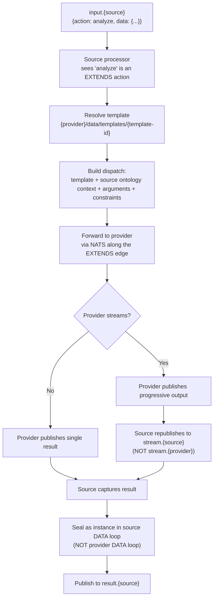

# EXTENDS Predicate

## The Design Problem: Capability Mounting

Some capabilities — LLM inference, search, transcoding, simulation — are too heavy or too specialised to embed in every kernel that wants to use them. A naive approach is to import a provider's library into every consumer's processor. That breaks three desirable properties of a concept kernel system:

1. **Not every kernel needs the capability.** A kernel that calculates checksums or routes NATS messages should not carry the inference runtime of an LLM-backed provider just because some sibling kernel does.
2. **Different consumers need different shapes of the same capability.** An analytical reviewer and a friendly assistant might both call the same LLM provider but with different system prompts, tool permissions, and output formats. The shape belongs to the consumer; the engine belongs to the provider.
3. **Capability should be composable.** If Kernel A gains a `summarise` action by EXTENDing a provider, and Kernel B COMPOSES Kernel A, then Kernel B should see `summarise` as a first-class action of A — without needing to know which provider implements it.

The v3.7 answer is the `EXTENDS` edge predicate. A source kernel declares an EXTENDS edge to a *capability provider* kernel and lists the new actions it gains from that provider. The capability is mounted, not inherited; the source kernel's identity stays sovereign while gaining new behaviour. The provider is just another concept kernel — there is nothing protocol-level that ties EXTENDS to a particular vendor or runtime.

## EXTENDS vs COMPOSES vs TRIGGERS

v3.7 introduces EXTENDS as the fifth edge predicate. Understanding it requires contrasting it with the existing predicates:

| Predicate | What Happens | Actions Appear On | Example |
|-----------|-------------|-------------------|---------|
| **COMPOSES** | Source inherits target's existing actions | Source kernel | Core COMPOSES ComplianceCheck -- Core gets `check.all` |
| **TRIGGERS** | Source can invoke target's actions remotely | Target kernel | ExchangeParser TRIGGERS IntentMapper -- parser calls `classify` on mapper |
| **PRODUCES** | Source generates output for target's input | Neither (data flow) | ThreadScout PRODUCES ExchangeParser -- output feeds input |
| **CONSUMES** | Source reads target's output | Neither (data flow) | Core CONSUMES TaxonomySynthesis -- reads synthesized data |
| **EXTENDS** | Source gains NEW actions backed by target's capability | **Source kernel** | Core EXTENDS {provider} -- Core gains `analyze` (action defined by Core's edge config; backed by provider's runtime) |

The critical distinction between COMPOSES and EXTENDS:

- **COMPOSES** exposes the target's EXISTING actions on the source. `check.all` already exists on CK.ComplianceCheck; COMPOSES makes it available on Core.
- **EXTENDS** creates ENTIRELY NEW actions on the source, backed by the target's capability. `analyze` does NOT exist on the provider as a discrete action — the source kernel declares it in its edge config, and the provider supplies the execution engine.

## Edge Declaration

```yaml
# In conceptkernel.yaml of the source kernel
spec:
  edges:
    outbound:
      - target_kernel: {provider-kernel}        # any capability-provider kernel
        predicate: EXTENDS
        config:
          template: {provider-template-id}     # OPTIONAL — provider-defined behaviour template
          actions:
            - name: analyze
              description: "Deep analysis backed by {provider-kernel}"
              access: auth
            - name: summarize
              description: "Summarize instances backed by {provider-kernel}"
              access: auth
          constraints:                          # OPTIONAL — provider-defined bounds
            ...
```

The `actions` list is what the source kernel declares as its new actions. They appear on the source kernel, not on the provider. The optional `template` field references a provider-defined behavioural template (analogous to a persona, system prompt, or pre-canned configuration); its semantics are owned by the provider, not by the EXTENDS predicate. The optional `constraints` field carries provider-specific bounds (rate limits, tool allowlists, model selection, output schemas, etc.) — again opaque to the predicate, interpreted by the provider.

## Capability Provider Kernels

A *capability provider* is any concept kernel that another kernel can target with an EXTENDS edge. The protocol does not enumerate which kernels are providers — any kernel that satisfies the provider contract may serve in this role.

The provider contract:

1. **Declares its capability boundary.** The provider's `ontology.yaml` describes what kinds of inputs its runtime can shape into outputs. EXTENDS consumers MUST declare actions that fit within this boundary.
2. **Optionally publishes a behavioural-template registry.** A provider MAY maintain templates in its DATA organ (e.g., `data/templates/`, `data/personas/`, `data/profiles/`) that consumers reference via the edge `config.template` field. The schema and semantics of those templates are owned by the provider.
3. **Honours the runtime dispatch contract.** When a consumer invokes an EXTENDS-derived action, the provider's processor receives a request that names the action, its arguments, the consumer kernel's identity, and the optional template ID. The provider executes and returns a typed result.

Many providers will be `agent`-type kernels (long-running conversational, persistent subscribers, often LLM-backed), but EXTENDS works for any provider type whose runtime can be invoked over NATS — `node:hot`, `node:cold`, even an external library kernel routed through a bridge. Type compatibility is enforced by the source kernel's ontology, not by EXTENDS itself.

## Behavioural Templates (Provider-Defined)

When a provider supports configurable behaviour (e.g., system prompts for an LLM, output profiles for a renderer, query plans for a search engine), it MAY publish a registry of named *templates* in its DATA organ. The EXTENDS edge config references one template by name via `config.template`.

Important properties:

- **Templates live in the provider's DATA loop**, not the consumer's. The consumer references a template by ID; the provider serves its current version at invocation time.
- **Template schema is provider-defined.** EXTENDS does not specify a template format. One provider may use `system_prompt`/`tools`/`temperature`; another may use `query_plan`/`fields`/`limit`. The provider's `ontology.yaml` types each template.
- **Templates are versioned via git** alongside the rest of the provider's DATA organ. Edge invocations resolve to the template's HEAD content at the time of dispatch.
- **The optional `config.constraints` block** carries opaque provider-specific bounds (rate limits, max tokens, allowed tools, etc.) that bound or override the template's defaults for this particular EXTENDS edge.

The result is that a single capability provider can serve many consumers with different behaviours without duplicating its runtime — the runtime is shared, the behaviour is per-edge.

## get_effective_actions() -- Action Resolution

When the operator or web shell needs a kernel's full action list, it calls `get_effective_actions()` in `cklib/actions.py`. This function resolves all edge types:

1. Start with the kernel's own `spec.actions.common` and `spec.actions.unique`
2. For each COMPOSES edge: inherit target's existing actions
3. For each EXTENDS edge: create new actions from edge config, attaching the edge's `template` (if any) and `constraints` as metadata so the dispatcher can forward them to the provider

The resolved action list is what appears in:
- The web shell action sidebar
- The ConceptKernel CRD `.spec.actions`
- The `status` response when a kernel is queried

### Implementation in cklib/actions.py

```python
def resolve_composed_actions(kernel_yaml, concepts_dir):
    """COMPOSES: inherit target's existing actions."""
    actions = []
    for edge in kernel_yaml['spec']['edges']['outbound']:
        if edge['predicate'] == 'COMPOSES':
            target = load_kernel(edge['target_kernel'], concepts_dir)
            actions.extend(target['spec']['actions']['unique'])
    return actions

def get_effective_actions(kernel_yaml, concepts_dir):
    """Full action list: own + COMPOSES + EXTENDS."""
    actions = kernel_yaml['spec']['actions']['common'] + \
              kernel_yaml['spec']['actions']['unique']
    actions += resolve_composed_actions(kernel_yaml, concepts_dir)

    for edge in kernel_yaml['spec']['edges']['outbound']:
        if edge['predicate'] == 'EXTENDS':
            config = edge['config']
            for action in config['actions']:
                action['_extends'] = {
                    'target': edge['target_kernel'],
                    'template': config.get('template'),
                    'constraints': config.get('constraints', {})
                }
                actions.append(action)
    return actions
```

## Runtime Dispatch

When `input.{source}` receives a message naming an EXTENDS-declared action (`{action: "analyze", data: {...}}`):



Key design properties of this flow, all required for conformance:

1. **Stream to source kernel's topic.** Subscribers track the source kernel — they should not need to discover the EXTENDS relationship to find streamed output. Republishing on `stream.{source}` keeps the abstraction clean.
2. **Seal in source kernel's DATA loop.** The result is an instance of the source kernel's ontology, not the provider's. The provider's DATA loop is for the provider's own state; consumer instances live with the consumer.
3. **Template loaded from provider's storage.** Templates live in the provider's DATA loop. The source references them by name via the edge; it does not own or copy them.

## Why EXTENDS Instead of Direct Invocation

A consumer could in principle call a provider's runtime directly (publish to the provider's `input.*`, parse `result.*`). EXTENDS is preferred because it makes the relationship a first-class ontology edge rather than runtime glue:

| Concern | Direct Invocation | EXTENDS |
|---------|-------------------|---------|
| **Ontological grounding** | Ad-hoc, untyped output | Typed in source kernel's ontology |
| **Access control** | No governance | Source kernel's grants govern who can invoke |
| **Provenance** | No trace | Instance traces to source kernel's action; `prov:used` links to the provider |
| **Behaviour shape** | Per-call ad-hoc | Per-edge template + constraints, declared in CK loop |
| **Composability** | Not composable | The new action can be further composed by kernels that COMPOSE the source |
| **Location independence** | Requires runtime locally | EXTENDS works via NATS relay — provider can be local or remote |

A kernel that does not declare any EXTENDS edges has no provider-backed actions — it is purely algorithmic. A kernel that does declare EXTENDS edges gains specific, template-shaped, access-controlled actions that are indistinguishable from its native actions to consumers.

## 7 Action Types

CKP classifies all actions into seven types that determine context assembly, output format, and instance recording. These are a closed set -- conformant implementations MUST support all entries and MUST NOT define additional types without specification amendment.

| Type | Verbs / Pattern | Context Loaded | Instance Record | BFO (execution) |
|------|----------------|----------------|-----------------|-----------------|
| `inspect` | `status`, `show`, `list`, `version` | Target identity only | None (stateless) | -- |
| `check` | `check.*`, `validate`, `probe.*` | Target + rules + schema | `proof.json` | BFO:0000015 |
| `mutate` | `create`, `update`, `complete`, `assign` | Target + grants + pre-state | `ledger.json` (before/after) | BFO:0000015 |
| `operate` | `execute`, `render`, `run`, `spawn`, `chat` | Full workspace | Sealed instance + `conversation/` | BFO:0000015 |
| `query` | `fleet.*`, `catalog`, `search` | Fleet-wide scan | None (stateless) | -- |
| `deploy` | `deploy.*`, `apply`, `route.*` | Target + manifests + cluster state | Deployment record | BFO:0000015 |
| `transfer` | `export.*`, `import.*`, `sync`, `regenerate` | Source + destination + mapping | Transfer receipt | BFO:0000015 |

### Action Type Resolution

Action type is resolved by suffix/prefix matching against the action name. The matching order is: exact match, prefix match, suffix match. First match wins.

| Action Name | Match Rule | Resolved Type |
|-------------|-----------|---------------|
| `task.create` | suffix `create` | `mutate` |
| `check.identity` | prefix `check.*` | `check` |
| `fleet.catalog` | suffix `catalog` | `query` |
| `spawn` | exact `spawn` | `operate` |
| `deploy.inline` | prefix `deploy.*` | `deploy` |
| `export.backup` | prefix `export.*` | `transfer` |
| `status` | exact `status` | `inspect` |
| `chat` | exact `chat` | `operate` |

### Stateful vs Stateless

| Category | Types | Instance Record | Audit Requirement |
|----------|-------|-----------------|-------------------|
| Stateless | `inspect`, `query` | None | OPTIONAL (if `audit: true` in grants) |
| Stateful | `check`, `mutate`, `operate`, `deploy`, `transfer` | REQUIRED | REQUIRED (always) |

Stateful action types MUST produce an instance record with PROV-O provenance fields linking the instance to the action that created it, the operator who authorised it, and the kernel that produced it.

## Edge Predicate Registry

For a deep dive into all five edge predicates, see [Edge Predicates and Action Composition](./edges).

| Predicate | Source Role | Target Role | NATS Materialisation | Instance Ownership |
|-----------|-----------|-------------|----------------------|--------------------|
| `COMPOSES` | Hub (parent) | Spoke (child) | Subscribe `result.{spoke}` ; publish `input.{spoke}` | Each writes its own |
| `TRIGGERS` | Trigger source | Triggered target | Subscribe `event.{source}` with action filter | Each writes its own |
| `PRODUCES` | Event producer | Event consumer | Subscribe `event.{source}` | Each writes its own |
| `EXTENDS` | Capability consumer | Capability provider | Subscribe `result.{provider}` | Consumer writes all |
| `LOOPS_WITH` | Peer A | Peer B | Both subscribe `event.{peer}` | Each writes its own |

### Edge Subscription Materialisation

Edge predicates materialise as NATS subscriptions at kernel startup. No edge subscription code is written in the processor -- the `NatsKernelLoop` derives subscriptions from the `conceptkernel.yaml` edges block.

| Edge Predicate | NATS Subscription Created | Activation Trigger |
|----------------|---------------------------|--------------------|
| `PRODUCES` | Target subscribes to `event.{source}` | Target auto-invokes default action |
| `TRIGGERS` | Target subscribes to `event.{source}` with `trigger_action` | Target invokes the specified action |
| `COMPOSES` | Hub subscribes to `result.{spoke}`, publishes to `input.{spoke}` | Hub dispatches, receives results |
| `EXTENDS` | Source subscribes to `result.{target}`, dispatches with edge `template`/`constraints` | Source forwards EXTENDS actions to target |
| `LOOPS_WITH` | Both subscribe to each other's `event.*` topics | Bidirectional invocation with circular guard |

### Ontological Graph Materialisation

After successful deployment, [CK.Operator](./operator) SHOULD publish kernel metadata and edges as RDF triples to a SPARQL endpoint (reference implementation: Jena Fuseki `/ckp` dataset). Each kernel becomes a `ckp:Kernel` individual typed as `bfo:0000040` (Material Entity). Edges become RDF object properties using CKP predicates.

```turtle
<ckp://Kernel#Delvinator.Core:v1.0> a ckp:Kernel, bfo:0000040 ;
    rdfs:label "Delvinator.Core" ;
    ckp:hasType "node:cold" ;
    ckp:belongsToProject <ckp://Project#delvinator.tech.games> .

<ckp://Kernel#Delvinator.Core:v1.0> ckp:composes
    <ckp://Kernel#CK.ComplianceCheck:v1.0> .
```

Named graphs per project (`urn:ckp:fleet:{hostname}`) enable per-project SPARQL queries. Graph materialisation is best-effort; deploy MUST succeed even if SPARQL endpoint is unreachable.

### Compliance Validation

[CK.ComplianceCheck](./compliance) validates edges and actions using the registries:

- **`check.edges`:** Every edge target MUST exist. Every predicate MUST be in the registry. No duplicate edges. EXTENDS edges MUST define `config.actions`.
- **`check.nats`:** Every kernel MUST declare `spec.nats` with input/result/event topics. Edge subscriptions MUST be derivable from declared edges.
- **`check.edge_materialisation`:** Edge targets exist and NATS topics resolve.

## Architectural Consistency Check

::: details Logical Analysis: EXTENDS Design

**Question:** Does a capability provider have its own three loops?

**Answer:** Yes — a provider is a normal concept kernel and so has the standard three organs:
- CK loop: identity, ontology (defines its template and constraint types), behavioural instructions
- TOOL loop: processor that handles its declared actions
- DATA loop: behavioural templates, its own instance records when invoked directly

A provider CAN be invoked directly (via TRIGGERS or NATS publish to its `input.*`). EXTENDS is the predicate that makes "use the provider's runtime to power my own actions" first-class.

**Question:** What prevents a circular EXTENDS chain (A EXTENDS B EXTENDS A)?

**Answer:** A SHOULD-level rule, not yet a hard enforcement. `get_effective_actions()` does not currently detect cycles, and a circular EXTENDS chain would loop in action resolution. Conformant compliance checks (`check.edges`) SHOULD detect and reject cycles in the EXTENDS sub-graph; this is a known gap to be tightened in a future revision.

**Question:** Can a kernel EXTENDS multiple providers?

**Answer:** Yes. A source kernel can declare EXTENDS edges to as many providers as it needs — one for inference, one for search, one for transcoding, etc. Each EXTENDS edge contributes its own actions. Action names MUST be unique across the source kernel's effective action set.

**Contradiction check:** EXTENDS creates "new actions on the source kernel backed by the target's capability." But behavioural templates live in the target's DATA loop. The source kernel reads the target's DATA loop content at runtime — a cross-loop read. Is this a separation-axiom violation?

**Resolution:** No. The separation axiom prohibits a kernel from WRITING to another kernel's loops. READING another kernel's DATA loop is permitted through declared access (grants). The EXTENDS edge declaration IS the grant. Templates in the provider's DATA loop are read-only shared assets, analogous to how COMPOSES reads another kernel's action catalog.
:::

## Conformance Requirements

- EXTENDS MUST create new actions on the source kernel; it MUST NOT expose the target's existing actions (that is the role of COMPOSES).
- If `config.template` is present, it MUST reference a valid behavioural template in the target's DATA loop.
- Actions created by EXTENDS MUST be listed in the source kernel's effective action set returned by `get_effective_actions()`.
- Instances produced by EXTENDS-derived actions MUST be sealed in the **source** kernel's DATA loop, never the target's.
- Provenance MUST trace to the source kernel's action; `prov:used` MUST include the target kernel's identity.
- The EXTENDS target MUST be a concept kernel that satisfies the capability-provider contract for the declared actions; type compatibility is asserted by the source kernel's ontology, not by the EXTENDS predicate.
- Stream events from EXTENDS-derived actions MUST be published to `stream.{source_kernel}`, not `stream.{target_kernel}`.
- Action names declared in `config.actions` MUST be unique across the source kernel's effective action set (no collisions with own actions, COMPOSED actions, or other EXTENDS edges).
- Compliance checks SHOULD detect and reject cyclic EXTENDS chains in the kernel graph.
