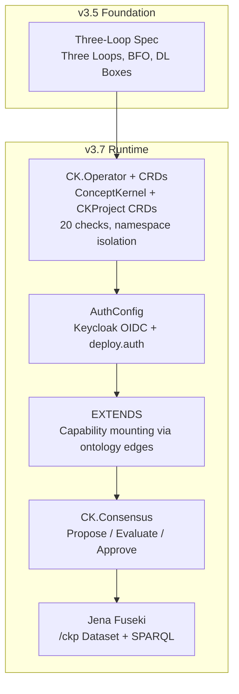

# Introduction to CKP v3.7

## Purpose

The Concept Kernel Protocol (CKP) v3.7 governs how a Concept Kernel exists, wakes into being, executes its purpose, and accumulates knowledge. It is the complete specification for building, deploying, and operating concept kernels in a distributed system.

A Concept Kernel is a persistently-identified computational entity -- a Material Entity in the sense of BFO 2020 -- that possesses three independently-versioned loops (CK, TOOL, DATA), communicates over a message broker, and accumulates knowledge through sealed, provenance-tracked instances. CKP defines the rules by which these entities are created, composed, governed, and evolved.

## Why CKP Exists

Distributed systems today lack a formal identity model for computational components. Containers have no persistent self-knowledge. Microservices have no ontological grounding. Data pipelines have no provenance chain linking output to the process that created it. CKP closes these gaps by treating every computational unit as a Material Entity with:

1. **Persistent identity** -- a GUID that survives restarts, upgrades, and data accumulation.
2. **Formal typing** -- grounded in BFO 2020 (ISO 21838-2), the same upper ontology used in biomedical informatics, defence, and manufacturing.
3. **Three-loop separation** -- identity (CK), capability (TOOL), and knowledge (DATA) are physically isolated, independently versioned, and governed by distinct write authorities.
4. **Mandatory provenance** -- every instance links to the action, agent, and time that created it via W3C PROV-O.
5. **Message-native communication** -- all inter-kernel interaction occurs over NATS messaging with JWT authentication, not ad-hoc HTTP calls.

The result is a protocol where every kernel can answer: *Who am I? What can I do? What have I produced? Who authorised it?*

## Scope

This specification covers:

- The formal typing of concept kernels in BFO 2020
- The [three-loop architecture](./three-loops) (CK/TOOL/DATA) with independent versioning
- The four-layer ontology import chain and published OWL modules
- The [awakening sequence and identity model](./ck-loop)
- NATS-based messaging with JWT authentication
- Action types, edge predicates, and composition
- [Instance lifecycle with PROV-O provenance](./data-loop)
- The unified filesystem tree and volume layout
- Compliance checking and fleet validation
- Kubernetes materialisation via CK.Operator
- Dynamic kernel spawning and occurrent tracking

This specification does **not** cover:

- Kubernetes-specific resource definitions (implementation artifacts of CK.Operator)
- LLM integration details (per-kernel tool concerns)
- UI/UX requirements (client concerns)

## The Three Loops -- Overview

The Three Loops are not separate subsystems. They are three modes of being of the same Material Entity -- each loop a different answer to a different existential question. The [CK loop](./ck-loop) asks *who it is and why it exists*. The [TOOL loop](./tool-loop) is the *executable capability* the kernel brings to the world. The [DATA loop](./data-loop) is *everything the kernel has produced and come to know*. The loops exist in a deliberate dependency order: DATA is the purpose; TOOL exists to serve DATA; the CK loop exists to define and sustain both.

| Loop | Existential Question | Filesystem Volume | Git Versioning | Write Authority |
|------|----------------------|-------------------|----------------|-----------------|
| CK | Who am I and why am I? | `ck-{guid}-ck` | Developer commits -- permanent | Operator / CI pipeline |
| TOOL | What can I do? | `ck-{guid}-tool` | Tool author commits -- permanent | Tool developer / CI pipeline |
| DATA | What have I produced? | `ck-{guid}-storage` | Append-only -- archival | Kernel runtime only |

## The Eight Design Principles

CKP is built on eight design principles. Every normative requirement in the specification traces to one or more of these principles. Implementations that satisfy the letter of individual requirements but violate these principles are not conformant in spirit.

### 1. Ontology-Driven

If it is not in the ontology, it does not exist. Every entity, relationship, and process MUST be formally typed in the four-layer ontology stack. This ensures that CKP systems are machine-interpretable, not merely machine-executable.

### 2. Three-Loop Separation

CK loop (identity) is ReadOnly. TOOL loop (capability) is ReadOnly. DATA loop (knowledge) is the only writable surface. This MUST be enforced at [volume mount level](./three-loops), not by convention. The rationale is security through architecture: a compromised runtime process cannot alter its own identity or code.

### 3. NATS-Native

All inter-kernel communication MUST use NATS messaging. HTTP is for static web surfaces only. This ensures a uniform communication fabric with built-in publish/subscribe semantics, JetStream durability, and JWT-based access control.

### 4. Version-Pinned

Containers SHALL see only the versions declared in the CK.Project CR (`spec.versions`). No arbitrary version access. This prevents version drift and ensures reproducible behaviour across the fleet. Version state lives in the Kubernetes control plane, not on the filesystem.

### 5. Provenance-Mandatory

Every instance MUST include PROV-O fields linking to the action, agent, and time that created it. This makes audit trails a first-class architectural concern, not an afterthought.

### 6. Idempotent

Reprocessing the same input SHOULD produce the same output. Instances are write-once sealed. This enables safe retries and simplifies failure recovery.

### 7. Filesystem-First

The distributed filesystem is the primary store. No external database is REQUIRED for core CKP operations. This keeps the system self-contained and portable.

### 8. Sovereignty

Each kernel's volumes are sovereign. No kernel MAY write to another kernel's CK or TOOL volume. Cross-kernel data access is governed by SPIFFE grants, not implicit trust.

## Protocol Feature Status

The following table summarises the implementation status of major protocol features.

| Feature | Status | Notes |
|---------|--------|-------|
| Three-loop separation (volume-enforced) | **Implemented** | CK.Operator materialises ReadOnly PVCs |
| Six-step ontological awakening sequence (`conceptkernel.yaml`, `ontology.yaml`, `cktype/`, `rules.shacl`, SPIFFE) | **Implemented** | CK.Lib.Py, CK.Lib.Js |
| PROV-O provenance in instances | **Implemented** | MUST -- all instances |
| NATS topic topology | **Implemented** | 22 topics across three loops |
| SPIFFE workload identity | **Implemented** | SPIRE integration |
| Capability advertisement | **Implemented** | `spec.actions` + `capability:` block |
| Five edge predicates | **Implemented** | COMPOSES, EXTENDS, TRIGGERS, PRODUCES, LOOPS_WITH |
| Seven action types | **Implemented** | inspect, check, mutate, operate, query, deploy, transfer |
| SHACL validation pipeline | Partial | Permissive stub mode is current default |
| Audience profile accumulation | Future | Designed but not implemented |
| SHACL reactive business rules | Future | Stubs only |
| ValueFlows economic events | Future | Designed but not implemented |
| Full ODRL policy composition | Future | Grants block implements subset |
| Database-backed DL boxes | Future | Filesystem is current physical layer |

## Specification Structure

CKP v3.7 is organised into nine parts:

| Part | Scope |
|------|-------|
| I | Foundations: purpose, [conformance](./conformance), [terminology](./conformance#defined-terms), [namespaces](./namespaces), design principles |
| II | The Three Loops: [CK identity](./ck-loop), [TOOL capability](./tool-loop), [DATA knowledge](./data-loop), [system integration](./three-loops) |
| III | Ontology: [BFO 2020 grounding](./bfo-grounding), [four-layer model](./ontology-model), published modules, SHACL |
| IV | Messaging: [NATS transport and topics](./nats), [message envelope](./message-envelope) |
| V | Security: [loop isolation](./isolation), [authentication](./auth), [namespace security](./namespace-security) |
| VI | Edges & Composition: [edge predicates](./edges), [EXTENDS](./extends) |
| VII | System Kernels: [taxonomy](./taxonomy), [CK.ComplianceCheck](./compliance), [CK.Operator](./operator), [CK.Project & Libraries](./project) |
| VIII | Infrastructure: [ConceptKernel + CKProject CRDs](./crd), [evidence-based proof](./proof), [reconciliation](./reconciliation), [versioning](./versioning) |
| IX | Governance & Accumulation: [CK.Consensus](./consensus), [task engine](./task-engine), [ontological graph](./graph), [sessions](./sessions), [PROV-O provenance](./provenance) |

## The Shift: From Specification to Runtime

CKP v3.5 defined the foundation: the three-loop model, BFO 2020 grounding, and Description Logic box mapping. It answered the question "what IS a concept kernel?"

v3.7 answers a different question: **how do you operate one?**

v3.5 gives you the ontology. v3.7 gives you the operator, the auth, the CRDs, the reconciliation lifecycle, the consensus loop, and the graph store. v3.5 is the constitution; v3.7 is the government.

| Concern | v3.5 (Foundation) | v3.7 (Runtime) |
|---------|-------------------|----------------|
| Identity | conceptkernel.yaml, awakening sequence | ConceptKernel CRD -- `kubectl get ck` |
| Authentication | (not addressed) | AuthConfig ontology, Keycloak provisioning |
| User interface | (not addressed) | Three-panel web shell, action discovery |
| Developer workflow | (not addressed) | `/ck Operator` -- subagent with kernel identity |
| LLM integration | (not addressed) | EXTENDS predicate, persona mounting, streaming |
| Governance | STRICT/RELAXED/AUTONOMOUS modes | CK.Consensus -- propose/evaluate/approve loop |
| Knowledge graph | Ontology declared in Turtle | Jena Fuseki /ckp dataset, SPARQL-queryable fleet |
| Proof | Defined in spec | 15-check evidence-based verification, SHA-256 hashed |
| Logging | (not specified) | Structured JSON stdout, `stream.{kernel}` topic |

## Release Train Model

v3.7 is not a single release. It is the **sum of v3.5.5 through v3.5.16** -- twelve independently shippable increments that each add one operational capability. The versions compose: each builds on all previous, and the full v3.7 release is the composition of all twelve.

```
v3.5.0  Foundation (spec, three-loop, BFO ontology)              RELEASED
v3.5.1  Full 50-chapter specification                            RELEASED
v3.5.2  CRD, namespace isolation, evidence-based proof           DEPLOYED
v3.5.3  AuthConfig + deploy.auth (delta spec)                    SPEC
v3.5.4  Subagent, streaming, consensus, EXTENDS (delta)          SPEC
v3.5.5  AuthConfig implementation + Keycloak integration         DEPLOYED
v3.5.6  Web client (deferred from v3.7 spec)                     DEPLOYED
v3.5.7  Hello.Greeter kernel + multi-project deploy              DEPLOYED
v3.5.10 EXTENDS predicate (capability mounting)                  DEPLOYED
v3.5.11 CK.Consensus kernel                                      DEPLOYED
v3.5.12 Jena Fuseki /ckp ontology dataset                        DEPLOYED
v3.5.13 Ontological graph materialisation                        PLANNED
v3.5.14 Multi-user NATS sessions                                 PLANNED
v3.5.15 Task execution engine                                    PLANNED
---------------------------------------------------------------------
v3.7    Full release -- sum of all above

v3.7  serving-multiversion-unpack (CK.Operator v1.3.0)       PROVEN
        Option A: three sibling dirs (runc constraint discovery)
        Per-kernel master clones (no monorepo, no /ck-tool/ root)
        CKProject CRD with per-kernel ck_ref/tool_ref
        kopf + NATS dual control plane
        Per-version deployments, 3 PVs per kernel per version
        Quick setup mode (no git required)
        serving.json retired; version pins in .ckproject manifest + CKProject CR
        Proven: hello-v1-0-0-proc Running with three sibling PVs
```

### Why This Model

Each version is independently deployable and testable. This means:

1. **No big-bang releases.** Each increment ships when ready.
2. **Each version has proof.** The 15-check verification runs after every deploy -- if it passes, the version is live.
3. **Rollback is per-version.** If v3.5.9 (streaming) breaks something, roll back streaming without losing v3.5.8 (subagent).
4. **The spec evolves with the code.** Delta specifications (v3.5.2, v3.5.3, v3.5.4) were written BEFORE implementation. The implementation validates the spec.

### Spec-First, Then Code

The implementation order follows a deliberate pattern:

1. **Delta spec written** (v3.5.2 through v3.5.4) -- defines WHAT and WHY
2. **Implementation** (v3.5.5 through v3.5.12) -- builds the WHAT
3. **Proof verification** -- every deploy runs 13-15 checks to confirm the WHAT matches the spec
4. **Documentation** (this site) -- explains HOW it works architecturally

This is why v3.5.3 (AuthConfig spec) was written before v3.5.5 (AuthConfig implementation), and why v3.5.4 D7 (Consensus spec) was written before v3.5.11 (Consensus implementation).

## What v3.7 Adds: The Operational Stack

v3.7 builds five layers of operational capability on top of the v3.5 foundation:



Each layer depends on the layers below it. Auth needs the operator. EXTENDS needs auth (so capability invocations carry identity). Consensus uses EXTENDS to delegate proposal review to a capability provider. The graph materialises only after the full fleet is reconcilable.

## Known Implementations

| Implementation | Language | Scope | Package |
|---------------|----------|-------|---------|
| `conceptkernel` | Python | Full runtime library (CK.Lib.Py) | PyPI |
| `@conceptkernel/cklib` | JavaScript | Browser client library (CK.Lib.Js) | npm |
| CK.Operator | Python/Kubernetes | Kubernetes materialiser | Internal |
| CK.ComplianceCheck | Python | Fleet validator | Internal |

This specification is the authoritative reference for all implementations. Where an implementation diverges from this specification, the specification is normative.

## Cluster State After v3.7

The reference deployment (`delvinator.tech.games` + `hello.tech.games`) demonstrates the full stack:

| Component | State | Evidence |
|-----------|-------|---------|
| CK.Operator | Running in `ck-system` namespace | `kubectl get deploy -n ck-system` |
| ConceptKernel CRD | Installed | `kubectl get ck -A` shows 7 kernels |
| Delvinator fleet | 6 kernels, 15/15 checks each | `kubectl get ck -n ck-delvinator` |
| Hello.Greeter | 1 kernel, 15/15 checks | `kubectl get ck -n ck-hello` |
| Keycloak realms | `techgames` (reused), `hello` (created) | OIDC discovery 200 on both |
| Web shell | Live at both hostnames | `curl -sI https://delvinator.tech.games/cklib/console.html` |
| NATS | Connected, structured JSON logs | `kubectl logs` on any processor |
| Jena Fuseki | /ckp dataset, 2,797 triples | `jena.conceptkernel.dev/ckp/sparql` |

## Reading This Documentation

The v3.7 docs are organized by capability, not by version number. Each page explains:

- **WHY** the capability exists (the problem it solves)
- **HOW** it works architecturally (the design decisions)
- **WHAT** was actually deployed (the evidence)

| Page | Covers |
|------|--------|
| [Conformance & Terminology](/v3.7/conformance) | RFC 2119 keywords, conformance levels, glossary of defined terms |
| [Namespaces](/v3.7/namespaces) | 13 namespace prefixes and their URIs |
| [CK Loop](/v3.7/ck-loop) | Awakening sequence, identity document, NATS topics |
| [TOOL Loop](/v3.7/tool-loop) | Tool forms, storage contract, SHACL validation |
| [DATA Loop](/v3.7/data-loop) | Instance tree, PROV-O provenance, mutation policy |
| [Three Loops](/v3.7/three-loops) | Dependency order, separation axiom, filesystem tree |
| [Auth](/v3.7/auth) | AuthConfig ontology, deploy.auth, Keycloak integration |
| [Operator](/v3.7/operator) | CK.Operator lifecycle, proof, reconciliation, namespace isolation |
| [CRDs](/v3.7/crd) | ConceptKernel and CKProject CRD OpenAPI schemas |
| [EXTENDS](/v3.7/extends) | EXTENDS predicate — capability mounting via ontology edges |
| [Consensus](/v3.7/consensus) | CK.Consensus kernel, propose/evaluate/approve |
| [Graph](/v3.7/graph) | Jena Fuseki, /ckp dataset, SPARQL queries |
| [Sessions](/v3.7/sessions) | Multi-user NATS sessions |
| [Task Engine](/v3.7/task-engine) | Consensus-driven executor dispatch |
| [Versioning](/v3.7/versioning) | Per-kernel master clones, three sibling dirs, .git-ref provenance |
| [Changelog](/v3.7/changelog) | Full version-by-version changelog |

::: info Logical Analysis Note
Two of the operational pages (Sessions, Task Engine) cover planned features that are not yet implemented. They are included because the delta specification defines them normatively and the architecture is designed to support them. They are clearly marked as PLANNED.
:::
