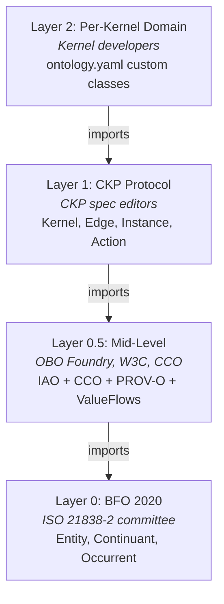

# Four-Layer Ontology Model

## Import Chain

CKP adopts a four-layer ontology import chain grounded in established ontologies. Each layer imports the layers below it. Implementations MUST respect the import order and MUST NOT introduce circular imports.

```
Layer 0:   BFO 2020 (ISO 21838-2)           -- upper ontology (entity, continuant, occurrent)
Layer 0.5: IAO + CCO + PROV-O + ValueFlows  -- mid-level (information, agents, provenance, economics)
Layer 1:   CKP (conceptkernel.org/v3.7/)     -- protocol (kernel, edge, instance, action)
Layer 2:   Per-kernel (ontology.yaml)         -- domain-specific (custom classes per kernel)
```

The layering exists because ontological governance requires clear authority boundaries. Layer 0 is governed by ISO. Layer 0.5 is governed by established open communities (OBO Foundry, W3C, CCO consortium). Layer 1 is governed by the CKP specification editors. Layer 2 is governed by individual kernel developers. No lower layer may contradict a higher layer.



| Layer | Name | Governance | Change Frequency | Example Classes |
|-------|------|-----------|-----------------|-----------------|
| 0 | BFO 2020 | ISO 21838-2 committee | Rarely (standard) | `bfo:BFO_0000040` (Material Entity), `bfo:BFO_0000015` (Process) |
| 0.5 | Mid-level imports | External maintainers (OBO, W3C, CCO) | Annually | `iao:0000027` (DataItem), `cco:Agent`, `prov:Entity` |
| 1 | CKP protocol ontology | CKP specification editors | Per CKP release | `ckp:AutonomousKernel`, `ckp:Edge`, `ckp:Instance` |
| 2 | Per-kernel domain | Kernel developer | Per CK loop commit | Domain-specific classes defined in `ontology.yaml` |

## Imported Ontologies (Layer 0.5)

Layer 0.5 bridges the abstract upper ontology (BFO) with the protocol-specific classes (CKP). These are established, well-maintained ontologies that provide the semantic grounding for CKP's core concepts.

| Ontology | IRI | Scope | Grounds These CKP Concepts |
|----------|-----|-------|---------------------------|
| **IAO** | `http://purl.obolibrary.org/obo/iao.owl` | Information entities | `ckp:KernelOntology` -> `iao:Document`, `ckp:Instance` -> `iao:DataItem`, `ckp:Action` -> `iao:PlanSpecification` |
| **CCO Agent** | `cco:AgentOntology` | Agents, roles, organisations | `ckp:Kernel` -> `cco:Agent`, `ckp:Project` -> `cco:Organization` |
| **CCO Artifact** | `cco:ArtifactOntology` | Artifacts, specifications | `ckp:Edge` -> `cco:Artifact` |
| **CCO Info Entity** | `cco:InformationEntityOntology` | Information, documents | Aligns with IAO for richer information typing |
| **CCO Event** | `cco:EventOntology` | Events, actions | Action subtypes -> `cco:Event` |
| **PROV-O** | `http://www.w3.org/ns/prov#` | Provenance chains | Instance -> `prov:Entity`, Action execution -> `prov:Activity`, Kernel -> `prov:Agent` |
| **ValueFlows** | `https://w3id.org/valueflows#` | Economic events (REA) | Payment -> `vf:EconomicEvent`, Agreement -> `vf:Agreement` |

## CKP Layer 1 OWL Artifact

A Turtle file (`ckp.ttl`) MUST be published at `https://conceptkernel.org/v3.7/ckp.ttl` declaring the CKP class hierarchy, imports for Layer 0 and 0.5, object properties for the three loops, edges, and action types, and annotation properties mapping to filesystem paths.

```turtle
# ckp.ttl -- Layer 1 CKP Protocol Ontology (normative)
@prefix ckp:  <https://conceptkernel.org/ontology/v3.7/> .
@prefix bfo:  <http://purl.obolibrary.org/obo/BFO_> .
@prefix iao:  <http://purl.obolibrary.org/obo/IAO_> .
@prefix cco:  <http://www.ontologyrepository.com/CommonCoreOntologies/> .
@prefix prov: <http://www.w3.org/ns/prov#> .
@prefix owl:  <http://www.w3.org/2002/07/owl#> .
@prefix rdfs: <http://www.w3.org/2000/01/rdf-schema#> .

<https://conceptkernel.org/ontology/v3.7/> a owl:Ontology ;
    owl:imports <http://purl.obolibrary.org/obo/bfo.owl> ,
                <http://purl.obolibrary.org/obo/iao.owl> ,
                <http://www.w3.org/ns/prov#> ;
    rdfs:label "Concept Kernel Protocol Ontology v3.7" .

# Core classes
ckp:AutonomousKernel a owl:Class ;
    rdfs:subClassOf bfo:0000040 , cco:Agent ;
    rdfs:label "Autonomous Kernel" ;
    rdfs:comment "A persistently-identified computational entity with three loops." .

ckp:HotKernel a owl:Class ;
    rdfs:subClassOf ckp:AutonomousKernel ;
    rdfs:label "Hot Kernel" .

ckp:ColdKernel a owl:Class ;
    rdfs:subClassOf ckp:AutonomousKernel ;
    rdfs:label "Cold Kernel" .

ckp:InlineKernel a owl:Class ;
    rdfs:subClassOf ckp:AutonomousKernel ;
    rdfs:label "Inline Kernel" .

ckp:StaticKernel a owl:Class ;
    rdfs:subClassOf ckp:AutonomousKernel ;
    rdfs:label "Static Kernel" .

ckp:Instance a owl:Class ;
    rdfs:subClassOf iao:0000027 ;
    rdfs:label "CKP Instance" .

ckp:Edge a owl:Class ;
    rdfs:subClassOf cco:Artifact ;
    rdfs:label "CKP Edge" .

ckp:Action a owl:Class ;
    rdfs:subClassOf iao:0000104 ;
    rdfs:label "CKP Action" ;
    rdfs:comment "An action definition is a PlanSpecification; an action execution is a bfo:Process." .

# Object properties
ckp:hasCKLoop a owl:ObjectProperty ;
    rdfs:domain ckp:AutonomousKernel ;
    rdfs:label "has CK loop" .

ckp:hasTOOLLoop a owl:ObjectProperty ;
    rdfs:domain ckp:AutonomousKernel ;
    rdfs:label "has TOOL loop" .

ckp:hasDATALoop a owl:ObjectProperty ;
    rdfs:domain ckp:AutonomousKernel ;
    rdfs:label "has DATA loop" .

ckp:hasEdge a owl:ObjectProperty ;
    rdfs:domain ckp:AutonomousKernel ;
    rdfs:range  ckp:Edge ;
    rdfs:label "has edge" .
```

## Published Turtle Modules

The CKP ontology is published as 10 OWL modules. Each module is independently importable and covers a specific concern. Conformant implementations MUST import the Core module. All other modules are RECOMMENDED for full conformance.

| # | Module | File | Import IRI | Scope | Dependencies |
|---|--------|------|-----------|-------|-------------|
| 1 | **Core** | `ckp-core.ttl` | `ckp:core` | Kernel classes, GUID, three-loop properties | BFO 2020, IAO, CCO Agent |
| 2 | **Instance** | `ckp-instance.ttl` | `ckp:instance` | Instance lifecycle, DataItem typing, sealed/amendable | Core, IAO |
| 3 | **Action** | `ckp-action.ttl` | `ckp:action` | Seven action types, PlanSpecification, Process execution | Core, IAO, CCO Event |
| 4 | **Edge** | `ckp-edge.ttl` | `ckp:edge` | Five edge predicates, Artifact typing | Core, CCO Artifact |
| 5 | **Provenance** | `ckp-provenance.ttl` | `ckp:provenance` | PROV-O mappings, audit chain, three-factor | Core, Instance, PROV-O |
| 6 | **Identity** | `ckp-identity.ttl` | `ckp:identity` | SPIFFE SVID, grants, access control | Core, CCO Agent |
| 7 | **Governance** | `ckp-governance.ttl` | `ckp:governance` | STRICT/RELAXED/AUTONOMOUS modes, compliance | Core, Identity |
| 8 | **Lifecycle** | `ckp-lifecycle.ttl` | `ckp:lifecycle` | Task state machine, mint-to-accumulation | Core, Instance, Action, PROV-O |
| 9 | **Economic** | `ckp-economic.ttl` | `ckp:economic` | ValueFlows economic events, capability advertisement | Core, ValueFlows |
| 10 | **Topology** | `ckp-topology.ttl` | `ckp:topology` | Volume layout, NATS topics, filesystem paths | Core |

:::warning
All 10 modules are published together under the same version URI. Individual modules MUST NOT be versioned independently -- they form a coherent set. Implementations MUST pin to a specific published version and MUST NOT use unversioned or `latest` module URIs.
:::

## LinkML Integration and ontology.yaml

Each kernel declares its domain-specific ontology (Layer 2) in `ontology.yaml` using LinkML syntax. This file imports CKP modules and defines the kernel's custom classes.

```yaml
# ontology.yaml -- Layer 2 per-kernel ontology
id: https://example.org/ck/finance-employee/v1
name: finance-employee-ontology
prefixes:
  ckp: https://conceptkernel.org/ontology/v3.7/
  linkml: https://w3id.org/linkml/

imports:
  - ckp:core
  - ckp:instance
  - ckp:action
  - ckp:provenance
  - linkml:types

classes:
  EmployeeRecord:
    is_a: ckp:Instance
    attributes:
      name:
        range: string
        required: true
      department:
        range: string
      role:
        range: string

# Instance mutability declaration
instance_mutability: sealed
```

Conformant implementations MUST validate that:

1. All `imports` resolve to published CKP modules or `linkml:types`.
2. All `is_a` references point to valid CKP or BFO classes.
3. The `instance_mutability` value is one of `sealed`, `amendments_allowed`, or `full_versioning`.

## SHACL Validation

Each kernel MAY include a `rules.shacl` file in its CK loop that defines SHACL shapes for validating instances before they are written to the DATA loop.

SHACL shapes are evaluated against instance data as follows:

1. The platform converts `data.json` to an RDF graph using the JSON-LD `@context` defined in `ontology.yaml`.
2. The SHACL shapes in `rules.shacl` are applied to the RDF graph.
3. If validation fails, the write is blocked and `ck.{guid}.data.shacl-rejected` is published on NATS.
4. If no `@context` is defined, SHACL operates in permissive stub mode (all writes accepted).

:::tip
SHACL provides a standard, W3C-endorsed mechanism for constraint checking. By using SHACL rather than ad-hoc validation logic, CKP ensures that constraints are machine-readable, composable, and interoperable with the broader Semantic Web ecosystem.
:::

### Normative SHACL Shapes

The published `shapes.ttl` module defines five normative SHACL node shapes:

| Shape | Target Class | Validates |
|-------|-------------|-----------|
| `ckp:KernelShape` | `ckp:AutonomousKernel` | Kernel identity completeness (GUID, class, three loops) |
| `ckp:EdgeShape` | `ckp:Edge` | Edge structural integrity (source, target, predicate, authorisation) |
| `ckp:InstanceShape` | `ckp:Instance` | Instance provenance completeness (PROV-O fields present) |
| `ckp:AuditEventShape` | Audit events | Ledger entry structural integrity |
| `ckp:ProtocolOntologyGraphShape` | CKP ontology graph | Immutability constraint on Layer 1 |

## Abbreviated Class Tree

The following tree shows the top two levels of the CKP ontology class hierarchy. The full hierarchy contains **95 OWL classes** across 10 Turtle modules.

```
bfo:Entity
|
+-- bfo:Continuant (BFO_0000002)
|   |
|   +-- bfo:IndependentContinuant
|   |   |
|   |   +-- bfo:MaterialEntity (BFO_0000040)
|   |   |   +-- ckp:Kernel  (also subClassOf cco:Agent)        [core.ttl]
|   |   |   |   +-- ckp:HotKernel                              [core.ttl]
|   |   |   |   +-- ckp:ColdKernel                             [core.ttl]
|   |   |   |   +-- ckp:InlineKernel                           [core.ttl]
|   |   |   |   +-- ckp:StaticKernel                           [core.ttl]
|   |   |   |   +-- ckp:EdgeKernel                             [core.ttl]
|   |   |   |   +-- ckp:ConsensusKernel                        [core.ttl]
|   |   |   |   +-- ckp:WssHubKernel                           [core.ttl]
|   |   |   |   +-- ckp:SystemKernel                           [kernel-metadata.ttl]
|   |   |   |   +-- ckp:ApplicationKernel                      [kernel-metadata.ttl]
|   |   |   |   +-- ckp:UIKernel                               [kernel-metadata.ttl]
|   |   |   |   +-- ckp:TemplateKernel                         [kernel-metadata.ttl]
|   |   |   |   ...
|   |   |   +-- ckp:Agent                                      [rbac.ttl]
|   |   |   |   +-- ckp:UserAgent
|   |   |   |   +-- ckp:ProcessAgent
|   |   |   ...
|   |
|   +-- bfo:GenericallyDependentContinuant (BFO_0000031)
|   |   +-- ckp:KernelMetadata                                 [kernel-metadata.ttl]
|   |   +-- ckpw:WorkflowEdge                                  [workflow.ttl]
|   |
|   +-- bfo:SpecificallyDependentContinuant
|       +-- bfo:Quality (BFO_0000019)
|       |   +-- ckp:KernelType, ckp:RelationshipType, ...      [core.ttl]
|       |   +-- ckp:Runtime, ckp:KernelStatus, ...             [kernel-metadata.ttl]
|       +-- bfo:RealizableEntity
|           +-- bfo:Disposition (BFO_0000016)
|           |   +-- ckp:StorageContract, ckp:GovernanceMode     [core.ttl]
|           |   +-- ckp:Capability, ckp:ServingDisposition      [kernel-metadata.ttl]
|           |   +-- ckp:Permission                              [rbac.ttl]
|           +-- bfo:Role (BFO_0000023)
|           |   +-- ckp:Role                                    [rbac.ttl]
|           +-- bfo:Function (BFO_0000034)
|               +-- ckpw:WorkflowAction                         [workflow.ttl]
|
+-- bfo:Occurrent (BFO_0000003)
|   |
|   +-- bfo:Process (BFO_0000015)
|   |   +-- ckpp:Process                                        [processes.ttl]
|   |   |   +-- ckpp:InvocationProcess
|   |   |   +-- ckpp:EdgeCommunicationProcess
|   |   |   +-- ckpp:ConsensusProcess
|   |   |   +-- ckpp:BroadcastProcess
|   |   +-- ckpp:TemporalPart                                   [processes.ttl]
|   |   |   +-- ckpp:AcceptedPhase, ckpp:ProcessingPhase, ...
|   |   +-- ckp:AuthorizationCheck                              [rbac.ttl]
|   |   +-- ckpw:Workflow                                       [workflow.ttl]
|   |   +-- ckpi:ImprovementProcess                             [self-improvement.ttl]
|   |
|   +-- bfo:ProcessBoundary (BFO_0000035)
|   |   +-- ckpp:StartBoundary, ckpp:EndBoundary                [processes.ttl]
|   |
|   +-- bfo:TemporalRegion (BFO_0000008)
|       +-- ckpp:TemporalRegion                                 [processes.ttl]
|
+-- (IAO / CCO mid-level grounding)
    |
    +-- iao:InformationContentEntity (IAO_0000030)
    |   +-- ckp:InformationEntity                               [core.ttl]
    |   +-- iao:DataItem (IAO_0000027)
    |   |   +-- ckp:Instance, ckp:InstanceManifest              [core.ttl, base-instances.ttl]
    |   |   +-- ckp:LedgerEntry, ckp:ProofRecord                [base-instances.ttl, proof.ttl]
    |   +-- iao:DirectiveInformationEntity
    |   |   +-- ckp:QueueContract                               [core.ttl]
    |   +-- iao:PlanSpecification (IAO_0000104)
    |   |   +-- ckp:Action                                      [core.ttl]
    |   +-- iao:Document (IAO_0000310)
    |       +-- ckp:KernelOntology                              [core.ttl]
    |
    +-- cco:Artifact
    |   +-- ckp:Edge, ckp:AuthorizedEdge                        [core.ttl]
    |
    +-- cco:Agent
    |   +-- ckp:Kernel  (dual grounding with bfo:MaterialEntity)
    |
    +-- cco:Organization
        +-- ckp:Project                                         [core.ttl]
```

## Key Reclassifications

CKP grounds its core classes through mid-level ontologies rather than direct BFO typing. This provides richer semantic typing and better alignment with established information science ontologies.

| CKP Class | Mid-Level Grounding | Rationale |
|-----------|---------------------|-----------|
| `ckp:KernelOntology` | `iao:Document` (IAO_0000310) | An ontology is a document, not a quality of the kernel |
| `ckp:Instance` | `iao:DataItem` (IAO_0000027) | An instance is a truthful data item about something |
| `ckp:Edge` | `cco:Artifact` | An edge is a constructed artifact connecting kernels |
| `ckp:Kernel` | `cco:Agent` + `bfo:BFO_0000040` | A kernel is both material entity AND agent -- it acts |
| `ckp:Action` | `iao:PlanSpecification` (IAO_0000104) | An action *definition* is a plan specification; an action *execution* is a `bfo:Process` |
| `ckp:Project` | `cco:Organization` | A project organises kernels into a coherent unit |
| `ckp:QueueContract` | `iao:DirectiveInformationEntity` (IAO_0000033) | A contract directs how to interact, not just a capability |

:::warning Action Typing Distinction
The Action **definition** in `SKILL.md` is an `iao:PlanSpecification`. The Action **execution** (a specific invocation at a specific time) is a `bfo:Process` (`bfo:BFO_0000015`). Conformant implementations MUST maintain this distinction.
:::

## Future: Database-Backed Boxes

The filesystem is the current physical layer. In future versions, TBox definitions MAY be served from a graph database (RDF/SPARQL) and ABox instances from a document database (FerretDB, MongoDB). The RBox (tool) remains filesystem-bound -- it is executable code, not query results. The three-loop separation makes this migration transparent: swap the storage layer per loop without affecting the others.

## Deliberately Skipped Ontologies

The following ontologies were evaluated and deliberately deferred. Each has a specific trigger condition for future adoption.

| Ontology | Reason for Deferral | Revisit When |
|----------|-------------------|--------------|
| **CCO Geospatial** | CKP kernels do not have physical location | Geo-distributed kernels across data centres |
| **CCO Facility** | No physical infrastructure modelling needed | Modelling cluster topology or edge nodes |
| **CCO Units of Measure** | `xsd:decimal` sufficient for current metrics | Quality-of-service SLAs with formal measurement |
| **CCO Quality** | `bfo:0000019` sufficient for kernel qualities | Quality scoring with richer dimensional analysis |
| **CCO Time** | `xsd:dateTime` sufficient for timestamps | Temporal reasoning (Allen intervals, scheduling) |
| **CCO Currency Unit** | ValueFlows covers economic events | Multi-currency support requiring ISO 4217 |
| **ODRL** | Grants block in `conceptkernel.yaml` is simpler | Fine-grained policy composition across fleet |
| **Hydra Core** | REST API descriptions handled by OpenAPI | Hypermedia-driven API discovery |
| **SWRL** | SHACL rules sufficient for validation | Complex temporal/conditional business rules |

## Conformance Requirements

| ID | Requirement | Level |
|----|------------|-------|
| O-3 | Four-layer import chain MUST be respected; no circular imports | Core |
| O-4 | `ckp.ttl` Layer 1 artifact MUST be published at the CKP version URI | Core |
| O-5 | Implementation MUST import the Core module (`ckp:core`) | Core |
| O-6 | All 10 modules MUST be versioned together; no independent module versioning | Core |
| O-7 | `ontology.yaml` MUST declare imports, and all `is_a` references MUST resolve to valid classes | Core |
| O-8 | `instance_mutability` MUST be one of the three defined values | Core |
| O-9 | SHACL rejection MUST block writes when `@context` is present | Core |
| O-10 | Implementations MUST use the namespace prefixes from Part I when emitting CKP ontology content | Core |

See also: [BFO Grounding](./bfo-grounding) for the Material Entity mapping, [NATS Messaging](./nats) for how ontology declarations materialise as NATS subscriptions at runtime.
